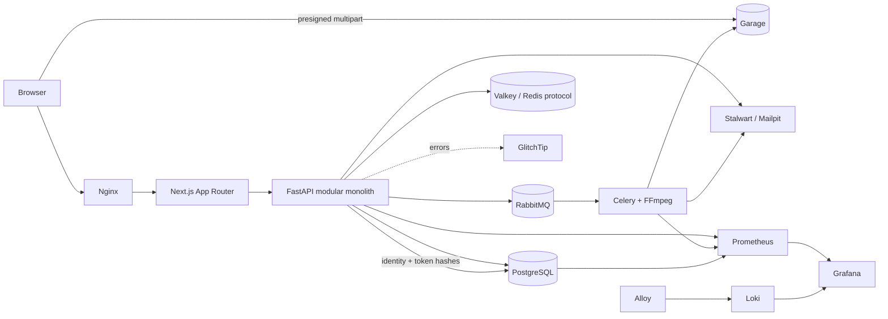

# Feed.io

> A self-hosted video review and approval workspace for agencies, built with FastAPI, PostgreSQL and Next.js.

Feed.io is an open-source platform inspired by modern media-review tools. It keeps identity, storage, queues, cache, mail and observability under your control—without requiring managed cloud subscriptions.

**Project status:** Early development. Core platform, project workspace, review player, transcode pipeline, rate limiter, admin panel, and Cloudflare Tunnel production infrastructure are implemented.

## Why Feed.io?

Creative teams should be able to upload a cut, collect frame-accurate feedback and get approval without scattering context across chat, email and generic file drives. Feed.io is designed for agencies with fewer than 1,000 initial users while retaining production-grade boundaries and operational practices.

## What works today

- FastAPI liveness plus PostgreSQL, Valkey, RabbitMQ and Garage readiness probes.
- Organization-scoped project create/list API backed by PostgreSQL.
- First-party SaaS registration, mandatory email verification, login, workspace onboarding, recovery and session revocation.
- Argon2id passwords, short-lived JWTs, rotating refresh-token hashes and HttpOnly + CSRF cookies.
- Valkey-backed sliding-window rate limiter with custom RFC 7807 429 handlers, IETF RateLimit headers, and Prometheus telemetry metrics.
- Nginx edge rate limiting gateway for development with 1GB upload buffers, burst protection zones, and dedicated WebSocket support.
- Platform Admin Panel (`/app/admin`) with role-based access control (`super_admin`, `support`), system health & infrastructure monitoring, user governance, organization storage quotas, and security audit logs.
- Next.js auth screens, protected project dashboard and create-project flow.
- OpenAPI → Orval → typed Axios + TanStack Query client generation.
- Storybook design system catalog (`make storybook`) with visual testing across shared components and administrative flows.
- Production deployment architecture with Cloudflare Tunnel (Zero Public Inbound Ports), immutable multi-stage builds, and automated DR backup/restore scripts.
- Automatic Alembic schema migration before API and worker startup.
- Ruff, mypy, pytest, import-linter, ESLint and TypeScript quality gates with CI failure above 500 physical lines per file.

## Roadmap

- [x] Monorepo and enterprise module boundaries.
- [x] Project workspace vertical slice.
- [x] Self-hosted registration, verify email, login/refresh/logout, recovery and session revocation.
- [x] Organization/project administration UI and project-level RBAC matrix.
- [x] Multipart upload directly to Garage S3.
- [x] Celery/RabbitMQ + FFmpeg HLS processing.
- [x] HLS review player, timecode comments and annotations.
- [x] Media versioning, version stacks and side-by-side comparison player.
- [x] Socket.IO collaboration over Valkey Pub/Sub.
- [x] Secure client share links and approval history.
- [x] Edge API Gateway & Sliding-window Rate Limiter (Valkey + Nginx + RFC 7807 429).
- [x] Platform Admin Panel (User Governance, System Metrics, S3 Quota, Audit Logs).
- [x] Storybook UI component catalog & visual testing.
- [x] Local metrics, logs and error-tracking services.
- [x] Production deployment with Cloudflare Tunnel (Zero Inbound Ports) and backup/recovery drills.

Detailed architectural decisions and roadmaps are indexed in the [Documentation Index](#documentation-index).

## Architecture at a glance



Feed.io starts as a modular monolith. API, worker and scheduler are independent processes from one Python package. PostgreSQL is authoritative; Valkey is ephemeral cache/pub-sub; RabbitMQ is the durable job broker; Garage owns media objects.

### Backend dependency direction

```text
presentation ───────→ application ───────→ domain
infrastructure ─────→ application ports ─→ domain
bootstrap ──────────→ presentation + infrastructure
```

- Domain code cannot import FastAPI, SQLModel, Celery or storage clients.
- Application code owns use cases and small `Protocol` ports.
- Infrastructure implements I/O adapters; Presentation translates HTTP/WebSocket messages only.
- Other modules import only from `modules/<name>/public.py`.

### Frontend dependency direction

Routes only compose feature modules. Client components live at the lowest practical leaf. Components use generated React Query hooks; only the generated client/custom mutator imports Axios.

## Documentation Index

| Category | Guide / Document | Description |
|---|---|---|
| **Production** | [Production Deployment Guide](docs/PRODUCTION_DEPLOYMENT_GUIDE.md) | Cloudflare Tunnel, Zero Inbound Ports, UFW, Compose, DR |
| **Local Operations** | [Local Stack Runbook](docs/operations/local-stack.md) | Development stack, healthchecks, and testing walkthrough |
| **Storage** | [Garage Storage Guide](infra/garage/README.md) | S3 cluster layout, bucket management, and capacity |
| **Architecture** | [System Overview](docs/architecture/system-overview.md) | High-level system design and data-flow topology |
| **ADRs** | [ADR-0001: Modular Monolith](docs/adr/0001-modular-monolith.md) | Package structure and cross-module boundaries |
| | [ADR-0002: Tenant Isolation](docs/adr/0002-postgresql-tenant-isolation.md) | PostgreSQL row-level multitenancy and agency isolation |
| | [ADR-0003: OIDC BFF Sessions](docs/adr/0003-oidc-bff-cookie-session.md) | Cookie-based session management and token rotation |
| | [ADR-0004: Self-Hosted Auth](docs/adr/0004-self-hosted-saas-auth.md) | First-party authentication, Argon2id, and JWTs |
| | [ADR-0005: Context Vocabulary](docs/adr/0005-context-vocabulary.md) | Domain language definitions and bounded contexts |
| **Specifications** | [Engineering Standards](feed-io-engineering-standards.md) | Quality gates, 500-line limit, and architectural rules |
| | [Development Plan](feed-io-development-plan.md) | Milestones, roadmap, and implementation phases |
| | [Database Design Plan](feed-io-database-design-plan.md) | PostgreSQL schema, relations, and indexing strategy |
| | [Library Plan](feed-io-library-plan.md) | Technology and dependency evaluation criteria |
| | [Context Alignment Plan](feed-io-context-alignment-plan.md) | Bounded context boundaries and service responsibilities |
| | [Platform Admin Panel Plan](docs/ADMIN_PANEL_PLAN.md) | Governance, user management, quotas, and audit logs |
| | [API Gateway & Rate Limiting](docs/API_GATEWAY_AND_RATE_LIMIT_PLAN.md) | Valkey sliding-window rate limiter & RFC 7807 specs |
| | [Realtime & Notifications](docs/REALTIME_AND_NOTIFICATIONS_PLAN.md) | WebSocket collaboration and event dispatching |
| | [Project Progress](docs/PROJECT_PROGRESS.md) | Implementation tracking and completed deliverables |

## Technology stack

| Area | Technology |
|---|---|
| Web | Next.js App Router, React, TypeScript |
| API | FastAPI, Pydantic, SQLModel/SQLAlchemy, Alembic |
| Contract | OpenAPI, Orval, Axios, TanStack Query |
| Database | PostgreSQL |
| Cache/realtime | Valkey (Redis-compatible protocol) |
| Background jobs | RabbitMQ, Celery |
| Media | Garage S3 API, FFmpeg/FFprobe, HLS, Nginx cache |
| Identity | First-party FastAPI auth, Argon2id, JWT + PostgreSQL sessions |
| Development mail | Mailpit |
| Production mail | Stalwart Mail Server / SMTP Relay |
| Metrics | Prometheus, PostgreSQL exporter, RabbitMQ exporter |
| Logs | Grafana Alloy, Loki |
| Dashboards | Grafana |
| Error tracking | GlitchTip |
| Ingress (Prod) | Cloudflare Tunnel (`cloudflared`) |
| Tooling | pnpm workspaces, Turborepo, uv |

## Quick start

### Prerequisites

- Docker 29+ with Compose v2.
- Node.js 22+ and Corepack.
- Python 3.12+.
- [`uv`](https://docs.astral.sh/uv/).

### 1. Clone and configure

```bash
git clone https://github.com/khanhnkq/feed.io.git
cd feed.io
```

`make stack-up` creates a private, git-ignored `.env` with random local secrets when one does not exist. Copy [.env.example](.env.example) only when you want to manage values manually. Never commit `.env`.

### 2. Install dependencies

```bash
make bootstrap
```

### 3. Run everything in containers

```bash
make stack-up
```

Open local endpoints:

| Service | URL |
|---|---|
| Feed.io through Nginx | `http://localhost:8088` |
| Web directly | `http://localhost:3000` |
| FastAPI docs | `http://localhost:8000/docs` |
| RabbitMQ management | `http://localhost:15672` |
| Mailpit | `http://localhost:8025` |
| Garage S3 API | `http://localhost:3900` |
| GlitchTip | `http://localhost:8001` |
| Prometheus | `http://localhost:9090` |
| Grafana | `http://localhost:3001` |
| Loki API | `http://localhost:3100` |
| Alloy UI | `http://localhost:12345` |
| Storybook UI catalog | `http://localhost:6006` (`make storybook`) |
| Platform Admin Panel | `http://localhost:8088/app/admin` (`super_admin` / `support`) |

### 4. Run apps on the host

Start infrastructure with `make infra-up`, then run in separate terminals:

```bash
make api
make web
```

Apply migrations: `cd apps/backend && uv run alembic upgrade head`. Open `http://localhost:8088/register`, verify email via Mailpit at `http://localhost:8025`, sign in, and complete `/onboarding`. See the [Local Stack Runbook](docs/operations/local-stack.md) for the full test flow.

## Configuration

| Variable | Purpose | Development default |
|---|---|---|
| `FEEDIO_DATABASE_URL` | Async PostgreSQL connection | Local `feedio` database |
| `FEEDIO_CORS_ORIGINS` | Allowed browser origins | `http://localhost:3000` |
| `NEXT_PUBLIC_API_URL` | Browser-visible API base URL | `http://localhost:8088` |
| `FEEDIO_VALKEY_URL` | Redis-compatible cache connection | Local Valkey |
| `FEEDIO_RABBITMQ_URL` | AMQP broker connection | Local RabbitMQ |
| `GARAGE_RPC_SECRET` | Garage cluster secret | Randomly generated |
| `GARAGE_ADMIN_TOKEN` | Garage admin API token | Randomly generated |
| `AUTH_JWT_SECRET` | Container JWT signing secret | Randomly generated |
| `FEEDIO_AUTH_JWT_SECRET` | Host API JWT signing secret | Randomly generated |
| `FEEDIO_AUTH_ACCESS_TTL_SECONDS` | Access-cookie lifetime | `300` |
| `FEEDIO_AUTH_REFRESH_TTL_SECONDS` | Refresh session lifetime | `2592000` |
| `FEEDIO_AUTH_COOKIE_SECURE` | Require HTTPS for auth cookies | `false` locally |
| `FEEDIO_SMTP_HOST` / `FEEDIO_SMTP_PORT` | Self-hosted SMTP transport | Mailpit `1025` |

See [.env.example](.env.example) for the full local set. For production, see [Production Deployment Guide](docs/PRODUCTION_DEPLOYMENT_GUIDE.md).

## API and generated client

FastAPI publishes OpenAPI at `/openapi.json`. Generate the checked-in TypeScript client after any contract change:

```bash
make generate
```

Flow: `SQLModel/Pydantic → FastAPI OpenAPI → Orval → Axios functions + React Query hooks + types`. Do not manually edit `packages/api-client/src/generated/`.

Current primary endpoints:

| Method | Path | Description |
|---|---|---|
| `GET` | `/api/v1/health/live` | Process liveness probe |
| `GET` | `/api/v1/health/ready` | Datastores readiness probe |
| `POST` | `/api/v1/auth/register` | Create account & send verification email |
| `POST` | `/api/v1/auth/verify-email` | Activate account via token |
| `POST` | `/api/v1/auth/login` | Verify credentials & set HttpOnly cookies |
| `POST` | `/api/v1/auth/refresh` | Rotate access and refresh cookies |
| `POST` | `/api/v1/auth/logout` | Revoke session & clear cookies |
| `POST` | `/api/v1/auth/forgot-password` | Send password recovery email |
| `POST` | `/api/v1/auth/reset-password` | Reset password and invalidate sessions |
| `GET` | `/api/v1/auth/me` | Return current authenticated user |
| `GET` | `/api/v1/auth/sessions` | List active sessions |
| `DELETE` | `/api/v1/auth/sessions/{id}` | Revoke an active session |
| `POST` | `/api/v1/organizations` | Create workspace & owner membership |
| `GET` | `/api/v1/projects` | List projects in organization |
| `POST` | `/api/v1/projects` | Create a new project |

## Repository structure

<!-- repository-tree:start -->
```text
feed.io/
├── .agents/
│   └── memory/
│       ├── MEMORY.md
│       └── tech-decisions.md
├── .forgejo/
│   └── workflows/
│       └── verify.yaml
├── .github/
│   ├── ISSUE_TEMPLATE/
│   │   ├── bug_report.yml
│   │   └── feature_request.yml
│   └── PULL_REQUEST_TEMPLATE.md
├── apps/
│   ├── backend/
│   │   ├── .import_linter_cache/
│   │   ├── migrations/
│   │   ├── src/
│   │   ├── tests/
│   │   ├── .env.example
│   │   ├── alembic.ini
│   │   ├── Dockerfile
│   │   ├── openapi.json
│   │   ├── pyproject.toml
│   │   └── uv.lock
│   └── web/
│       ├── .storybook/
│       ├── public/
│       ├── src/
│       ├── storybook-static/
│       ├── .env.example
│       ├── AGENTS.md
│       ├── CLAUDE.md
│       ├── debug-storybook.log
│       ├── Dockerfile
│       ├── eslint.config.mjs
│       ├── next-env.d.ts
│       ├── next.config.ts
│       ├── package.json
│       ├── postcss.config.mjs
│       ├── tsconfig.json
│       └── vitest.config.ts
├── docs/
│   ├── adr/
│   │   ├── 0001-modular-monolith.md
│   │   ├── 0002-postgresql-tenant-isolation.md
│   │   ├── 0003-oidc-bff-cookie-session.md
│   │   ├── 0004-self-hosted-saas-auth.md
│   │   └── 0005-context-vocabulary.md
│   ├── architecture/
│   │   └── system-overview.md
│   ├── operations/
│   │   └── local-stack.md
│   ├── ADMIN_PANEL_PLAN.md
│   ├── API_GATEWAY_AND_RATE_LIMIT_PLAN.md
│   ├── PHASE_8_PLAN.md
│   ├── PHASE_8A_PLAN.md
│   ├── PHASE_8B_PLAN.md
│   ├── PRODUCTION_DEPLOYMENT_GUIDE.md
│   ├── PROJECT_PROGRESS.md
│   └── REALTIME_AND_NOTIFICATIONS_PLAN.md
├── infra/
│   ├── alloy/
│   │   └── config.alloy
│   ├── compose/
│   │   ├── compose.dev.yaml
│   │   └── compose.prod.yaml
│   ├── garage/
│   │   ├── bootstrap.sh
│   │   ├── Dockerfile.init
│   │   ├── garage.toml
│   │   └── README.md
│   ├── grafana/
│   │   ├── dashboards/
│   │   └── provisioning/
│   ├── loki/
│   │   └── loki.yaml
│   ├── nginx/
│   │   └── nginx.dev.conf
│   ├── postgres/
│   │   └── init-databases.sql
│   ├── prometheus/
│   │   ├── alerts.yaml
│   │   └── prometheus.yaml
│   └── rabbitmq/
│       └── enabled_plugins
├── packages/
│   ├── api-client/
│   │   ├── src/
│   │   ├── eslint.config.mjs
│   │   ├── openapi.json
│   │   ├── orval.config.ts
│   │   ├── package.json
│   │   └── tsconfig.json
│   ├── eslint-config/
│   │   ├── base.mjs
│   │   ├── next.mjs
│   │   └── package.json
│   └── typescript-config/
│       ├── base.json
│       ├── library.json
│       ├── nextjs.json
│       └── package.json
├── scripts/
│   ├── backup-db.sh
│   ├── check-file-lines.sh
│   ├── ensure-local-env.sh
│   ├── ensure-prod-env.sh
│   ├── export_openapi.py
│   ├── generate-repository-tree.mjs
│   └── restore-db.sh
├── .dockerignore
├── .DS_Store
├── .editorconfig
├── .env.example
├── .gitignore
├── CHANGELOG.md
├── CODE_OF_CONDUCT.md
├── CONTRIBUTING.md
├── feed-io-context-alignment-plan.md
├── feed-io-database-design-plan.md
├── feed-io-development-plan.md
├── feed-io-engineering-standards.md
├── feed-io-library-plan.md
├── GOVERNANCE.md
├── LICENSE
├── llms.txt
├── Makefile
├── package.json
├── pnpm-lock.yaml
├── pnpm-workspace.yaml
├── README.md
├── SECURITY.md
├── SUPPORT.md
└── turbo.json
```
<!-- repository-tree:end -->

## Development workflow

1. Branch from `main` as `<user>/<issue>-short-description`.
2. Keep changes inside one business module and its public API.
3. Regenerate OpenAPI client when backend contracts change.
4. Add unit, contract and integration coverage.
5. Run `make verify` before opening a pull request.
6. Update documentation when behavior or operations change.

### Quality commands

```bash
make lint       # backend/frontend lint, types and architecture
make test       # pytest + Vitest
make test-integration # PostgreSQL tenant context and cross-agency isolation
make generate   # OpenAPI and Orval output
make storybook  # Storybook dev server for component and admin UI testing
make verify     # full pre-push gate
```

All hand-written files must stay at or below 500 physical lines. Documented in [Feed.io Engineering Standards](feed-io-engineering-standards.md).

## Production deployment and security

For production environments, follow the [Production Deployment Guide](docs/PRODUCTION_DEPLOYMENT_GUIDE.md).

Key production architecture:
- **Cloudflare Tunnel Ingress:** Zero public inbound ports (UFW blocks ports 80/443; only SSH port 22 is open).
- **Direct Edge Routing:** `cloudflared` routes directly to `web:3000` (Next.js Standalone) and `api:8000` (FastAPI) via [infra/compose/compose.prod.yaml](infra/compose/compose.prod.yaml).
- **Production Build Mode:** Multi-stage container builds running with non-root security.
- **Automated Validation & Backups:** Use [scripts/ensure-prod-env.sh](scripts/ensure-prod-env.sh) for secrets generation and [scripts/backup-db.sh](scripts/backup-db.sh) / [scripts/restore-db.sh](scripts/restore-db.sh) for 30-day rotating PostgreSQL dumps.

Report vulnerabilities through the process in [SECURITY.md](SECURITY.md). Never include secrets, access tokens, share links or presigned URLs in issues or logs.

## Contributing and Governance

Contributions and architectural discussions are welcome:
- Start with [CONTRIBUTING.md](CONTRIBUTING.md) and adhere to the [Code of Conduct](CODE_OF_CONDUCT.md).
- Architectural and roadmap decisions are recorded in ADRs. See [GOVERNANCE.md](GOVERNANCE.md) and [SUPPORT.md](SUPPORT.md).
- Version updates and release history are tracked in [CHANGELOG.md](CHANGELOG.md).

## License

Licensed under the [Apache License 2.0](LICENSE).
