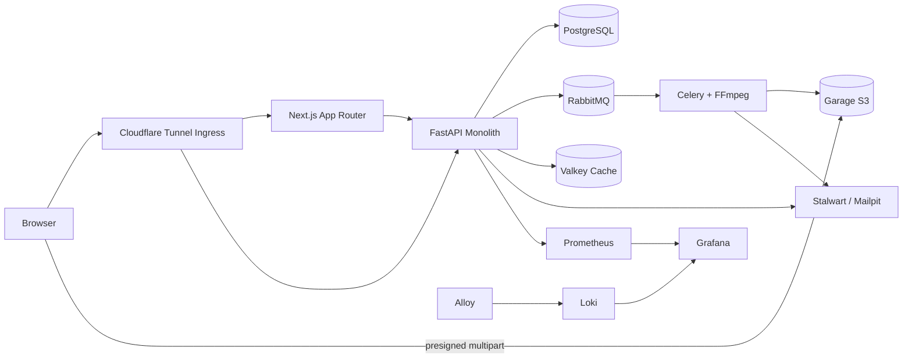

# Feed.io — Free, Open-Source Frame.io Alternative

> The self-hosted video review, frame-accurate annotation, and client approval workspace for creative agencies, video editors, and production teams. 100% free, private, and open-source.

<p align="center">
  <a href="https://github.com/khanhnkq/feed.io/stargazers"></a>
  <a href="https://github.com/khanhnkq/feed.io/network/members"></a>
  <a href="https://github.com/khanhnkq/feed.io/issues"></a>
  <a href="https://github.com/khanhnkq/feed.io/blob/main/LICENSE"></a>
</p>

<p align="center">
  <a href="#development-workflow-and-quality-gates"></a>
  <a href="infra/compose/compose.dev.yaml"></a>
  <a href="docs/PRODUCTION_DEPLOYMENT_GUIDE.md"></a>
  <a href="apps/backend"></a>
  <a href="apps/web"></a>
  <a href="https://github.com/khanhnkq/feed.io"></a>
</p>

Feed.io gives video production teams complete ownership of their review workflows. Keep your media, client comments, version stacks, and user data on your own infrastructure—without monthly per-seat SaaS fees or vendor lock-in.

## Feed.io vs. Frame.io Comparison

| Feature / Capability | Feed.io (Self-Hosted) | Frame.io (Adobe Cloud) |
|---|---|---|
| **Pricing & Licensing** | **100% Free & Open-Source (Apache 2.0)** | $15 – $25+ / user / month |
| **Data Ownership & Storage** | **Your S3 / Garage / On-Premise Disks** | Proprietary cloud storage |
| **Seat & User Limits** | **Unlimited creators, clients & reviewers** | Metered per creator seat |
| **Storage Capacity** | **Unlimited (scale with your own drives)** | Tiered storage quotas (250GB–1TB) |
| **Frame-Accurate Video Player** | Native HLS + timecode comment precision | Proprietary cloud player |
| **Media Version Stacks** | Side-by-side & version comparison player | Supported |
| **Client Review Links** | Password & expiry protected (no login needed) | Supported |
| **Network Security** | Zero public inbound ports (Cloudflare Tunnel) | Third-party public cloud SaaS |
| **White-Label / Customization** | Full control over Next.js frontend code | Restricted to Enterprise plans |

## Key Features

- **Frame-Accurate Timecode Review:** Scrub with frame precision, drop timecoded comments, and sketch annotations directly over video frames.
- **Media Version Stacks:** Group iterations into version stacks with side-by-side comparison playback to track revisions effortlessly.
- **No-Login Client Review Links:** Share private, password-protected presentation links with clients without forcing them to create accounts.
- **Direct S3 / Garage Multipart Uploads:** Upload multi-gigabyte ProRes and 4K source cuts directly to S3-compatible storage with chunked resilience.
- **Real-Time Collaboration:** Instant comment updates and status changes powered by Valkey Pub/Sub and WebSockets.
- **Built-in Platform Admin Panel (`/app/admin`):** Manage organizations, inspect tenant storage quotas, audit security logs, and monitor system health.
- **Zero-Inbound-Port Production Ingress:** Deploy securely with Cloudflare Tunnel—no open ports 80/443 on your host firewall.

## Architecture at a glance



PostgreSQL is authoritative; Valkey provides fast caching, rate limiting and real-time pub-sub; RabbitMQ coordinates asynchronous FFmpeg HLS transcode jobs; Garage S3 stores media files and chunks.

## Documentation Index

| Category | Guide / Document | Description |
|---|---|---|
| **Production** | [Production Deployment Guide](docs/PRODUCTION_DEPLOYMENT_GUIDE.md) | Cloudflare Tunnel, Zero Inbound Ports, UFW, Compose, DR |
| **Local Operations** | [Local Stack Runbook](docs/operations/local-stack.md) | Development stack, healthchecks, and testing walkthrough |
| **Storage** | [Garage Storage Guide](infra/garage/README.md) | S3 cluster layout, bucket management, and capacity |
| **Architecture** | [System Overview](docs/architecture/system-overview.md) | High-level system design and data-flow topology |
| **ADRs** | [ADR-0001: Modular Monolith](docs/adr/0001-modular-monolith.md) | Package structure and cross-module boundaries |
| | [ADR-0002: Tenant Isolation](docs/adr/0002-postgresql-tenant-isolation.md) | PostgreSQL row-level multitenancy and agency isolation |
| | [ADR-0003: OIDC BFF Sessions](docs/adr/0003-oidc-bff-cookie-session.md) | Cookie-based session management and token rotation |
| | [ADR-0004: Self-Hosted Auth](docs/adr/0004-self-hosted-saas-auth.md) | First-party authentication, Argon2id, and JWTs |
| | [ADR-0005: Context Vocabulary](docs/adr/0005-context-vocabulary.md) | Domain language definitions and bounded contexts |
| **Specifications** | [Engineering Standards](feed-io-engineering-standards.md) | Quality gates, 500-line limit, and architectural rules |
| | [Development Plan](feed-io-development-plan.md) | Milestones, roadmap, and implementation phases |
| | [Database Design Plan](feed-io-database-design-plan.md) | PostgreSQL schema, relations, and indexing strategy |
| | [Library Plan](feed-io-library-plan.md) | Technology and dependency evaluation criteria |
| | [Context Alignment Plan](feed-io-context-alignment-plan.md) | Bounded context boundaries and service responsibilities |
| | [Platform Admin Panel Plan](docs/ADMIN_PANEL_PLAN.md) | Governance, user management, quotas, and audit logs |
| | [API Gateway & Rate Limiting](docs/API_GATEWAY_AND_RATE_LIMIT_PLAN.md) | Valkey sliding-window rate limiter & RFC 7807 specs |
| | [Realtime & Notifications](docs/REALTIME_AND_NOTIFICATIONS_PLAN.md) | WebSocket collaboration and event dispatching |
| | [Project Progress](docs/PROJECT_PROGRESS.md) | Implementation tracking and completed deliverables |

## Technology stack

| Layer | Technologies |
|---|---|
| **Web Frontend** | Next.js 15 (App Router), React 19, TypeScript, TailwindCSS, TanStack Query |
| **Backend API** | FastAPI, Pydantic v2, SQLModel, SQLAlchemy 2, Alembic, uv |
| **Databases & Cache** | PostgreSQL 17, Valkey (Redis protocol) |
| **Jobs & Transcoding** | RabbitMQ 4, Celery, FFmpeg (HLS adaptive bitrate encoding) |
| **Media Storage** | Garage S3 Object Storage, Presigned Multipart Streaming |
| **Security & Ingress** | Cloudflare Tunnel (`cloudflared`), Argon2id, Short-lived JWTs, RFC 7807 Rate Limiting |
| **Observability** | Prometheus, Grafana, Grafana Alloy, Loki, GlitchTip |

## Quick start

### Prerequisites
- Docker 29+ with Compose v2.
- Node.js 22+ and Corepack (`pnpm`).
- Python 3.12+ and [`uv`](https://docs.astral.sh/uv/).

### 1. Clone and launch local stack

```bash
git clone https://github.com/khanhnkq/feed.io.git
cd feed.io
make bootstrap
make stack-up
```

`make stack-up` automatically generates a private local `.env`, runs database migrations, and boots all containers with healthcheck verification.

### 2. Access local services

| Service | URL | Default Access |
|---|---|---|
| **Feed.io Web Application** | `http://localhost:3000` (or via Cloudflare Tunnel) | Main Workspace Portal |
| **Platform Admin Panel** | `http://localhost:3000/app/admin` | Requires `super_admin` or `support` role |
| **FastAPI Swagger Docs** | `http://localhost:8000/docs` | Interactive OpenAPI documentation |
| **Storybook UI Catalog** | `http://localhost:6006` | Run `make storybook` |
| **Mailpit (Local Emails)** | `http://localhost:8025` | Verification and password reset inbox |
| **RabbitMQ Management** | `http://localhost:15672` | `guest` / `guest` |
| **Grafana Dashboards** | `http://localhost:3001` | Pre-provisioned metrics & logs |

### 3. Register and create your first workspace
Open `http://localhost:3000/register`, create an account, verify the email link received in Mailpit (`http://localhost:8025`), and complete onboarding to start your workspace. See the [Local Stack Runbook](docs/operations/local-stack.md) for testing details.

## Frequently Asked Questions (FAQ)

### Is Feed.io really a 100% free alternative to Frame.io?
Yes. Feed.io is fully open-source under the Apache 2.0 license. There are no artificial limits on users, projects, or storage. You can run it on your own VPS, cloud server, or on-premise hardware for only the cost of your hosting.

### Can I self-host Feed.io without opening ports on my firewall?
Yes. Feed.io natively supports **Cloudflare Tunnel (`cloudflared`)**. Your server establishes an outbound tunnel to Cloudflare Edge. You do not need to open port 80 or 443, and Cloudflare provides automatic SSL/TLS termination and DDoS mitigation. See the [Production Deployment Guide](docs/PRODUCTION_DEPLOYMENT_GUIDE.md).

### Do clients need to register to review videos?
No. You can create public or password-protected review share links with custom expiration dates. Clients can play the cut, pause, and leave frame-accurate comments without signing up.

## Repository structure

<!-- repository-tree:start -->
```text
feed.io/
├── .agents/
│   └── memory/
│       ├── MEMORY.md
│       └── tech-decisions.md
├── .forgejo/
│   └── workflows/
│       └── verify.yaml
├── .github/
│   ├── ISSUE_TEMPLATE/
│   │   ├── bug_report.yml
│   │   └── feature_request.yml
│   └── PULL_REQUEST_TEMPLATE.md
├── apps/
│   ├── backend/
│   │   ├── .import_linter_cache/
│   │   ├── migrations/
│   │   ├── src/
│   │   ├── tests/
│   │   ├── .env.example
│   │   ├── alembic.ini
│   │   ├── Dockerfile
│   │   ├── openapi.json
│   │   ├── pyproject.toml
│   │   └── uv.lock
│   └── web/
│       ├── .storybook/
│       ├── public/
│       ├── src/
│       ├── storybook-static/
│       ├── .env.example
│       ├── AGENTS.md
│       ├── CLAUDE.md
│       ├── debug-storybook.log
│       ├── Dockerfile
│       ├── eslint.config.mjs
│       ├── next-env.d.ts
│       ├── next.config.ts
│       ├── package.json
│       ├── postcss.config.mjs
│       ├── tsconfig.json
│       └── vitest.config.ts
├── docs/
│   ├── adr/
│   │   ├── 0001-modular-monolith.md
│   │   ├── 0002-postgresql-tenant-isolation.md
│   │   ├── 0003-oidc-bff-cookie-session.md
│   │   ├── 0004-self-hosted-saas-auth.md
│   │   └── 0005-context-vocabulary.md
│   ├── architecture/
│   │   └── system-overview.md
│   ├── operations/
│   │   └── local-stack.md
│   ├── ADMIN_PANEL_PLAN.md
│   ├── API_GATEWAY_AND_RATE_LIMIT_PLAN.md
│   ├── PHASE_8_PLAN.md
│   ├── PHASE_8A_PLAN.md
│   ├── PHASE_8B_PLAN.md
│   ├── PRODUCTION_DEPLOYMENT_GUIDE.md
│   ├── PROJECT_PROGRESS.md
│   └── REALTIME_AND_NOTIFICATIONS_PLAN.md
├── infra/
│   ├── alloy/
│   │   └── config.alloy
│   ├── compose/
│   │   ├── compose.dev.yaml
│   │   └── compose.prod.yaml
│   ├── garage/
│   │   ├── bootstrap.sh
│   │   ├── Dockerfile.init
│   │   ├── garage.toml
│   │   └── README.md
│   ├── grafana/
│   │   ├── dashboards/
│   │   └── provisioning/
│   ├── loki/
│   │   └── loki.yaml
│   ├── nginx/
│   │   └── nginx.dev.conf
│   ├── postgres/
│   │   └── init-databases.sql
│   ├── prometheus/
│   │   ├── alerts.yaml
│   │   └── prometheus.yaml
│   └── rabbitmq/
│       └── enabled_plugins
├── packages/
│   ├── api-client/
│   │   ├── src/
│   │   ├── eslint.config.mjs
│   │   ├── openapi.json
│   │   ├── orval.config.ts
│   │   ├── package.json
│   │   └── tsconfig.json
│   ├── eslint-config/
│   │   ├── base.mjs
│   │   ├── next.mjs
│   │   └── package.json
│   └── typescript-config/
│       ├── base.json
│       ├── library.json
│       ├── nextjs.json
│       └── package.json
├── scripts/
│   ├── backup-db.sh
│   ├── check-file-lines.sh
│   ├── ensure-local-env.sh
│   ├── ensure-prod-env.sh
│   ├── export_openapi.py
│   ├── generate-repository-tree.mjs
│   └── restore-db.sh
├── .dockerignore
├── .DS_Store
├── .editorconfig
├── .env.example
├── .gitignore
├── CHANGELOG.md
├── CODE_OF_CONDUCT.md
├── CONTRIBUTING.md
├── feed-io-context-alignment-plan.md
├── feed-io-database-design-plan.md
├── feed-io-development-plan.md
├── feed-io-engineering-standards.md
├── feed-io-library-plan.md
├── GOVERNANCE.md
├── LICENSE
├── llms.txt
├── Makefile
├── package.json
├── pnpm-lock.yaml
├── pnpm-workspace.yaml
├── README.md
├── SECURITY.md
├── SUPPORT.md
└── turbo.json
```
<!-- repository-tree:end -->

## Development workflow and quality gates

```bash
make lint       # backend/frontend lint, types and architectural constraints
make test       # pytest + Vitest full test suites
make test-integration # PostgreSQL tenant context and cross-agency isolation
make generate   # Regenerate TypeScript API client from OpenAPI contracts
make storybook  # Launch Storybook component catalog and visual testing
make verify     # Complete pre-push gate
```

All hand-written source files must remain $\le 500$ physical lines. Enforced automatically by `scripts/check-file-lines.sh` and documented in [Feed.io Engineering Standards](feed-io-engineering-standards.md).

## Production deployment and security

For production installations, follow the [Production Deployment Guide](docs/PRODUCTION_DEPLOYMENT_GUIDE.md):
- **Cloudflare Tunnel Ingress:** Zero inbound ports on host firewall (`compose.prod.yaml`).
- **Direct Edge Routing:** `cloudflared` proxies directly to Next.js (`web:3000`) and FastAPI (`api:8000`).
- **Production Build Mode:** Multi-stage container builds with non-root security.
- **Automated Validation & Backups:** Use [scripts/ensure-prod-env.sh](scripts/ensure-prod-env.sh) for secrets and [scripts/backup-db.sh](scripts/backup-db.sh) / [scripts/restore-db.sh](scripts/restore-db.sh) for 30-day rotating PostgreSQL dumps.

Report security vulnerabilities according to [SECURITY.md](SECURITY.md).

## Star History & Community Growth

If you find Feed.io valuable, please consider giving it a star on GitHub! It helps more video editors, creators, and creative agencies discover this free, self-hosted Frame.io alternative.

<p align="center">
  <a href="https://star-history.com/#khanhnkq/feed.io&Date">
    
  </a>
</p>

## Contributing and Governance

Contributions and architectural feedback are welcome:
- Follow [CONTRIBUTING.md](CONTRIBUTING.md) and the [Code of Conduct](CODE_OF_CONDUCT.md).
- Major architectural changes require an ADR. See [GOVERNANCE.md](GOVERNANCE.md) and [SUPPORT.md](SUPPORT.md).
- Version updates are documented in [CHANGELOG.md](CHANGELOG.md).

## License

Feed.io is licensed under the [Apache License 2.0](LICENSE).
