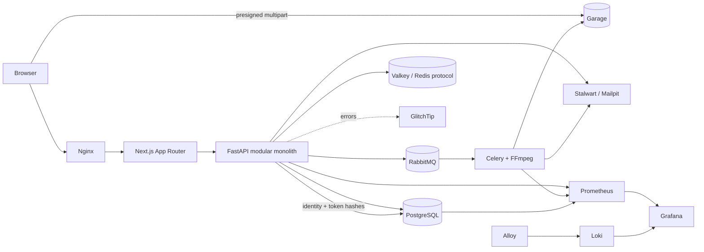

# Feed.io

> A self-hosted video review and approval workspace for agencies, built with FastAPI, PostgreSQL and Next.js.

Feed.io is an open-source learning project inspired by modern media-review platforms. It keeps identity, storage, queues, cache, mail and observability under your control—without requiring a managed cloud service.

**Project status:** early development. The foundation and project workspace vertical slice are implemented; upload, transcoding and review workflows are on the roadmap.

## Why Feed.io?

Creative teams should be able to upload a cut, collect frame-accurate feedback and get approval without scattering context across chat, email and generic file drives. Feed.io is designed for agencies with fewer than 1,000 initial users while retaining production-grade boundaries and operational practices.

## What works today

- FastAPI liveness plus PostgreSQL, Valkey, RabbitMQ and Garage readiness probes.
- Organization-scoped project create/list API backed by PostgreSQL.
- First-party SaaS registration, mandatory email verification, login, recovery and session revocation.
- Argon2id passwords, short-lived JWTs, rotating refresh-token hashes and HttpOnly + CSRF cookies.
- Next.js auth screens, protected project dashboard and create-project flow.
- OpenAPI → Orval → typed Axios + TanStack Query client generation.
- One-command local platform with PostgreSQL, Valkey, RabbitMQ, Garage, Mailpit, Nginx, GlitchTip and Grafana observability.
- Automatic Alembic schema migration before API and worker startup.
- Ruff, mypy, pytest, import-linter, ESLint and TypeScript quality gates.
- CI failure above 500 physical lines per hand-written source file.

## Roadmap

- [x] Monorepo and enterprise module boundaries.
- [x] Project workspace vertical slice.
- [x] Self-hosted registration, verify email, login/refresh/logout, recovery and session revocation.
- [ ] Organization/project administration UI and project-level RBAC matrix.
- [ ] Multipart upload directly to Garage.
- [ ] Celery/RabbitMQ + FFmpeg HLS processing.
- [ ] HLS review player, timecode comments and annotations.
- [ ] Socket.IO collaboration over Valkey Pub/Sub.
- [ ] Secure client share links and approval history.
- [x] Local metrics, logs and error-tracking services.
- [ ] Production backup, restore and recovery drills.

The detailed decisions live in [the development plan](feed-io-development-plan.md), [the library plan](feed-io-library-plan.md) and [the database design plan](feed-io-database-design-plan.md).

## Architecture at a glance



Feed.io starts as a modular monolith. API, worker and scheduler are independent processes from one Python package. PostgreSQL is authoritative; Valkey is ephemeral cache/pub-sub; RabbitMQ is the durable job broker; Garage owns media objects.

### Backend dependency direction

```text
presentation ───────→ application ───────→ domain
infrastructure ─────→ application ports ─→ domain
bootstrap ──────────→ presentation + infrastructure
```

- Domain code cannot import FastAPI, SQLModel, Celery or storage clients.
- Application code owns use cases and small `Protocol` ports.
- Infrastructure implements I/O adapters.
- Presentation translates HTTP/WebSocket messages only.
- Other modules import only from `modules/<name>/public.py`.

### Frontend dependency direction

Routes only compose feature modules. Client components live at the lowest practical leaf. Components use generated React Query hooks; only the generated client/custom mutator imports Axios.

Read [ADR-0001](docs/adr/0001-modular-monolith.md), [ADR-0002](docs/adr/0002-postgresql-tenant-isolation.md), [ADR-0004](docs/adr/0004-self-hosted-saas-auth.md), [the system overview](docs/architecture/system-overview.md) and [engineering standards](feed-io-engineering-standards.md) before changing boundaries.

## Technology stack

| Area | Technology |
|---|---|
| Web | Next.js App Router, React, TypeScript |
| API | FastAPI, Pydantic, SQLModel/SQLAlchemy, Alembic |
| Contract | OpenAPI, Orval, Axios, TanStack Query |
| Database | PostgreSQL |
| Cache/realtime | Valkey (Redis-compatible protocol) |
| Background jobs | RabbitMQ, Celery |
| Media | Garage S3 API, FFmpeg/FFprobe, HLS, Nginx cache |
| Identity | First-party FastAPI auth, Argon2id, JWT + PostgreSQL sessions |
| Development mail | Mailpit |
| Production mail | Stalwart Mail Server |
| Metrics | Prometheus, PostgreSQL exporter, RabbitMQ exporter |
| Logs | Grafana Alloy, Loki |
| Dashboards | Grafana |
| Error tracking | GlitchTip |
| Tooling | pnpm workspaces, Turborepo, uv |

## Quick start

### Prerequisites

- Docker 29+ with Compose v2.
- Node.js 22+ and Corepack.
- Python 3.12+.
- [`uv`](https://docs.astral.sh/uv/).

### 1. Clone and configure

```bash
git clone https://github.com/khanhnkq/feed.io.git
cd feed.io
```

`make stack-up` creates a private, git-ignored `.env` with random local secrets when one does not exist. Copy `.env.example` only when you want to manage the values yourself. Never commit `.env`.

### 2. Install dependencies

```bash
make bootstrap
```

### 3. Run everything in containers

```bash
make stack-up
```

This builds the apps, starts the full platform and waits for healthchecks. Re-running it is safe. Use `make stack-status` to inspect services and `make infra-down` to stop containers while retaining data volumes.

Open:

| Service | URL |
|---|---|
| Feed.io through Nginx | `http://localhost:8088` |
| Web directly | `http://localhost:3000` |
| FastAPI docs | `http://localhost:8000/docs` |
| RabbitMQ management | `http://localhost:15672` |
| Mailpit | `http://localhost:8025` |
| Garage S3 API | `http://localhost:3900` |
| GlitchTip | `http://localhost:8001` |
| Prometheus | `http://localhost:9090` |
| Grafana | `http://localhost:3001` |
| Loki API | `http://localhost:3100` |
| Alloy UI | `http://localhost:12345` |

### 4. Run apps on the host

Start infrastructure with `make infra-up`, then run these in separate terminals:

```bash
make api
make web
```

Apply the first migration before using the PostgreSQL repository:

```bash
cd apps/backend
uv run alembic upgrade head
```

Open `http://localhost:8088/register`, create an account, then read the verification message at `http://localhost:8025`. Protected API calls require a valid session plus `X-Organization-Id`; the API verifies active membership instead of trusting the header. See the [local stack runbook](docs/operations/local-stack.md) for the complete test flow.

## Configuration

| Variable | Purpose | Development default |
|---|---|---|
| `FEEDIO_DATABASE_URL` | Async PostgreSQL connection | Local `feedio` database |
| `FEEDIO_CORS_ORIGINS` | Allowed browser origins | `http://localhost:3000` |
| `NEXT_PUBLIC_API_URL` | Browser-visible API base URL | `http://localhost:8088` |
| `FEEDIO_VALKEY_URL` | Redis-compatible cache connection | Local Valkey |
| `FEEDIO_RABBITMQ_URL` | AMQP broker connection | Local RabbitMQ |
| `GARAGE_RPC_SECRET` | Garage cluster secret | Randomly generated |
| `GARAGE_ADMIN_TOKEN` | Garage admin API token | Randomly generated |
| `AUTH_JWT_SECRET` | Container JWT signing secret | Randomly generated |
| `FEEDIO_AUTH_JWT_SECRET` | Host API JWT signing secret | Randomly generated |
| `FEEDIO_AUTH_ACCESS_TTL_SECONDS` | Access-cookie lifetime | `300` |
| `FEEDIO_AUTH_REFRESH_TTL_SECONDS` | Refresh session lifetime | `2592000` |
| `FEEDIO_AUTH_COOKIE_SECURE` | Require HTTPS for auth cookies | `false` locally |
| `FEEDIO_SMTP_HOST` / `FEEDIO_SMTP_PORT` | Self-hosted SMTP transport | Mailpit `1025` |

See [.env.example](.env.example) for the complete local set. Production secrets must use SOPS + age and must never be committed in plaintext.

## API and generated client

FastAPI publishes OpenAPI at `/openapi.json`. Generate the checked-in TypeScript client after any contract change:

```bash
make generate
```

The flow is:

```text
SQLModel/Pydantic → FastAPI OpenAPI → Orval → Axios functions + React Query hooks + types
```

Do not manually edit `packages/api-client/src/generated/` or duplicate API interfaces in the web app. CI is expected to regenerate the client and fail when the working tree changes.

Current endpoints:

| Method | Path | Description |
|---|---|---|
| `GET` | `/api/v1/health/live` | Process liveness |
| `GET` | `/api/v1/health/ready` | PostgreSQL, Valkey, RabbitMQ and Garage readiness |
| `POST` | `/api/v1/auth/register` | Create pending account and send verification mail |
| `POST` | `/api/v1/auth/verify-email` | Activate account and create owner workspace |
| `POST` | `/api/v1/auth/resend-verification` | Send a replacement verification link |
| `POST` | `/api/v1/auth/login` | Verify credentials and set HttpOnly cookies |
| `POST` | `/api/v1/auth/refresh` | Rotate access and refresh cookies |
| `POST` | `/api/v1/auth/logout` | Revoke refresh token and clear cookies |
| `POST` | `/api/v1/auth/forgot-password` | Send a generic recovery response and email |
| `POST` | `/api/v1/auth/reset-password` | Replace password and revoke all sessions |
| `GET` | `/api/v1/auth/me` | Return the current verified user |
| `GET` | `/api/v1/auth/sessions` | List active account sessions |
| `DELETE` | `/api/v1/auth/sessions/{id}` | Revoke one owned session |
| `GET` | `/api/v1/projects` | List projects in an organization |
| `POST` | `/api/v1/projects` | Create a project |

## Repository structure

This section is generated from the real filesystem. Run `pnpm docs:tree` after structural changes; do not edit the block by hand.

<!-- repository-tree:start -->
```text
feed.io/
├── .forgejo/
│   └── workflows/
│       └── verify.yaml
├── .github/
│   ├── ISSUE_TEMPLATE/
│   │   ├── bug_report.yml
│   │   └── feature_request.yml
│   └── PULL_REQUEST_TEMPLATE.md
├── apps/
│   ├── backend/
│   │   ├── .import_linter_cache/
│   │   ├── migrations/
│   │   ├── src/
│   │   ├── tests/
│   │   ├── alembic.ini
│   │   ├── Dockerfile
│   │   ├── openapi.json
│   │   ├── pyproject.toml
│   │   └── uv.lock
│   └── web/
│       ├── public/
│       ├── src/
│       ├── AGENTS.md
│       ├── CLAUDE.md
│       ├── Dockerfile
│       ├── eslint.config.mjs
│       ├── next-env.d.ts
│       ├── next.config.ts
│       ├── package.json
│       ├── postcss.config.mjs
│       └── tsconfig.json
├── docs/
│   ├── adr/
│   │   ├── 0001-modular-monolith.md
│   │   ├── 0002-postgresql-tenant-isolation.md
│   │   ├── 0003-oidc-bff-cookie-session.md
│   │   └── 0004-self-hosted-saas-auth.md
│   ├── architecture/
│   │   └── system-overview.md
│   └── operations/
│       └── local-stack.md
├── infra/
│   ├── alloy/
│   │   └── config.alloy
│   ├── compose/
│   │   └── compose.dev.yaml
│   ├── garage/
│   │   ├── bootstrap.sh
│   │   ├── Dockerfile.init
│   │   ├── garage.toml
│   │   └── README.md
│   ├── grafana/
│   │   ├── dashboards/
│   │   └── provisioning/
│   ├── loki/
│   │   └── loki.yaml
│   ├── nginx/
│   │   └── nginx.dev.conf
│   ├── postgres/
│   │   └── init-databases.sql
│   ├── prometheus/
│   │   ├── alerts.yaml
│   │   └── prometheus.yaml
│   └── rabbitmq/
│       └── enabled_plugins
├── packages/
│   ├── api-client/
│   │   ├── src/
│   │   ├── eslint.config.mjs
│   │   ├── orval.config.ts
│   │   ├── package.json
│   │   └── tsconfig.json
│   ├── eslint-config/
│   │   ├── base.mjs
│   │   ├── next.mjs
│   │   └── package.json
│   └── typescript-config/
│       ├── base.json
│       ├── library.json
│       ├── nextjs.json
│       └── package.json
├── scripts/
│   ├── check-file-lines.sh
│   ├── ensure-local-env.sh
│   ├── export_openapi.py
│   └── generate-repository-tree.mjs
├── .dockerignore
├── .editorconfig
├── .env.example
├── .gitignore
├── CHANGELOG.md
├── CODE_OF_CONDUCT.md
├── CONTRIBUTING.md
├── feed-io-database-design-plan.md
├── feed-io-development-plan.md
├── feed-io-engineering-standards.md
├── feed-io-library-plan.md
├── GOVERNANCE.md
├── LICENSE
├── llms.txt
├── Makefile
├── package.json
├── pnpm-lock.yaml
├── pnpm-workspace.yaml
├── README.md
├── SECURITY.md
├── SUPPORT.md
└── turbo.json
```
<!-- repository-tree:end -->

## Development workflow

1. Pick or create a Linear issue.
2. Branch from `main` as `<user>/<issue>-short-description`.
3. Keep changes inside one business module and its public API.
4. Regenerate OpenAPI client when backend contracts change.
5. Add unit/contract/integration coverage appropriate to the change.
6. Run `make verify` before opening a pull request.
7. Update README, ADR or runbook when behavior or operations change.

### Quality commands

```bash
make lint       # backend/frontend lint, types and architecture
make test       # pytest + Vitest
make test-integration # PostgreSQL tenant context and cross-agency isolation
make generate   # OpenAPI and Orval output
make verify     # full pre-push gate
```

All hand-written files must stay at or below 500 physical lines. Generated files, lockfiles and migrations are the only explicit exceptions. The full rule is documented in [Feed.io Engineering Standards](feed-io-engineering-standards.md).

## Testing strategy

- **Unit:** framework-free domain rules and application use cases.
- **Contract:** FastAPI request/response shapes and generated OpenAPI.
- **Integration:** PostgreSQL, Valkey, RabbitMQ and Garage through containers.
- **Frontend:** Vitest and Testing Library for feature components.
- **E2E:** Playwright for login → upload → transcode → comment → approve/share.
- **Recovery:** backup restore and media-node failure drills before production.

## Self-hosting and security

The development Compose file is not production configuration. Before deployment:

- Replace every development credential.
- Terminate TLS at Nginx and restrict admin ports.
- Run Garage with three nodes/zones.
- Use a high-entropy JWT secret, SMTP authentication, TLS-only cookies and trusted proxy headers.
- Configure Nginx plus Valkey-backed rate limits for registration, login and recovery endpoints.
- Enable PostgreSQL PITR and off-host media/config backups.
- Forward the included Prometheus/Loki data and alerts to production-grade storage and notification channels.

Report vulnerabilities through the process in [SECURITY.md](SECURITY.md). Never include secrets, access tokens, share links or presigned URLs in issues or logs.

## Contributing

Contributions, architectural discussion and documentation fixes are welcome. Start with [CONTRIBUTING.md](CONTRIBUTING.md), follow the [Code of Conduct](CODE_OF_CONDUCT.md), and use the issue templates before opening a large pull request.

Good first contributions include tests, documentation, accessibility fixes, developer tooling and small use cases already present in the roadmap. New infrastructure dependencies require an ADR and must remain self-hostable.

## Governance and support

The maintainer reviews roadmap, architecture and security-sensitive changes. Decisions are recorded in ADRs so contributors can challenge the reasoning, not guess at unwritten rules. See [GOVERNANCE.md](GOVERNANCE.md) and [SUPPORT.md](SUPPORT.md).

## License

Licensed under the [Apache License 2.0](LICENSE). Contributions are accepted under the same license.
