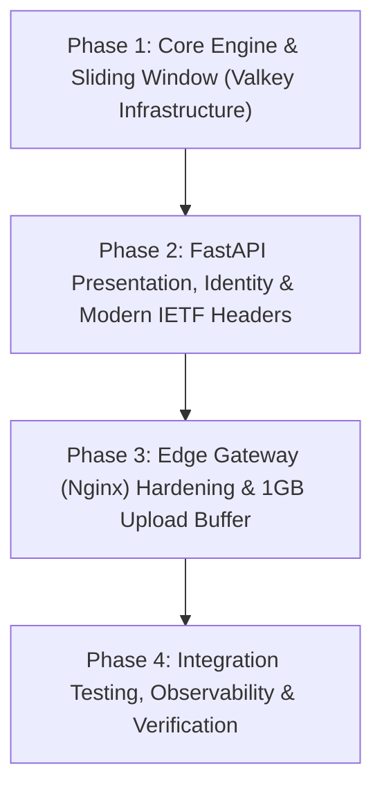
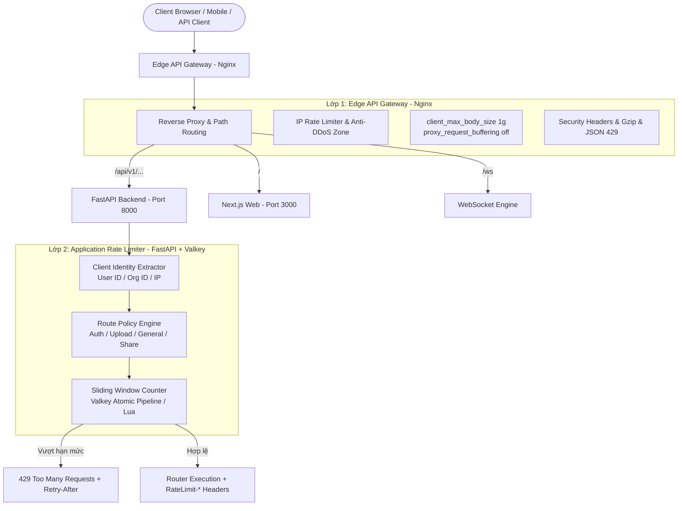

# Kế Hoạch Triển Khai Toàn Diện: API Gateway & Rate Limiting (Feed.io)

Tài liệu này quy định chi tiết kiến trúc, chính sách hạn mức và lộ trình triển khai 4 Phase cho **Edge Gateway** và hệ thống **Rate Limiting phân tầng (Application Layer với Valkey)** cho nền tảng cộng tác video Feed.io.

> [!IMPORTANT]
> **Cập nhật Kiến trúc Ingress Production:** Trên môi trường Production, lớp Edge Gateway sử dụng **Cloudflare Tunnel (`cloudflared`)** với kiến trúc Zero Public Inbound Ports (không cần container Nginx trên máy chủ production). Toàn bộ bảo vệ DDoS, WAF và chứng chỉ TLS 1.3 được xử lý tại Cloudflare Edge kết hợp cùng Application Rate Limiter (FastAPI + Valkey).

---

## 🗺️ Lộ Trình Tổng Quan 4 Phase



---

## 🛡️ Mô Hình Kiến Trúc Phòng Thủ 2 Lớp (Defense-in-Depth)



---

## 📊 Ma Trận Hạn Mức (Production vs Development)

| Nhóm Endpoint | Phạm vi (Scope) | Hạn mức Production | Hạn mức Dev / Test | Mục đích bảo vệ |
|---|---|---|---|---|
| **Authentication**<br/>`/api/v1/auth/login`<br/>`/api/v1/auth/register`<br/>`/api/v1/auth/forgot-password` | Theo IP | **10 requests / phút**<br/>Burst: 5 | **1,000 requests / phút** | Chống Brute Force, credential stuffing, spam đăng ký bot và spam mailer |
| **Media Upload**<br/>`/api/v1/media/upload`<br/>`/api/v1/media/multipart/*`<br/>`/api/v1/profiles/me/avatar` | Theo User ID / Org ID | **30 requests / phút**<br/>Burst: 10 | **2,000 requests / phút** | Bảo vệ băng thông S3 Garage và tránh quá tải worker transcode |
| **Public Share Links**<br/>`/api/v1/share-links/{slug}/*` | Theo IP | **60 requests / phút** | **2,000 requests / phút** | Ngăn bot cào quét media preview công khai |
| **General API**<br/>CRUD Projects, Folders, Comments, Profiles | Theo User ID (nếu auth) hoặc IP (nếu public) | **200 requests / phút** | **5,000 requests / phút** | Đảm bảo tính khả dụng (High Availability) cho người dùng bình thường |

---

## 📋 Chi Tiết Từng Phase Triển Khai

### 🚀 Phase 1: Core Engine & Thuật Toán Sliding Window (Valkey Infrastructure)

#### 1. Mục tiêu
- Xây dựng engine tính toán hạn mức theo cửa sổ trượt (Sliding Window Counter) phân tán trên cụm Valkey/Redis.
- Đảm bảo độ chính xác theo mili-giây, chống lỗi burst tại biên và có cơ chế chịu lỗi fail-open.

#### 2. Chi tiết kỹ thuật Backend (`apps/backend`)
- **Cấu hình Settings** (`src/feedio/bootstrap/config.py`):
  - `rate_limit_enabled: bool = True`
  - `rate_limit_auth_rpm: int = 10`
  - `rate_limit_upload_rpm: int = 30`
  - `rate_limit_general_rpm: int = 200`
  - `rate_limit_dev_multiplier: int = 100` (ở môi trường `development`, tự động nhân hạn mức lên 100 lần).
- **Engine Valkey** (`src/feedio/shared/infrastructure/rate_limit.py`):
  - Tạo class `ValkeySlidingWindowRateLimiter`.
  - Sử dụng cấu trúc Sorted Set Valkey (`ZADD`, `ZREMRANGEBYSCORE`, `ZCARD`, `EXPIRE`) thực thi qua **atomic pipeline**:
    - Xóa các timestamp cũ ngoài window: `ZREMRANGEBYSCORE key 0 (now - window)`
    - Đếm số phần tử hiện tại: `ZCARD key`
    - Nếu count < limit: thêm timestamp hiện tại `ZADD key now now` và set `EXPIRE key window`
    - Tính `remaining = max(0, limit - count - 1)`
    - Tính `reset_seconds = window` hoặc thời gian chênh lệch với phần tử cũ nhất.
  - **Fail-Open Resilience**: Nếu Valkey bị mất kết nối đột ngột, ghi log warning và trả về `allowed=True` để dịch vụ không bị sập theo.

#### 3. Kiểm thử Phase 1
- Tạo `tests/unit/test_rate_limiter.py`:
  - Test thuật toán sliding window với Fake Valkey.
  - Test reset thời gian trượt và tính toán remaining.
  - Test fail-open khi Valkey ném ngoại lệ.

---

### 🚀 Phase 2: FastAPI Presentation, Định Danh & Header Chuẩn IETF

#### 1. Mục tiêu
- Xây dựng tầng FastAPI Dependency và Middleware nhận diện danh tính khách gọi, áp dụng chính sách theo từng router và xuất các HTTP Header chuẩn IETF Draft RFC.

#### 2. Chi tiết kỹ thuật Backend (`apps/backend`)
- **FastAPI Dependency & Identity Extraction** (`src/feedio/shared/presentation/rate_limit.py`):
  - Hàm dependency `rate_limit(scope: str, limit_rpm: int, window_seconds: int = 60)`.
  - Phân giải định danh đa tầng:
    - **Người dùng đã đăng nhập**: Trích xuất `user:{user.id}` (hoặc `org:{org.id}`).
    - **Khách chưa đăng nhập**: Trích xuất `ip:{client_ip}` (hỗ trợ đọc `X-Forwarded-For` từ Nginx / reverse proxy).
- **Bộ Header Chuẩn Hiện Đại & Phản Hồi 429**:
  - Chèn vào Response các header IETF Draft:
    - `RateLimit-Limit: <limit>`
    - `RateLimit-Remaining: <remaining>`
    - `RateLimit-Reset: <reset_seconds>`
  - Khi vượt quá hạn mức, ném `HTTPException(status_code=429)` với header `Retry-After: <retry_after>` và body chuẩn Problem Details:
    ```json
    {
      "type": "https://feed.io/errors/rate-limit-exceeded",
      "title": "Rate Limit Exceeded",
      "status": 429,
      "detail": "Hạn mức yêu cầu đã vượt quá giới hạn. Vui lòng thử lại sau 25 giây.",
      "code": "RATE_LIMIT_EXCEEDED",
      "retry_after": 25
    }
    ```
- **Wiring vào Router** (`src/feedio/entrypoints/api.py`):
  - Gắn rate limit vào:
    - Router xác thực: `/api/v1/auth/login`, `/api/v1/auth/register`, `/api/v1/auth/forgot-password`
    - Router media: `/api/v1/media/upload`, `/api/v1/media/multipart/*`
    - Router profile avatar: `/api/v1/profiles/me/avatar`
    - Router share links công khai: `/api/v1/share-links/{slug}/*`

---

### 🚀 Phase 3: Edge Gateway (Nginx) Hardening & Tải File 1GB

#### 1. Mục tiêu
- Nâng cấp Nginx đóng vai trò là cửa ngõ bên ngoài (Edge Gateway) vững chắc, hỗ trợ upload video dung lượng lớn (1GB) mượt mà và chống tấn công càn quét từ bên ngoài.

#### 2. Chi tiết kỹ thuật Infra (`infra/nginx`)
- **Cập nhật `infra/nginx/nginx.dev.conf`**:
  - **Tải file 1GB**:
    ```nginx
    client_max_body_size 1g;
    client_body_buffer_size 128k;
    proxy_request_buffering off;  # Streaming trực tiếp lên backend/S3, không chiếm RAM Nginx
    proxy_read_timeout 600s;
    proxy_send_timeout 600s;
    ```
  - **Lớp chắn DDoS / Brute-force IP**:
    ```nginx
    limit_req_zone $binary_remote_addr zone=edge_api_limit:10m rate=50r/s;
    limit_req_zone $binary_remote_addr zone=edge_auth_limit:10m rate=20r/m;
    ```
  - **Định tuyến chuyên biệt**:
    - Location `/api/`: Chuyển tiếp tới backend, áp dụng zone giới hạn kèm burst.
    - Location `/ws`: Cấu hình WebSocket Upgrade (`$http_upgrade`, `$connection_upgrade`).
    - Location `/`: Chuyển tiếp Next.js frontend.
  - **Custom Error Page JSON cho 429**:
    - Cấu hình Nginx trả về payload JSON khi kích hoạt rate limit tầng Edge thay vì trang HTML mặc định.

---

### 🚀 Phase 4: Kiểm Thử Tích Hợp, Observability & Đo Kiểm

#### 1. Mục tiêu
- Xác thực toàn bộ hệ thống bằng integration test trên môi trường Docker thực tế và thu thập metrics giám sát.

#### 2. Chi tiết kỹ thuật
- **Integration Tests (Live Valkey)**:
  - Tạo `apps/backend/tests/integration/test_rate_limit_integration.py`:
    - Kiểm thử gửi liên tiếp N requests vượt hạn mức và kiểm tra nhận đúng HTTP 429.
    - Kiểm tra sự xuất hiện đầy đủ của các header `RateLimit-*` và `Retry-After`.
    - Kiểm tra phục hồi tự động khi qua khỏi cửa sổ thời gian trượt.
- **Prometheus Metrics** (`src/feedio/shared/presentation/metrics.py`):
  - Tích hợp metric `feedio_rate_limit_exceeded_total(scope, client_type)`.
- **Đo kiểm End-to-End**:
  - Khởi động stack qua Nginx Gateway (`http://localhost:8088`).
  - Gửi tải mô phỏng kiểm tra cả 2 lớp Edge và Application.

---

## 📌 Checklist Tiến Độ Thực Hiện

- [x] **Phase 1: Core Engine & Thuật Toán Sliding Window**
  - [x] Thêm cấu hình Rate Limit & Dev Multiplier vào `config.py`
  - [x] Triển khai `ValkeySlidingWindowRateLimiter` tại `shared/infrastructure/rate_limit.py`
  - [x] Viết unit tests tại `tests/unit/test_rate_limiter.py`
  - [x] Chạy `pytest` xác minh Phase 1 pass 100%
- [x] **Phase 2: FastAPI Presentation, Identity & Modern IETF Headers**
  - [x] Triển khai `rate_limit` dependency tại `shared/presentation/rate_limit.py`
  - [x] Bổ sung các header `RateLimit-*` và phản hồi 429 chuẩn RFC
  - [x] Gắn rate limit vào các router nhạy cảm trong `api.py`
  - [x] Viết router tests kiểm tra các headers và mã 429
- [x] **Phase 3: Edge Gateway (Nginx) Hardening & 1GB Upload Buffer**
  - [x] Cập nhật `infra/nginx/nginx.dev.conf` với `client_max_body_size 1g;`
  - [x] Thêm `proxy_request_buffering off;` và streaming timeouts
  - [x] Cấu hình `limit_req_zone` cho API và Auth
  - [x] Cấu hình custom JSON error cho HTTP 429
- [x] **Phase 4: Kiểm Thử Tích Hợp, Observability & Đo Kiểm**
  - [x] Viết integration test `test_rate_limit_integration.py` với Valkey thực tế
  - [x] Thêm Prometheus metric `feedio_rate_limit_exceeded_total`
  - [x] Chạy `make test-integration` và kiểm tra Nginx E2E
