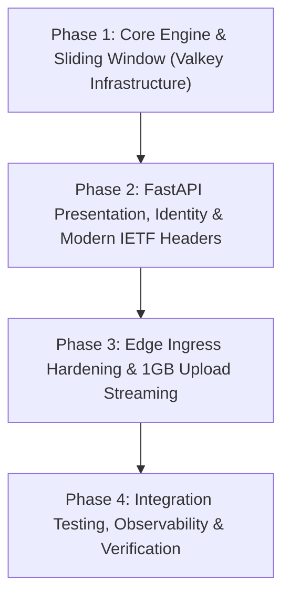
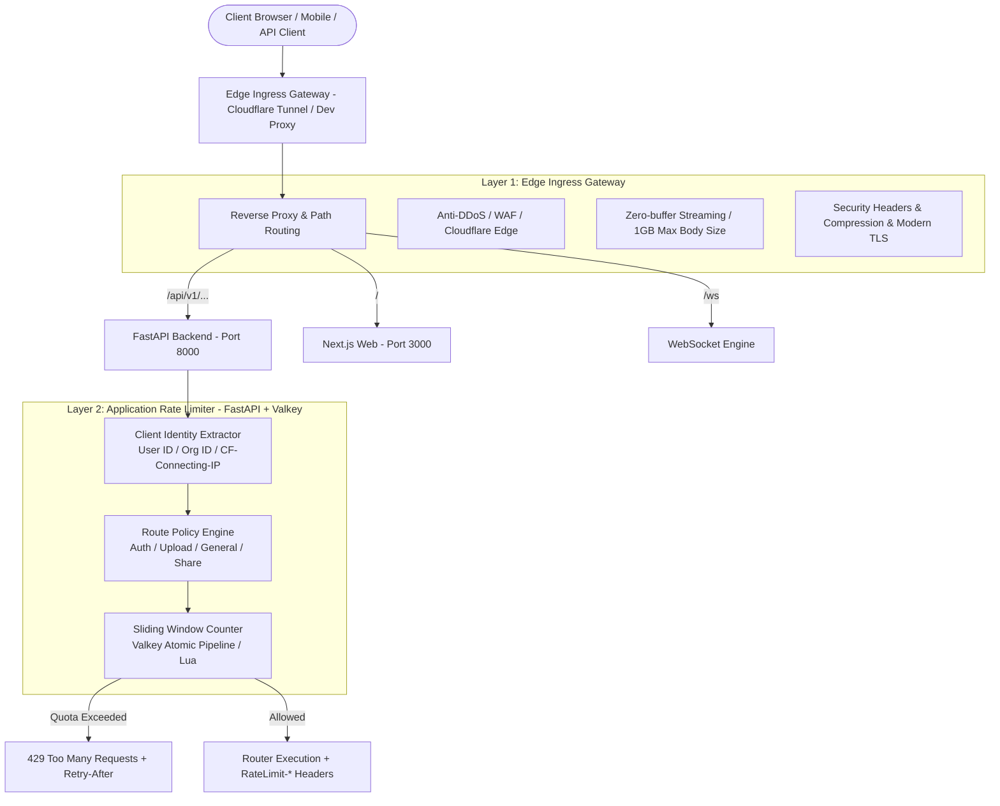

# API Gateway & Rate Limiting Architecture Plan (Feed.io)

This document provides the architectural specification, quota policies, and 4-phase delivery roadmap for the **Edge Gateway** and tiered **Application-Layer Rate Limiting (Valkey)** system for the Feed.io video collaboration platform.

> [!IMPORTANT]
> **Production Ingress Architecture Notice:** In production environments, the Edge Gateway layer utilizes **Cloudflare Tunnel (`cloudflared`)** under a Zero Public Inbound Ports architecture (eliminating the need for an Nginx container on production hosts). DDoS mitigation, WAF, and TLS 1.3 termination occur at Cloudflare's Edge, in tandem with the application rate limiter (FastAPI + Valkey). Nginx configurations are retained for optional local development environments.

---

## 🗺️ 4-Phase Delivery Roadmap



---

## 🛡️ Defense-in-Depth Architecture



---

## 📊 Rate Limit Policy Matrix (Production vs Development)

| Endpoint Category | Identity Scope | Production Limit | Dev / Test Limit | Protection Objective |
|---|---|---|---|---|
| **Authentication**<br/>`/api/v1/auth/login`<br/>`/api/v1/auth/register`<br/>`/api/v1/auth/forgot-password` | By IP (`CF-Connecting-IP` / Client IP) | **10 requests / min**<br/>Burst: 5 | **1,000 requests / min** | Mitigate brute-force credential stuffing, bot registrations, and emailer abuse |
| **Media Upload**<br/>`/api/v1/media/upload`<br/>`/api/v1/media/multipart/*`<br/>`/api/v1/profiles/me/avatar` | By User ID / Org ID | **30 requests / min**<br/>Burst: 10 | **2,000 requests / min** | Protect S3 Garage bandwidth and prevent transcode worker saturation |
| **Public Share Links**<br/>`/api/v1/share-links/{slug}/*` | By IP | **60 requests / min** | **2,000 requests / min** | Prevent automated scraping of public review links |
| **General API**<br/>CRUD Projects, Folders, Comments, Profiles | By User ID (auth) or IP (anonymous) | **200 requests / min** | **5,000 requests / min** | Ensure high availability and fair service distribution |

---

## 📋 Phase Breakdown

### 🚀 Phase 1: Core Engine & Sliding Window Algorithm (Valkey Infrastructure)

#### 1. Objectives
- Implement a distributed Sliding Window Counter rate-limiting engine on Valkey/Redis.
- Ensure sub-millisecond precision, eliminate border-burst anomalies, and support fail-open resilience.

#### 2. Backend Implementation (`apps/backend`)
- **Configuration** (`src/feedio/bootstrap/config.py`):
  - `rate_limit_enabled: bool = True`
  - `rate_limit_auth_rpm: int = 10`
  - `rate_limit_upload_rpm: int = 30`
  - `rate_limit_general_rpm: int = 200`
  - `rate_limit_dev_multiplier: int = 100` (automatically scales limits by 100x in `development`).
- **Valkey Engine** (`src/feedio/shared/infrastructure/rate_limit.py`):
  - Implement `ValkeySlidingWindowRateLimiter`.
  - Utilize Valkey Sorted Sets (`ZADD`, `ZREMRANGEBYSCORE`, `ZCARD`, `EXPIRE`) through an **atomic pipeline**:
    - Purge expired timestamps: `ZREMRANGEBYSCORE key 0 (now - window)`
    - Count current entries: `ZCARD key`
    - If count < limit: append timestamp `ZADD key now now` and refresh TTL `EXPIRE key window`
    - Calculate remaining quota: `remaining = max(0, limit - count - 1)`
    - Compute `reset_seconds = window` or delta relative to oldest entry in window.
  - **Fail-Open Resilience**: If Valkey experiences connection failure, emit warning log and allow request (`allowed=True`) to prevent cascading downtime.

#### 3. Verification
- `tests/unit/test_rate_limiter.py`:
  - Unit test sliding window calculations using fake Valkey.
  - Verify timestamp expiration and remaining quota calculations.
  - Verify fail-open behavior upon infrastructure exceptions.

---

### 🚀 Phase 2: FastAPI Presentation, Identity & Modern IETF Headers

#### 1. Objectives
- Build FastAPI dependency and middleware to identify caller identity, enforce per-route policies, and return IETF Draft RFC rate-limiting headers.

#### 2. Backend Implementation (`apps/backend`)
- **FastAPI Dependency & Identity Resolution** (`src/feedio/shared/presentation/rate_limit.py`):
  - Dependency generator `rate_limit(scope: str, limit_rpm: int, window_seconds: int = 60)`.
  - Multi-tiered identity resolution:
    - **Authenticated User**: Resolve `user:{user.id}` (or `org:{org.id}`).
    - **Anonymous Visitor**: Resolve `ip:{client_ip}` (prioritizing `CF-Connecting-IP`, falling back to `X-Forwarded-For`).
- **Standard HTTP Headers & 429 Response Format**:
  - Attach standard IETF Draft headers:
    - `RateLimit-Limit: <limit>`
    - `RateLimit-Remaining: <remaining>`
    - `RateLimit-Reset: <reset_seconds>`
  - When quota is exceeded, raise `HTTPException(status_code=429)` with `Retry-After: <retry_after>` and RFC 7807 Problem Details:
    ```json
    {
      "type": "https://feed.io/errors/rate-limit-exceeded",
      "title": "Rate Limit Exceeded",
      "status": 429,
      "detail": "Request quota exceeded. Please retry after 25 seconds.",
      "code": "RATE_LIMIT_EXCEEDED",
      "retry_after": 25
    }
    ```
- **Router Integration** (`src/feedio/entrypoints/api.py`):
  - Enforce rate limiting across:
    - Auth routes: `/api/v1/auth/login`, `/api/v1/auth/register`, `/api/v1/auth/forgot-password`
    - Media upload routes: `/api/v1/media/upload`, `/api/v1/media/multipart/*`
    - Avatar upload: `/api/v1/profiles/me/avatar`
    - Public share links: `/api/v1/share-links/{slug}/*`

---

### 🚀 Phase 3: Edge Ingress Hardening & 1GB Upload Streaming

#### 1. Objectives
- Ensure ingress edge supports 1GB video uploads with streaming proxying (no disk/memory buffering bottlenecks) and basic IP connection throttling.

#### 2. Implementation
- **Local Dev Proxy Config (`infra/nginx/nginx.dev.conf`)**:
  - `client_max_body_size 1g;`
  - `proxy_request_buffering off;` (direct streaming to backend/S3 to conserve proxy RAM)
  - `proxy_read_timeout 600s; proxy_send_timeout 600s;`
  - Dev rate limit zones and custom JSON 429 error responses.
- **Production Edge (Cloudflare Tunnel)**:
  - Tunnel ingress handles edge SSL termination, DDoS filtering, and forwards traffic directly to `web:3000` and `api:8000`.

---

### 🚀 Phase 4: Integration Testing, Observability & Verification

#### 1. Objectives
- Validate end-to-end functionality via integration tests on live Docker services and verify Prometheus metrics.

#### 2. Implementation
- **Integration Tests (Live Valkey)**:
  - `apps/backend/tests/integration/test_rate_limit_integration.py`:
    - Simulate N requests exceeding quota and assert HTTP 429 response.
    - Validate presence of `RateLimit-*` and `Retry-After` headers.
    - Verify automatic recovery after window expiration.
- **Prometheus Metrics** (`src/feedio/shared/presentation/metrics.py`):
  - Metric: `feedio_rate_limit_exceeded_total(scope, client_type)`.
- **End-to-End Verification**:
  - Validate end-to-end routing and rate limit enforcement across backend and web client.

---

## 📌 Implementation Checklist

- [x] **Phase 1: Core Engine & Sliding Window Algorithm**
  - [x] Add rate limit settings & dev multiplier to `config.py`
  - [x] Implement `ValkeySlidingWindowRateLimiter` in `shared/infrastructure/rate_limit.py`
  - [x] Add unit tests in `tests/unit/test_rate_limiter.py`
  - [x] Verify unit tests pass
- [x] **Phase 2: FastAPI Presentation, Identity & Modern IETF Headers**
  - [x] Implement `rate_limit` dependency in `shared/presentation/rate_limit.py`
  - [x] Add standard `RateLimit-*` headers and RFC 7807 429 response
  - [x] Wire rate limiter into sensitive endpoints in `api.py`
  - [x] Write router tests verifying headers and 429 responses
- [x] **Phase 3: Edge Ingress Hardening & 1GB Upload Streaming**
  - [x] Configure 1GB maximum body size and streaming timeout settings
  - [x] Set `proxy_request_buffering off;` for streaming media uploads
  - [x] Add Cloudflare Tunnel `CF-Connecting-IP` extraction support
- [x] **Phase 4: Integration Testing, Observability & Verification**
  - [x] Write integration tests with live Valkey
  - [x] Add Prometheus rate-limiting metrics
  - [x] Execute automated test suites and verify 100% pass rate
