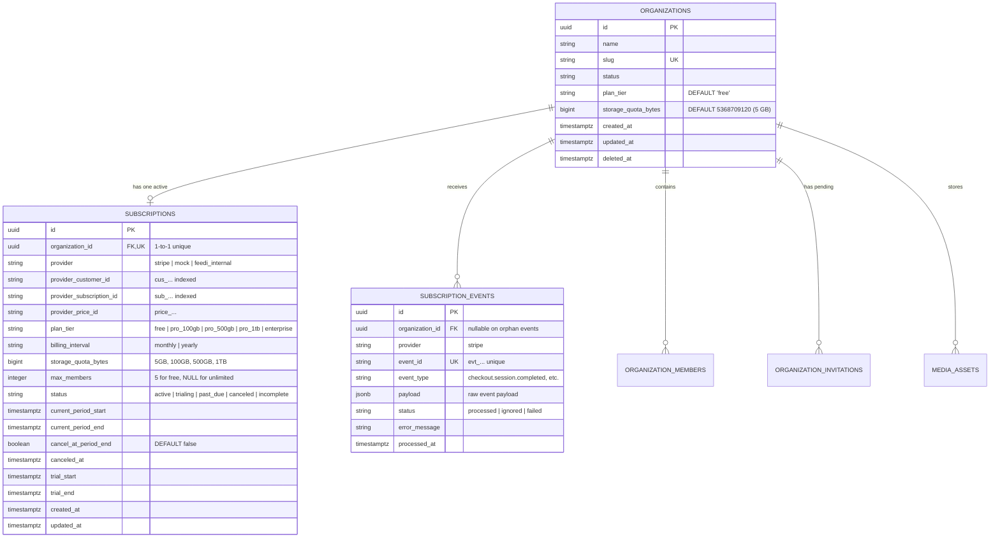

# Feedi — Database Architecture & Migration Plan for Subscriptions & Pricing

This document provides the exhaustive database design, entity schemas, constraints, indexing strategies, backfill procedures, and query access patterns required to implement the backend subscription engine for **Feedi**, benchmarked against [FreeFrame Pricing](https://freeframe.io/pricing).

---

## 1. Architectural Objectives

1. **Strict Storage-Tiered Model:** Enforce dynamic storage quotas (5 GB on Free; 100 GB, 500 GB, 1 TB on Pro) across all upload pathways.
2. **Per-Seat Immunity for Paid Plans:** Free tier is strictly capped at **5 members** (active + pending). Paid tiers have `max_members = NULL` (unlimited).
3. **Zero-Latency Upload Hot-Path:** Media upload presigning occurs hundreds of times per session. Quota checks must **never perform multi-table joins**. We denormalize current quota onto `organizations` with Valkey caching.
4. **Webhook Idempotency & Audit Trail:** Guarantee that replayed or out-of-order Stripe webhooks never corrupt subscription states or duplicate credit records.

---

## 2. Entity-Relationship Diagram (ERD)



---

## 3. Detailed Table Specifications

### 3.1. New Table: `subscriptions`

Stores the single active subscription state for an organization.

```sql
CREATE TABLE subscriptions (
    id UUID PRIMARY KEY DEFAULT gen_random_uuid(),
    organization_id UUID NOT NULL REFERENCES organizations(id) ON DELETE CASCADE,
    provider VARCHAR(32) NOT NULL DEFAULT 'stripe',
    provider_customer_id VARCHAR(255) NULL,
    provider_subscription_id VARCHAR(255) NULL,
    provider_price_id VARCHAR(255) NULL,

    plan_tier VARCHAR(32) NOT NULL DEFAULT 'free',
    billing_interval VARCHAR(16) NOT NULL DEFAULT 'monthly',
    storage_quota_bytes BIGINT NOT NULL DEFAULT 5368709120, -- 5 GB in bytes
    max_members INTEGER NULL DEFAULT 5,                     -- 5 for Free, NULL for unlimited

    status VARCHAR(32) NOT NULL DEFAULT 'active',
    current_period_start TIMESTAMPTZ NULL,
    current_period_end TIMESTAMPTZ NULL,
    cancel_at_period_end BOOLEAN NOT NULL DEFAULT FALSE,
    canceled_at TIMESTAMPTZ NULL,
    trial_start TIMESTAMPTZ NULL,
    trial_end TIMESTAMPTZ NULL,

    created_at TIMESTAMPTZ NOT NULL DEFAULT NOW(),
    updated_at TIMESTAMPTZ NOT NULL DEFAULT NOW(),

    -- Constraints
    CONSTRAINT uq_subscriptions_org_id UNIQUE (organization_id),
    CONSTRAINT ck_subscriptions_plan_tier CHECK (
        plan_tier IN ('free', 'pro_100gb', 'pro_500gb', 'pro_1tb', 'enterprise')
    ),
    CONSTRAINT ck_subscriptions_billing_interval CHECK (
        billing_interval IN ('monthly', 'yearly')
    ),
    CONSTRAINT ck_subscriptions_status CHECK (
        status IN ('active', 'trialing', 'past_due', 'canceled', 'incomplete', 'incomplete_expired')
    ),
    CONSTRAINT ck_subscriptions_storage_quota_positive CHECK (
        storage_quota_bytes > 0
    )
);

-- Indexes for lightning-fast webhook resolution and tenant lookups
CREATE INDEX ix_subscriptions_provider_sub_id ON subscriptions (provider_subscription_id) WHERE provider_subscription_id IS NOT NULL;
CREATE INDEX ix_subscriptions_customer_id ON subscriptions (provider_customer_id) WHERE provider_customer_id IS NOT NULL;
CREATE INDEX ix_subscriptions_status ON subscriptions (status);
```

---

### 3.2. New Table: `subscription_events` (Idempotency & Audit)

Prevents duplicate execution of webhooks and stores an auditable log of plan changes.

```sql
CREATE TABLE subscription_events (
    id UUID PRIMARY KEY DEFAULT gen_random_uuid(),
    organization_id UUID NULL REFERENCES organizations(id) ON DELETE SET NULL,
    provider VARCHAR(32) NOT NULL DEFAULT 'stripe',
    event_id VARCHAR(255) NOT NULL,
    event_type VARCHAR(100) NOT NULL,
    payload JSONB NOT NULL,
    status VARCHAR(20) NOT NULL DEFAULT 'processed',
    error_message TEXT NULL,
    processed_at TIMESTAMPTZ NOT NULL DEFAULT NOW(),

    CONSTRAINT uq_subscription_events_provider_event_id UNIQUE (provider, event_id),
    CONSTRAINT ck_subscription_events_status CHECK (
        status IN ('processed', 'ignored', 'failed')
    )
);

CREATE INDEX ix_subscription_events_org_id ON subscription_events (organization_id);
CREATE INDEX ix_subscription_events_event_type ON subscription_events (event_type);
```

---

### 3.3. Modified Table: `organizations`

Denormalizes `plan_tier` and `storage_quota_bytes` for zero-join hot paths.

```sql
ALTER TABLE organizations
    ADD COLUMN plan_tier VARCHAR(32) NOT NULL DEFAULT 'free',
    ADD COLUMN storage_quota_bytes BIGINT NOT NULL DEFAULT 5368709120; -- 5 GB

ALTER TABLE organizations
    ADD CONSTRAINT ck_organizations_plan_tier CHECK (
        plan_tier IN ('free', 'pro_100gb', 'pro_500gb', 'pro_1tb', 'enterprise')
    ),
    ADD CONSTRAINT ck_organizations_storage_quota_positive CHECK (
        storage_quota_bytes > 0
    );

CREATE INDEX ix_organizations_plan_tier ON organizations (plan_tier);
```

---

## 4. Storage & Member Quotas Reference Matrix

| Plan Tier (`plan_tier`) | `storage_quota_bytes` (Exact Bytes) | Human Label | `max_members` | Default Status |
| :--- | :--- | :--- | :--- | :--- |
| `free` | `5,368,709,120` | **5 GB** | **`5`** | `active` |
| `pro_100gb` | `107,374,182,400` | **100 GB** | **`NULL` (Unlimited)** | `active` |
| `pro_500gb` | `536,870,912,000` | **500 GB** | **`NULL` (Unlimited)** | `active` |
| `pro_1tb` | `1,099,511,627,776` | **1 TB** | **`NULL` (Unlimited)** | `active` |
| `enterprise` | Custom (e.g. 5 TB+) | **Custom** | **`NULL` (Unlimited)** | `active` |

---

## 5. SQLModel Class Definitions (`apps/backend`)

### 5.1. Module Location: `apps/backend/src/feedio/modules/billing/infrastructure/models.py`

```python
from datetime import datetime
from uuid import UUID, uuid4

from sqlalchemy import BigInteger, CheckConstraint, Column, DateTime, Index, Integer, String, text
from sqlalchemy.dialects.postgresql import JSONB
from sqlmodel import Field, SQLModel

from feedio.shared.infrastructure.persistence import utc_now


class SubscriptionTable(SQLModel, table=True):
    __tablename__ = "subscriptions"
    __table_args__ = (
        CheckConstraint(
            "plan_tier IN ('free', 'pro_100gb', 'pro_500gb', 'pro_1tb', 'enterprise')",
            name="ck_subscriptions_plan_tier",
        ),
        CheckConstraint(
            "billing_interval IN ('monthly', 'yearly')",
            name="ck_subscriptions_billing_interval",
        ),
        CheckConstraint(
            "status IN ('active', 'trialing', 'past_due', 'canceled', 'incomplete', 'incomplete_expired')",
            name="ck_subscriptions_status",
        ),
        CheckConstraint(
            "storage_quota_bytes > 0",
            name="ck_subscriptions_storage_quota_positive",
        ),
        Index("uq_subscriptions_org_id", "organization_id", unique=True),
        Index(
            "ix_subscriptions_provider_sub_id",
            "provider_subscription_id",
            postgresql_where=text("provider_subscription_id IS NOT NULL"),
        ),
        Index(
            "ix_subscriptions_customer_id",
            "provider_customer_id",
            postgresql_where=text("provider_customer_id IS NOT NULL"),
        ),
    )

    id: UUID = Field(default_factory=uuid4, primary_key=True)
    organization_id: UUID = Field(
        foreign_key="organizations.id",
        nullable=False,
        ondelete="CASCADE",
    )
    provider: str = Field(
        default="stripe",
        sa_column=Column(String(32), nullable=False, server_default="stripe"),
    )
    provider_customer_id: str | None = Field(
        default=None,
        sa_column=Column(String(255), nullable=True),
    )
    provider_subscription_id: str | None = Field(
        default=None,
        sa_column=Column(String(255), nullable=True),
    )
    provider_price_id: str | None = Field(
        default=None,
        sa_column=Column(String(255), nullable=True),
    )

    plan_tier: str = Field(
        default="free",
        sa_column=Column(String(32), nullable=False, server_default="free"),
    )
    billing_interval: str = Field(
        default="monthly",
        sa_column=Column(String(16), nullable=False, server_default="monthly"),
    )
    storage_quota_bytes: int = Field(
        default=5 * 1024 * 1024 * 1024,
        sa_column=Column(BigInteger, nullable=False, server_default="5368709120"),
    )
    max_members: int | None = Field(
        default=5,
        sa_column=Column(Integer, nullable=True, server_default="5"),
    )

    status: str = Field(
        default="active",
        sa_column=Column(String(32), nullable=False, server_default="active"),
    )
    current_period_start: datetime | None = Field(
        default=None,
        sa_column=Column(DateTime(timezone=True), nullable=True),
    )
    current_period_end: datetime | None = Field(
        default=None,
        sa_column=Column(DateTime(timezone=True), nullable=True),
    )
    cancel_at_period_end: bool = Field(
        default=False,
        sa_column=Column(Boolean, nullable=False, server_default="false"),
    )
    canceled_at: datetime | None = Field(
        default=None,
        sa_column=Column(DateTime(timezone=True), nullable=True),
    )
    trial_start: datetime | None = Field(
        default=None,
        sa_column=Column(DateTime(timezone=True), nullable=True),
    )
    trial_end: datetime | None = Field(
        default=None,
        sa_column=Column(DateTime(timezone=True), nullable=True),
    )

    created_at: datetime = Field(
        default_factory=utc_now,
        sa_column=Column(DateTime(timezone=True), nullable=False, server_default=text("now()")),
    )
    updated_at: datetime = Field(
        default_factory=utc_now,
        sa_column=Column(DateTime(timezone=True), nullable=False, server_default=text("now()")),
    )


class SubscriptionEventTable(SQLModel, table=True):
    __tablename__ = "subscription_events"
    __table_args__ = (
        Index("uq_subscription_events_provider_event", "provider", "event_id", unique=True),
        Index("ix_subscription_events_org_id", "organization_id"),
        Index("ix_subscription_events_event_type", "event_type"),
    )

    id: UUID = Field(default_factory=uuid4, primary_key=True)
    organization_id: UUID | None = Field(
        default=None,
        foreign_key="organizations.id",
        nullable=True,
        ondelete="SET NULL",
    )
    provider: str = Field(default="stripe", sa_column=Column(String(32), nullable=False))
    event_id: str = Field(sa_column=Column(String(255), nullable=False))
    event_type: str = Field(sa_column=Column(String(100), nullable=False))
    payload: dict = Field(default_factory=dict, sa_column=Column(JSONB, nullable=False))
    status: str = Field(default="processed", sa_column=Column(String(20), nullable=False))
    error_message: str | None = Field(default=None, sa_column=Column(String, nullable=True))
    processed_at: datetime = Field(
        default_factory=utc_now,
        sa_column=Column(DateTime(timezone=True), nullable=False, server_default=text("now()")),
    )
```

---

## 6. Alembic Migration Procedure

### 6.1. Migration ID: `20260927_0021_create_subscriptions_and_quotas.py`
Revises: `20260927_0020_add_auth_identities_and_nullable_password`

#### `upgrade()` Steps:
1. **Alter `organizations` table:**
   - Add `plan_tier` column (`VARCHAR(32)`, `DEFAULT 'free'`, `NOT NULL`).
   - Add `storage_quota_bytes` column (`BIGINT`, `DEFAULT 5368709120`, `NOT NULL`).
   - Add check constraints `ck_organizations_plan_tier` and `ck_organizations_storage_quota_positive`.
   - Add index on `organizations(plan_tier)`.
2. **Create `subscriptions` table:**
   - Define all columns, foreign key with `ON DELETE CASCADE`.
   - Add unique index on `organization_id`.
   - Add partial indexes on `provider_subscription_id` and `provider_customer_id`.
   - Add check constraints for tiers, intervals, and statuses.
3. **Create `subscription_events` table:**
   - Define columns, unique index on `(provider, event_id)` for idempotency.
4. **Data Backfill (Zero Downtime):**
   - Populate `subscriptions` table for all existing organizations with a `free` subscription row:
     ```sql
     INSERT INTO subscriptions (
         id, organization_id, provider, plan_tier, billing_interval,
         storage_quota_bytes, max_members, status, created_at, updated_at
     )
     SELECT
         gen_random_uuid(), id, 'feedi_internal', 'free', 'monthly',
         5368709120, 5, 'active', NOW(), NOW()
     FROM organizations
     ON CONFLICT (organization_id) DO NOTHING;
     ```

#### `downgrade()` Steps:
1. Drop table `subscription_events`.
2. Drop table `subscriptions`.
3. Remove check constraints and columns `plan_tier`, `storage_quota_bytes` from `organizations`.

---

## 7. Backend Integration & Query Patterns

### 7.1. High-Speed Upload Quota Check (`StorageQuotaService`)
```sql
-- 1. Fast Org Quota lookup (Cached in Valkey with 1-hour TTL)
SELECT storage_quota_bytes FROM organizations WHERE id = :org_id;

-- 2. Current Usage Query (Cached in Valkey with 5-minute TTL)
SELECT COALESCE(SUM(file_size_bytes), 0)
FROM media_assets
WHERE organization_id = :org_id AND deleted_at IS NULL;

-- 3. Logic check:
-- IF current_usage + incoming_file_size > storage_quota_bytes -> RAISE StorageQuotaExceededError
```

### 7.2. 5-Member Ceiling Check (`InviteMember`)
```sql
-- Executed when creating a new invitation or accepting an invite
SELECT plan_tier FROM organizations WHERE id = :org_id;

-- If plan_tier == 'free':
SELECT
    (SELECT COUNT(*) FROM organization_members WHERE organization_id = :org_id)
    +
    (SELECT COUNT(*) FROM organization_invitations WHERE organization_id = :org_id AND status = 'pending')
    AS total_members;

-- If total_members >= 5:
-- RAISE FreeTierMemberLimitExceededError("Free workspaces are capped at 5 members. Upgrade to any paid plan for unlimited members.")
```

### 7.3. Webhook Idempotency Check (`StripeWebhookHandler`)
```sql
-- Insert attempt with ON CONFLICT DO NOTHING
INSERT INTO subscription_events (provider, event_id, event_type, payload, status)
VALUES ('stripe', :evt_id, :evt_type, :payload, 'processed')
ON CONFLICT (provider, event_id) DO NOTHING
RETURNING id;

-- If no row returned -> Event was ALREADY PROCESSED! Return 200 OK immediately.
```

---

## 8. Verification & Test Plan

1. **Schema Integrity Tests:**
   - Verify `organization_id` foreign key cascade delete works cleanly.
   - Verify check constraints reject invalid plan tiers (e.g. `'super_tier'`) and negative quotas.
2. **Backfill Verification:**
   - Assert all pre-existing organizations have a corresponding row in `subscriptions` with `plan_tier='free'` and `storage_quota_bytes=5368709120`.
3. **Concurrency & Race Condition Verification:**
   - Simultaneous member invitations cannot exceed 5 on free organizations (enforced with row-level lock `SELECT ... FOR UPDATE` or serializable check).
4. **Stripe Idempotency Test:**
   - Dispatch duplicate `checkout.session.completed` events; verify only one event is processed and the organization plan remains consistent.
