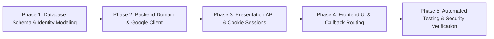

# Google OAuth 2.0 Integration & Identity Synchronization Plan (Feed.io)

This document provides the technical design, conflict resolution algorithms, security policies, and 5-phase delivery roadmap for integrating **Sign in with Google (OAuth 2.0 / OpenID Connect)** into the Feed.io platform.

> [!IMPORTANT]
> **Enterprise Security Notice (OWASP Pre-Account Takeover Defense):**
> When linking Google accounts to existing email-registered accounts, unverified accounts (`email_verified_at IS NULL`) represent a severe risk of Pre-Account Takeover. If an attacker pre-registers a victim's email with their own password, the subsequent Google Sign-In by the genuine victim MUST automatically **invalidate the old password hash** and mark the email verified.

---

## 🗺️ 5-Phase Delivery Roadmap



| Phase | Core Objective | Key Deliverables |
|---|---|---|
| **Phase 1** | Schema Migration & Data Models | `users.password_hash` nullable, `auth_identities` table, Alembic migrations |
| **Phase 2** | Domain Logic & Conflict Resolution | Google OAuth client, PKCE/State handling, Account Linking, Takeover protection |
| **Phase 3** | Backend Endpoints & Session Cookie | `GET /auth/google/login`, `POST /auth/google/callback`, `POST /auth/set-password` |
| **Phase 4** | Web UI & Flow Integration | Google buttons on Login/Register, `/auth/callback/google`, Set Password UI |
| **Phase 5** | Test Suite & Security Audit | Pytest integration tests for all 6 conflict cases, E2E session validation |

---

## 🛡️ Conflict & Edge Case Matrix (Xung đột & Ngoại lệ)

```mermaid
flowchart TD
    Start([Google OAuth Callback - Payload Verified]) --> CheckVerified{Google email_verified == true?}
    CheckVerified -- NO --> Err400[400 Bad Request: Google email must be verified]
    CheckVerified -- YES --> CheckIdentity{auth_identities contains<br/>(provider='google', sub)?}

    CheckIdentity -- YES --> LoadUser[Load User from DB]
    LoadUser --> CheckStatus{user.status == 'active'?}
    CheckStatus -- NO --> Err403[403 Forbidden: User disabled]
    CheckStatus -- YES --> IssueSession[Issue Session & Auth Cookies]

    CheckIdentity -- NO --> CheckEmailExists{users table contains<br/>normalized email?}

    %% New User
    CheckEmailExists -- NO --> CreateUser["Create new User:<br/>- password_hash: NULL<br/>- email_verified_at: now()<br/>- status: 'active'"]
    CreateUser --> LinkIdentity["Create auth_identities:<br/>- user_id, provider='google', sub"]
    LinkIdentity --> IssueSession

    %% Email Exists
    CheckEmailExists -- YES --> CheckOldVerified{Existing user<br/>email_verified_at != NULL?}

    %% Safe Linking (TH 1)
    CheckOldVerified -- YES --> LinkOld["Link Identity:<br/>Add to auth_identities"]
    LinkOld --> SendSecurityEmail["Send Security Alert Email:<br/>'New Google Account Linked'"]
    SendSecurityEmail --> IssueSession

    %% Pre-Account Takeover Defense (TH 2)
    CheckOldVerified -- NO --> MitigateTakeover["Takeover Mitigation:<br/>1. Reset password_hash = NULL<br/>2. Revoke pending verify tokens<br/>3. Set email_verified_at = now()"]
    MitigateTakeover --> LinkIdentity
```

### Chi tiết các kịch bản va chạm dữ liệu (Data Collisions)

| Mã | Kịch bản va chạm | Nguy cơ | Giải pháp kỹ thuật xử lý (Resolution) |
|---|---|---|---|
| **C1** | **User đã có tài khoản Email/Pass (Đã verify)**<br>👉 Bấm *Sign in with Google* cùng email | Trùng `email` duy nhất trong bảng `users`. | **Tự động liên kết (Account Linking):** Xác nhận `email_verified == true` từ Google, ghi bản ghi vào `auth_identities`, cấp phiên đăng nhập, gửi email thông báo bảo mật. |
| **C2** | **User đã đăng ký Email/Pass nhưng CHƯA verify**<br>👉 Bấm *Sign in with Google* cùng email | **Pre-account takeover**: Kẻ tấn công có thể đã đăng ký email của nạn nhân trước kèm password của kẻ tấn công. | **Chiếm lại quyền sở hữu an toàn:** Cập nhật `email_verified_at = now()`, **xóa `password_hash` cũ (set NULL)**, hủy toàn bộ token verification cũ, liên kết Google identity. Nạn nhân an toàn tuyệt đối. |
| **C3** | **Đăng ký bằng Google trước**<br>👉 Sau đó quay lại form Login gõ Email + Password | `password_hash` trong DB là `NULL`. Login thông thường sẽ crash hoặc báo sai pass khó hiểu. | Bắt trường hợp `user.password_hash is None`, trả về error code `OAUTH_ONLY_ACCOUNT`: *"Tài khoản được đăng ký qua Google. Vui lòng đăng nhập bằng Google hoặc bấm 'Quên mật khẩu' để tạo mật khẩu."* |
| **C4** | **Đăng ký bằng Google trước**<br>👉 Sau đó vào form Register đăng ký lại email đó | Bị chặn bởi `409 Conflict: Email already registered`. | Trả về thông báo thân thiện: *"Email này đã tồn tại. Nếu bạn từng đăng nhập bằng Google, hãy chọn 'Đăng nhập bằng Google' hoặc đặt mật khẩu mới."* |
| **C5** | **User Google muốn tạo mật khẩu độc lập**<br>👉 Vào cài đặt bảo mật hoặc bấm Quên mật khẩu | User chưa có mật khẩu hiện tại (`current_password`), form đổi mật khẩu thông thường sẽ từ chối. | Cung cấp flow **"Thiết lập mật khẩu lần đầu"** (không đòi `current_password`), hoặc qua luồng **"Quên mật khẩu"** (`forgot-password`) gửi link xác nhận về email. |
| **C6** | **Tấn công State Injection / CSRF Redirect** | Kẻ tấn công ép trình duyệt nạn nhân liên kết Google của kẻ tấn công vào tài khoản nạn nhân. | Sử dụng chuẩn **PKCE (`code_challenge` / `code_verifier`)** + **`state` mã hóa HMAC/signed** lưu trong HttpOnly Cookie có thời hạn ngắn (10 phút). |

---

## 📦 Chi tiết thực hiện theo từng Phase

### Phase 1: Database Schema Migration & Identity Modeling

#### 1.1. Cập nhật Model & Schema (`apps/backend`)
*   **Sửa đổi `UserTable`** (`apps/backend/src/feedio/modules/identity/infrastructure/models.py`):
    *   Đổi `password_hash: str = Field(sa_column=Column(String(255), nullable=False))` thành:
        `password_hash: str | None = Field(default=None, sa_column=Column(String(255), nullable=True))`
*   **Tạo mới `AuthIdentityTable`**:
    ```python
    class AuthIdentityTable(SQLModel, table=True):
        __tablename__ = "auth_identities"
        __table_args__ = (
            UniqueConstraint("provider", "provider_user_id", name="uq_auth_identities_provider_uid"),
            Index("ix_auth_identities_user_id", "user_id"),
        )

        id: UUID = Field(default_factory=uuid4, primary_key=True)
        user_id: UUID = Field(foreign_key="users.id", ondelete="CASCADE")
        provider: str = Field(sa_column=Column(String(32), nullable=False))  # 'google'
        provider_user_id: str = Field(sa_column=Column(String(255), nullable=False))  # 'sub'
        provider_email: str | None = Field(default=None, sa_column=Column(CITEXT(), nullable=True))
        created_at: datetime = Field(
            default_factory=utc_now,
            sa_column=Column(DateTime(timezone=True), nullable=False, server_default=func.now()),
        )
        updated_at: datetime = Field(
            default_factory=utc_now,
            sa_column=Column(
                DateTime(timezone=True),
                nullable=False,
                server_default=func.now(),
                onupdate=func.now(),
            ),
        )
    ```

#### 1.2. Tạo Migration Script Alembic
*   Chạy `uv run alembic revision --autogenerate -m "add_auth_identities_and_nullable_password"`
*   Kiểm tra tính an toàn: Đảm bảo không làm mất dữ liệu hiện có của các user đã đăng ký bằng password.

---

### Phase 2: Backend Core Domain & Google OAuth Client

#### 2.1. Cấu hình môi trường (`IdentitySettings`)
Bổ sung các biến môi trường vào `apps/backend/src/feedio/bootstrap/config.py`:
*   `GOOGLE_CLIENT_ID`: Client ID từ Google Cloud Console.
*   `GOOGLE_CLIENT_SECRET`: Client Secret từ Google Cloud Console.
*   `GOOGLE_REDIRECT_URI`: Ví dụ `http://localhost:3000/auth/callback/google` (hoặc trực tiếp backend endpoint).

#### 2.2. Google OAuth Service Client (`infrastructure/oauth_client.py`)
Triển khai service async dùng `httpx` (hoặc `google-auth`):
*   `build_authorization_url(state: str, code_challenge: str) -> str`: Tạo URL chuyển hướng sang Google với scopes `openid email profile`.
*   `exchange_code(code: str, code_verifier: str) -> GoogleTokenPayload`: Gửi `POST https://oauth2.googleapis.com/token`.
*   `verify_id_token(id_token: str) -> GoogleUserInfo`: Giải mã và xác thực chữ ký của Google.

#### 2.3. Mở rộng `AuthRepository` & `AuthService`
*   Thêm vào `AuthRepository`:
    *   `find_user_by_identity(provider: str, provider_user_id: str) -> User | None`
    *   `link_identity(user_id: UUID, provider: str, provider_user_id: str, email: str | None)`
    *   `clear_password_and_verify(user_id: UUID)`: Dùng cho trường hợp C2 (Pre-account takeover defense).
*   Triển khai `handle_google_login(payload: GoogleUserInfo)` trong `AuthService`:
    *   Thực thi toàn bộ logic rẽ nhánh theo sơ đồ quyết định tại Mục 2.
    *   Cấp phiên làm việc `create_session(...)` và phát hành bộ token `AuthTokens(access_token, refresh_token)`.

---

### Phase 3: Backend Presentation & API Endpoints

#### 3.1. Các Router mới trong `apps/backend/src/feedio/modules/identity/presentation/router.py`
1.  **`GET /auth/google/login`**:
    *   Tạo ngẫu nhiên `state` và `code_verifier` (PKCE `code_challenge = s256(code_verifier)`).
    *   Lưu `state` & `code_verifier` vào HttpOnly Cookie tạm (`oauth_state`, TTL 10 phút, `SameSite=Lax`).
    *   Trả về 302 Redirect hoặc trả về JSON chứa `auth_url` để Frontend điều hướng.
2.  **`POST /auth/google/callback`**:
    *   Nhận `{ code: str, state: str }`.
    *   So sánh `state` với cookie `oauth_state` (chống CSRF).
    *   Gọi `exchange_code` & xử lý đăng nhập qua `AuthService`.
    *   Set cookie `access_token`, `refresh_token`, `csrf_token` (dùng lại `cookies.set_tokens`).
3.  **`POST /auth/set-password`**:
    *   Endpoint cho user đang đăng nhập (đã xác thực qua cookie/session) mà `password_hash IS NULL`.
    *   Cho phép đặt mật khẩu lần đầu mà không cần hỏi mật khẩu cũ.
4.  **Cập nhật `POST /auth/login`**:
    *   Nếu `user.password_hash is None`: Trả về `400 Bad Request` với mã `OAUTH_ONLY_ACCOUNT`.

---

### Phase 4: Frontend Web Integration (Next.js 15 App Router)

#### 4.1. Cài đặt thư viện & UI Components
*   Cài đặt thư viện: `pnpm add @react-oauth/google` tại `apps/web`.
*   Tạo component `<GoogleSignInButton />` (`apps/web/src/modules/auth/components/google_button.tsx`):
    *   Phong cách thiết kế chuẩn Feed.io (nền trắng/dark, viền mảnh, logo SVG Google chính hãng).
    *   Xử lý loading state khi đang kích hoạt popup hoặc chuyển hướng.
*   Cập nhật `LoginForm` (`login_form.tsx`) & `RegisterForm` (`register_form.tsx`):
    *   Thêm nút *"Continue with Google"* lên đầu hoặc dưới cùng kèm dải phân cách `"OR"`.

#### 4.2. Trang xử lý Callback (`apps/web/src/app/(auth)/auth/callback/google/page.tsx`)
*   Đọc `code` và `state` từ search params.
*   Gửi request `POST /api/v1/auth/google/callback` về Backend.
*   Khi thành công: cập nhật TanStack Query cache `getCurrentUserQueryKey()`, sau đó gọi `router.replace(getPostAuthRedirectUrl(...))`.

#### 4.3. Cập nhật `ChangePasswordForm` (`change_password_form.tsx`)
*   Kiểm tra cờ `currentUser.has_password` (bổ sung vào `CurrentUserResponse`).
*   Nếu `has_password == false`:
    *   Ẩn ô "Current password".
    *   Đổi tiêu đề thành **"Set password"** ("Thiết lập mật khẩu").
    *   Gọi API `POST /auth/set-password`.

---

### Phase 5: Automated Testing & Security Verification

#### 5.1. Bộ Test Cases Tích Hợp (Pytest Backend)
*   [ ] `test_google_auth_new_user_created_without_password`: Đăng ký mới bằng Google tạo đúng User (active, verified) và bản ghi trong `auth_identities`.
*   [ ] `test_google_auth_links_existing_verified_user`: User đã có tài khoản và verified email -> liên kết Google thành công.
*   [ ] `test_google_auth_pre_account_takeover_prevention`: User tồn tại nhưng chưa verified -> đăng nhập Google làm sạch password cũ và xác thực tài khoản.
*   [ ] `test_password_login_rejected_for_google_only_user`: User tạo bằng Google gõ pass tại `/login` nhận lỗi gợi ý phù hợp.
*   [ ] `test_set_password_for_oauth_user`: User Google đặt mật khẩu lần đầu thành công và sau đó đăng nhập được bằng password.
*   [ ] `test_oauth_state_csrf_protection`: Request callback với `state` sai/hết hạn bị từ chối 400.

#### 5.2. Lệnh kiểm tra chất lượng (Verification Commands)
```bash
# Kiểm tra migration Alembic
cd apps/backend && uv run alembic upgrade head

# Chạy test suite xác thực Auth
cd apps/backend && uv run pytest tests/modules/identity -v

# Kiểm tra linting và type-check backend
uv run ruff check .
uv run mypy src/feedio

# Kiểm tra build frontend
cd apps/web && pnpm build
```

---

## 📌 Tổng kết quy tắc nghiệp vụ (Business Rules Summary)
1. **Một Email - Một Tài Khoản Duy Nhất**: Google và Email/Password liên kết vào cùng một User ID trong hệ thống.
2. **Không bắt buộc đặt mật khẩu**: User đăng nhập bằng Google không bị ép phải tạo mật khẩu; họ có thể dùng Google vĩnh viễn hoặc tự tạo mật khẩu bất cứ lúc nào trong trang Cài đặt.
3. **Ưu tiên xác minh của Google**: Khi Google đã gắn nhãn `email_verified: true`, Feed.io công nhận email đó là chính chủ và kích hoạt `email_verified_at`.
