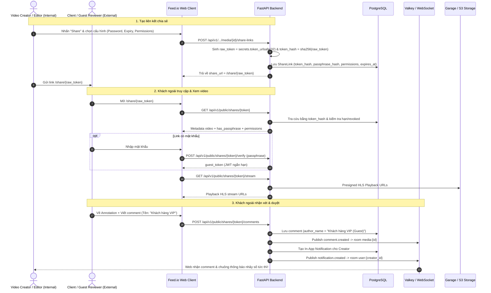

# Kế Hoạch Triển Khai Chi Tiết: Phase 8A — External Share Links & Guest Review Mode

Tài liệu này quy định kiến trúc kỹ thuật, mô hình cơ sở dữ liệu, danh sách API, luồng giao diện người dùng và kịch bản kiểm thử toàn diện cho **Phase 8A: External Share Links & Guest Review Mode** của nền tảng Feed.io.

---

## 🎯 Mục Tiêu Nghiệp Vụ của Phase 8A
1. Cho phép thành viên dự án tạo liên kết chia sẻ công khai (**Share Link**) an toàn cho bất kỳ video asset nào.
2. Cung cấp các tuỳ chọn bảo mật mạnh mẽ:
   - **Passphrase Protection**: Mật khẩu bảo vệ link (băm bảo mật).
   - **Expiration Date**: Đặt hạn sử dụng (1 ngày, 7 ngày, 30 ngày, hoặc không bao giờ).
   - **Granular Permissions**: Phân quyền chi tiết (*Allow Comments*, *Allow Approval/Decision*, *Allow Download Source*).
3. Cung cấp trang xem & duyệt video dành riêng cho khách ngoài (**Public Guest Reviewer** tại `/share/[token]`):
   - Không yêu cầu đăng nhập/tạo tài khoản.
   - Giao diện rạp chiếu phim (Cinematic Dark Mode), xem video HLS frame-accurate.
   - Vẽ Annotation (Bút vẽ, Hộp chữ nhật, Mũi tên) trực tiếp trên khung hình video.
   - Nhận xét (Comment) gắn liền với timecode.
   - Đưa ra quyết định duyệt (Approved / Needs Changes).
4. **Realtime & In-App Notification**: Mọi hoạt động của khách ngoài (comment, annotation, review decision) được đồng bộ tức thì qua WebSocket tới nhóm sản xuất nội bộ và gửi chuông thông báo In-App.

---

## 🏛️ Kiến Trúc Hệ Thống Phase 8A



---

## 🗄️ Thiết Kế Cơ Sở Dữ Liệu & Schema (PostgreSQL)

### 1. Bảng `share_links`
```sql
CREATE TABLE share_links (
    id UUID PRIMARY KEY DEFAULT gen_random_uuid(),
    organization_id UUID NOT NULL REFERENCES organizations(id) ON DELETE CASCADE,
    project_id UUID NOT NULL REFERENCES projects(id) ON DELETE CASCADE,
    media_id UUID REFERENCES media_assets(id) ON DELETE CASCADE,
    folder_id UUID REFERENCES project_folders(id) ON DELETE CASCADE,
    created_by_user_id UUID NOT NULL REFERENCES users(id) ON DELETE CASCADE,
    token_hash VARCHAR(64) NOT NULL UNIQUE,
    passphrase_hash VARCHAR(255) NULL,
    allow_comments BOOLEAN NOT NULL DEFAULT TRUE,
    allow_approval BOOLEAN NOT NULL DEFAULT TRUE,
    allow_download BOOLEAN NOT NULL DEFAULT FALSE,
    expires_at TIMESTAMPTZ NULL,
    access_count INTEGER NOT NULL DEFAULT 0,
    is_revoked BOOLEAN NOT NULL DEFAULT FALSE,
    created_at TIMESTAMPTZ NOT NULL DEFAULT NOW(),
    updated_at TIMESTAMPTZ NOT NULL DEFAULT NOW(),
    CONSTRAINT chk_target_asset CHECK (
        (media_id IS NOT NULL AND folder_id IS NULL) OR
        (media_id IS NULL AND folder_id IS NOT NULL)
    )
);

CREATE INDEX ix_share_links_token_hash ON share_links (token_hash);
CREATE INDEX ix_share_links_media_id ON share_links (media_id);
CREATE INDEX ix_share_links_org_proj ON share_links (organization_id, project_id);
```

---

## 🔌 Thiết Kế Chi Tiết API Endpoints

### 1. Phân hệ Internal Management API (Dành cho thành viên đăng nhập)
Prefix: `/api/v1/organizations/{organization_id}/projects/{project_id}/media/{media_id}/share-links`

| Method | Endpoint | Quyền hạn | Mô tả |
| :--- | :--- | :--- | :--- |
| `POST` | `/` | Owner, Admin, Editor | Tạo Share Link mới (hỗ trợ passphrase, expiry, permissions) |
| `GET` | `/` | Tất cả thành viên | Danh sách các Share Link đã tạo của media này (kèm số lượt xem, trạng thái) |
| `DELETE` | `/{share_link_id}` | Owner, Admin, Creator | Thu hồi (Revoke) link ngay lập tức |

#### Request/Response Schema:
- **`CreateShareLinkRequest`**:
  ```json
  {
    "passphrase": "optional_password_123",
    "expires_in_days": 7,
    "allow_comments": true,
    "allow_approval": true,
    "allow_download": false
  }
  ```
- **`ShareLinkCreatedResponse`**:
  ```json
  {
    "id": "uuid",
    "share_url": "/share/a8fbc72e...",
    "raw_token": "a8fbc72e...",
    "allow_comments": true,
    "allow_approval": true,
    "allow_download": false,
    "has_passphrase": true,
    "expires_at": "2026-09-15T10:00:00Z",
    "created_at": "2026-09-08T10:00:00Z"
  }
  ```

---

### 2. Phân hệ Public Guest API (Không yêu cầu đăng nhập)
Prefix: `/api/v1/public/shares`

| Method | Endpoint | Mô tả |
| :--- | :--- | :--- |
| `GET` | `/{token}` | Lấy thông tin cơ bản của link chia sẻ (Title, Duration, FPS, Permissions, `has_passphrase`, `is_authenticated`) |
| `POST` | `/{token}/verify` | Xác thực mật khẩu và cấp `guest_token` |
| `GET` | `/{token}/stream` | Lấy Presigned Stream URLs (Master HLS playlist & segments) |
| `GET` | `/{token}/comments` | Lấy danh sách comments và annotations của video |
| `POST` | `/{token}/comments` | Khách ngoài gửi nhận xét + nét vẽ canvas |
| `POST` | `/{token}/decisions` | Khách ngoài cập nhật trạng thái duyệt (Approve / Needs Changes) |
| `GET` | `/{token}/download` | Lấy Presigned Download URL cho file gốc (nếu `allow_download = true`) |

#### Request/Response Schemas:
- **`PublicShareDetailsResponse`**:
  ```json
  {
    "media_id": "uuid",
    "title": "TVC_Launch_Master_v2.mp4",
    "duration_seconds": 64.5,
    "fps": 24.0,
    "width": 3840,
    "height": 2160,
    "review_status": "in_progress",
    "has_passphrase": true,
    "allow_comments": true,
    "allow_approval": true,
    "allow_download": false,
    "thumbnail_url": "https://..."
  }
  ```
- **`GuestCommentRequest`**:
  ```json
  {
    "guest_name": "Nguyen Van A",
    "guest_email": "client@agency.com",
    "content": "Đoạn này màu hơi tối, cần tăng exposure 1 stop",
    "timestamp_seconds": 14.5,
    "frame_number": 348,
    "annotation_data": {
      "strokes": [{ "type": "pen", "color": "#00ff66", "points": [120, 240, 130, 250] }]
    },
    "parent_comment_id": null
  }
  ```
- **`GuestDecisionRequest`**:
  ```json
  {
    "guest_name": "Nguyen Van A",
    "status": "approved",
    "notes": "Video rất đẹp, duyệt bản này để phát sóng!"
  }
  ```

---

## 🎨 Thiết Kế Giao Diện Frontend (`apps/web`)

### 1. Share Link Management Dialog (Internal)
- Nằm trong trang **Review Workspace** (`/app/organizations/[slug]/projects/[id]/media/[mediaId]`) và **Kanban/Project Grid**.
- Button: **"Share Link"** với icon `Link2`.
- Modal giao diện 2 tabs:
  - **Tab 1: Create Link**:
    - Switch: Password Protection (`input[type=password]`).
    - Select: Expiry (`1 day`, `7 days`, `30 days`, `Never`).
    - Checkboxes: `Allow Comments`, `Allow Approvals`, `Allow Download`.
    - Button: **"Create & Copy Link"** (Tự động copy `https://feedio.app/share/{token}` vào clipboard).
  - **Tab 2: Active Links**:
    - Danh sách các link đang hoạt động, hiển thị số lượt xem (`access_count`), hạn sử dụng, và nút **"Revoke"** (Thùng rác).

### 2. Standalone Public Guest Page (`apps/web/src/app/(public)/share/[token]/page.tsx`)
- Giao diện độc lập hoàn toàn, không header/sidebar của ứng dụng quản trị nội bộ.
- **Passphrase Gate Component**:
  - Nếu link có mật khẩu và chưa mở khóa: Hiển thị giao diện nhập mật khẩu tinh tế, logo Feed.io, thông báo lỗi nếu sai mật khẩu.
- **Guest Player & Workspace Component**:
  - **Header**: Logo, Video Title, Review Status Badge, Guest Name badge, Download Button (nếu được phép).
  - **Main Player**:
    - HTML5 Video Player tối ưu HLS stream.
    - Timecode display (Timecode chuẩn `00:00:14:12` & Frame counter).
    - Scrubber với marker dots hiển thị vị trí các comments.
    - Waveform visualizer đồng bộ playback.
    - Canvas Annotation tool: Pen, Rectangle, Arrow, Clear.
    - Keyboard Shortcuts: Space (Play/Pause), J (Rewind), K (Pause), L (Fast Forward), Left/Right Arrow (Frame step).
  - **Sidebar / Drawer (Comment Panel)**:
    - Danh sách nhận xét theo thứ tự thời gian hoặc timecode.
    - Nhấp vào nhận xét: Scrubber nhảy ngay đến frame đó và hiển thị nét vẽ tương ứng.
    - Input nhận xét: Hỗ trợ nhập Tên khách (lưu `localStorage`), nội dung nhận xét, đính kèm nét vẽ hiện tại.
  - **Approval Action Bar**:
    - Button **"Approve Asset"** (Xanh lá - Checkmark).
    - Button **"Request Changes"** (Vàng cam - Alert).
    - Modal xác nhận trước khi submit decision.

---

## 🔒 Cơ Chế Bảo Mật & Phân Quyền (Security Specs)

1. **Token Security**:
   - `raw_token` sinh bằng `secrets.token_urlsafe(32)` (256-bit entropy).
   - Cơ sở dữ liệu **chỉ lưu `token_hash = sha256(raw_token)`**. Kể cả khi rò rỉ database cũng không thể suy ra link gốc.
2. **Passphrase Security**:
   - Mật khẩu chia sẻ được băm bằng thuật toán an toàn (PBKDF2/Argon2id/SHA-256 with salt).
   - Rate limiting trên endpoint `/verify` (tối đa 5 lần thử/phút cho 1 IP) để chống brute-force.
3. **Guest Session Token**:
   - Sau khi xác thực mật khẩu, API cấp 1 JWT token ngắn hạn (12 giờ) lưu vào `sessionStorage` của browser khách ngoài.
4. **Storage Link Security**:
   - Presigned URLs cho video stream và download chỉ có hạn ngắn (1 - 2 giờ), không bao giờ lộ trực tiếp bucket credentials.

---

## 📁 Cấu Trúc File & Module Cần Triển Khai Trong Phase 8A

### Backend (`apps/backend`):
```text
src/feedio/modules/media/
├── domain/
│   ├── entities.py                     # [MODIFY] Thêm ShareLink entity
│   └── errors.py                       # [MODIFY] Thêm ShareLinkNotFoundError, InvalidPassphraseError...
├── infrastructure/
│   ├── models.py                       # [MODIFY] Thêm ShareLinkTable
│   └── repository.py                   # [MODIFY] Thêm các hàm ShareLink CRUD vào SqlMediaRepository
├── application/
│   ├── commands/
│   │   ├── create_share_link.py        # [NEW] Use case tạo share link
│   │   └── revoke_share_link.py        # [NEW] Use case thu hồi share link
│   └── queries/
│       ├── get_public_share.py         # [NEW] Use case lấy thông tin public share link
│       └── list_share_links.py         # [NEW] Use case liệt kê link của media
└── presentation/
    ├── schemas.py                      # [MODIFY] Thêm Pydantic schemas cho Share Link
    ├── share_links_router.py           # [NEW] Internal Share Link Management Router
    └── public_share_router.py          # [NEW] Public Guest Access Router
```

### Frontend (`apps/web`):
```text
src/
├── app/(public)/
│   └── share/[token]/
│       ├── page.tsx                    # [NEW] Trang Guest Reviewer chính
│       └── layout.tsx                  # [NEW] Public Layout (tối giản, không app header)
├── modules/media/
│   ├── components/
│   │   └── share_link_dialog.tsx       # [NEW] Modal tạo & quản lý Share Link
│   └── hooks/
│       └── use_share_links.ts          # [NEW] React Query hooks cho CRUD Share Link
└── modules/review/
    └── components/public/
        ├── guest_review_workspace.tsx  # [NEW] Workspace riêng cho khách ngoài
        ├── guest_passphrase_gate.tsx   # [NEW] Màn hình nhập mật khẩu
        └── guest_decision_modal.tsx    # [NEW] Modal xác nhận duyệt video
```

---

## 📅 Các Bước Triển Khai Tuần Tự (Phase 8A Step-by-Step)

1. **Bước 1: Backend Domain & Database Table**:
   - Tạo `ShareLink` entity, `ShareLinkTable` trong SQLAlchemy, cập nhật `SqlMediaRepository`.
2. **Bước 2: Backend Use Cases & Internal API Router**:
   - Viết use cases `CreateShareLink`, `ListShareLinks`, `RevokeShareLink`.
   - Viết `share_links_router.py` và mount vào `api.py`.
3. **Bước 3: Backend Public Guest Router**:
   - Viết `public_share_router.py` hỗ trợ Metadata, Passphrase Verify, HLS Stream, Public Comments, Public Decisions, Download.
   - Tích hợp phát Realtime WebSocket Event & In-App Notification cho Creator khi Guest tương tác.
4. **Bước 4: Frontend Internal Share Dialog**:
   - Viết `share_link_dialog.tsx` và gắn nút "Share" vào `ReviewWorkspace` và Media Cards.
5. **Bước 5: Frontend Public Guest Review Page**:
   - Xây dựng `/share/[token]` với `GuestPassphraseGate`, `GuestReviewWorkspace`, Canvas Drawing, Commenting & Decision submission.
6. **Bước 6: Testing & Verification**:
   - Chạy test Backend (`pytest`) và Frontend (`vitest`).
   - Kiểm thử thực tế flow tạo link ➔ Mở tab ẩn danh ➔ Nhập mật khẩu ➔ Xem video ➔ Vẽ annotation ➔ Submit comment/decision ➔ Kiểm tra tab Creator nhận realtime & chuông thông báo.
