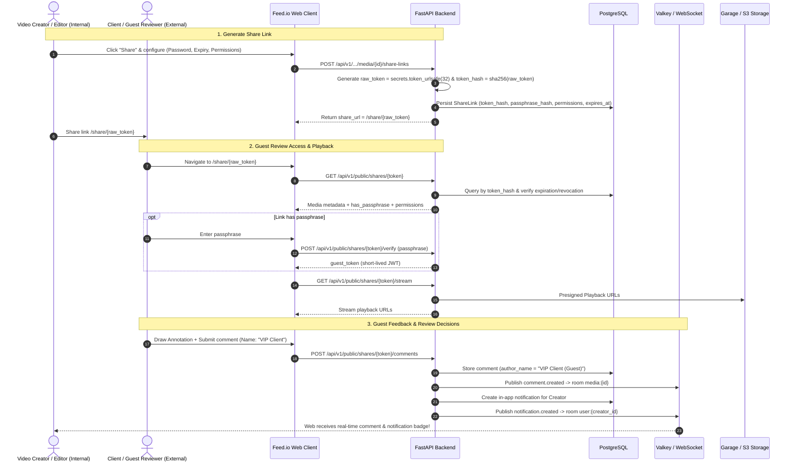

# Detailed Implementation Plan: Phase 8A — External Share Links & Guest Review Mode

This document specifies the technical architecture, database schema, API contracts, UI/UX interaction flows, and comprehensive verification scenarios for **Phase 8A: External Share Links & Guest Review Mode** of the Feed.io platform.

---

## 🎯 Phase 8A Business Objectives
1. Allow project members to generate secure public links (**Share Links**) for any video asset.
2. Provide robust security controls:
   - **Passphrase Protection**: Password-protected links (secure hashing).
   - **Expiration Date**: Configurable lifespan (1 day, 7 days, 30 days, or unlimited).
   - **Granular Permissions**: Fine-grained access toggles (*Allow Comments*, *Allow Approval/Decision*, *Allow Download Source*).
3. Deliver a dedicated public review workspace for external reviewers (**Public Guest Reviewer** at `/share/[token]`):
   - No login or account registration required.
   - Cinematic Dark Mode interface with frame-accurate video playback.
   - Canvas annotations (Pen, Rectangle, Arrow) directly over video frames.
   - Timecode-locked comments and threads.
   - Approval decisions (Approved / Needs Changes).
4. **Realtime & In-App Notifications**: Guest activity (comments, annotations, decisions) synchronizes immediately via WebSocket to internal team members and triggers in-app notification badges.

---

## 🏛️ Phase 8A Architecture



---

## 🗄️ Database Schema & Indexes (PostgreSQL)

### 1. Table `share_links`
```sql
CREATE TABLE share_links (
    id UUID PRIMARY KEY DEFAULT gen_random_uuid(),
    organization_id UUID NOT NULL REFERENCES organizations(id) ON DELETE CASCADE,
    project_id UUID NOT NULL REFERENCES projects(id) ON DELETE CASCADE,
    media_id UUID REFERENCES media_assets(id) ON DELETE CASCADE,
    folder_id UUID REFERENCES project_folders(id) ON DELETE CASCADE,
    created_by_user_id UUID NOT NULL REFERENCES users(id) ON DELETE CASCADE,
    token_hash VARCHAR(64) NOT NULL UNIQUE,
    passphrase_hash VARCHAR(255) NULL,
    allow_comments BOOLEAN NOT NULL DEFAULT TRUE,
    allow_approval BOOLEAN NOT NULL DEFAULT TRUE,
    allow_download BOOLEAN NOT NULL DEFAULT FALSE,
    expires_at TIMESTAMPTZ NULL,
    access_count INTEGER NOT NULL DEFAULT 0,
    is_revoked BOOLEAN NOT NULL DEFAULT FALSE,
    created_at TIMESTAMPTZ NOT NULL DEFAULT NOW(),
    updated_at TIMESTAMPTZ NOT NULL DEFAULT NOW(),
    CONSTRAINT chk_target_asset CHECK (
        (media_id IS NOT NULL AND folder_id IS NULL) OR
        (media_id IS NULL AND folder_id IS NOT NULL)
    )
);

CREATE INDEX ix_share_links_token_hash ON share_links (token_hash);
CREATE INDEX ix_share_links_media_id ON share_links (media_id);
CREATE INDEX ix_share_links_org_proj ON share_links (organization_id, project_id);
```

---

## 🔌 API Endpoint Specifications

### 1. Internal Management API (Authenticated Users)
Prefix: `/api/v1/organizations/{organization_id}/projects/{project_id}/media/{media_id}/share-links`

| Method | Endpoint | Authorization | Description |
| :--- | :--- | :--- | :--- |
| `POST` | `/` | Owner, Admin, Editor | Create new Share Link (passphrase, expiry, permissions) |
| `GET` | `/` | All Members | List existing Share Links for media (with view counts and status) |
| `DELETE` | `/{share_link_id}` | Owner, Admin, Creator | Revoke share link immediately |

#### Request/Response Schemas:
- **`CreateShareLinkRequest`**:
  ```json
  {
    "passphrase": "optional_password_123",
    "expires_in_days": 7,
    "allow_comments": true,
    "allow_approval": true,
    "allow_download": false
  }
  ```
- **`ShareLinkCreatedResponse`**:
  ```json
  {
    "id": "uuid",
    "share_url": "/share/a8fbc72e...",
    "raw_token": "a8fbc72e...",
    "allow_comments": true,
    "allow_approval": true,
    "allow_download": false,
    "has_passphrase": true,
    "expires_at": "2026-09-15T10:00:00Z",
    "created_at": "2026-09-08T10:00:00Z"
  }
  ```

---

### 2. Public Guest API (Unauthenticated)
Prefix: `/api/v1/public/shares`

| Method | Endpoint | Description |
| :--- | :--- | :--- |
| `GET` | `/{token}` | Fetch basic share link metadata (Title, Duration, FPS, Permissions, `has_passphrase`, `is_authenticated`) |
| `POST` | `/{token}/verify` | Verify passphrase and issue `guest_token` |
| `GET` | `/{token}/stream` | Fetch Presigned Streaming URLs (Proxy MP4 / Master HLS playlist) |
| `GET` | `/{token}/comments` | Retrieve comments and vector annotations |
| `POST` | `/{token}/comments` | Guest submits comment with canvas vector strokes |
| `POST` | `/{token}/decisions` | Guest updates approval status (Approved / Needs Changes) |
| `GET` | `/{token}/download` | Fetch Presigned Download URL for source file (if `allow_download = true`) |

#### Request/Response Schemas:
- **`PublicShareDetailsResponse`**:
  ```json
  {
    "media_id": "uuid",
    "title": "TVC_Launch_Master_v2.mp4",
    "duration_seconds": 64.5,
    "fps": 24.0,
    "width": 3840,
    "height": 2160,
    "review_status": "in_progress",
    "has_passphrase": true,
    "allow_comments": true,
    "allow_approval": true,
    "allow_download": false,
    "thumbnail_url": "https://..."
  }
  ```
- **`GuestCommentRequest`**:
  ```json
  {
    "guest_name": "Jane Doe",
    "guest_email": "client@agency.com",
    "content": "This scene is slightly underexposed; please increase exposure by 1 stop",
    "timestamp_seconds": 14.5,
    "frame_number": 348,
    "annotation_data": {
      "strokes": [{ "type": "pen", "color": "#00ff66", "points": [120, 240, 130, 250] }]
    },
    "parent_comment_id": null
  }
  ```
- **`GuestDecisionRequest`**:
  ```json
  {
    "guest_name": "Jane Doe",
    "status": "approved",
    "notes": "Looking great, approved for broadcast distribution!"
  }
  ```

---

## 🎨 Frontend UI/UX Architecture (`apps/web`)

### 1. Share Link Management Dialog (Internal)
- Accessible from **Review Workspace** (`/app/organizations/[slug]/projects/[id]/media/[mediaId]`) and **Project Grid**.
- Button: **"Share Link"** with `Link2` icon.
- Two-tab modal design:
  - **Tab 1: Create Link**:
    - Passphrase protection switch (`input[type=password]`).
    - Expiration select (`1 day`, `7 days`, `30 days`, `Never`).
    - Permission checkboxes: `Allow Comments`, `Allow Approvals`, `Allow Download`.
    - Button: **"Create & Copy Link"** (automatically copies `https://feed.io/share/{token}` to clipboard).
  - **Tab 2: Active Links**:
    - Lists active links with view counts (`access_count`), expiration dates, and **"Revoke"** action.

### 2. Standalone Public Guest Page (`apps/web/src/app/(public)/share/[token]/page.tsx`)
- Fully standalone layout free of internal navigation sidebars.
- **Passphrase Gate Component**:
  - Displays password entry form, Feed.io branding, and inline validation errors.
- **Guest Player & Workspace Component**:
  - **Header**: Logo, Asset Title, Review Status Badge, Guest Name badge, Download Button (if permitted).
  - **Main Player**:
    - HTML5 Video Player with progressive streaming support.
    - Standard SMPTE timecode readout (`00:00:14:12`) and frame index.
    - Scrubber with interactive comment marker dots.
    - Waveform visualizer synced to video time.
    - Canvas Annotation toolset: Pen, Rectangle, Arrow, Clear.
    - Keyboard navigation: Space (Play/Pause), J (Rewind), K (Pause), L (Fast Forward), Left/Right Arrows (Frame step).
  - **Sidebar / Drawer (Comment Panel)**:
    - Chronological / timecoded feedback list.
    - Clicking comment seeks video to exact frame and restores annotation canvas.
    - Guest name prompt (persisted in `localStorage`).
  - **Approval Action Bar**:
    - **"Approve Asset"** (Green Checkmark).
    - **"Request Changes"** (Amber Alert).
    - Confirmation modal before submitting decision.

---

## 🔒 Security Specifications & Access Control

1. **Token Entropy & Storage**:
   - `raw_token` generated via `secrets.token_urlsafe(32)` (256-bit cryptographic entropy).
   - Database stores **only `token_hash = sha256(raw_token)`**. Database dumps cannot compromise live links.
2. **Passphrase Security**:
   - Passphrases hashed using Argon2id/PBKDF2.
   - Rate limiting on `/verify` endpoint prevents automated brute-force attacks.
3. **Guest Session Tokens**:
   - Following passphrase validation, API issues a short-lived JWT (12 hours) stored in guest `sessionStorage`.
4. **Storage Link Security**:
   - Presigned streaming and download URLs expire in 1-2 hours; storage bucket credentials are never exposed.

---

## 📁 File Structure & Implementation Scope

### Backend (`apps/backend`):
```text
src/feedio/modules/media/
├── domain/
│   ├── entities.py                     # [MODIFY] ShareLink domain entity
│   └── errors.py                       # [MODIFY] ShareLinkNotFoundError, InvalidPassphraseError...
├── infrastructure/
│   ├── models.py                       # [MODIFY] ShareLinkTable SQLModel
│   └── repository.py                   # [MODIFY] ShareLink CRUD methods
├── application/
│   ├── commands/
│   │   ├── create_share_link.py        # [NEW] Create share link command
│   │   └── revoke_share_link.py        # [NEW] Revoke share link command
│   └── queries/
│       ├── get_public_share.py         # [NEW] Query public share details
│       └── list_share_links.py         # [NEW] List media share links
└── presentation/
    ├── schemas.py                      # [MODIFY] Pydantic request/response schemas
    ├── share_links_router.py           # [NEW] Internal Share Link Management Router
    └── public_share_router.py          # [NEW] Public Guest Access Router
```

### Frontend (`apps/web`):
```text
src/
├── app/(public)/
│   └── share/[token]/
│       ├── page.tsx                    # [NEW] Public Guest Reviewer Page
│       └── layout.tsx                  # [NEW] Public Layout (standalone)
├── modules/media/
│   ├── components/
│   │   └── share_link_dialog.tsx       # [NEW] Share Link management modal
│   └── hooks/
│       └── use_share_links.ts          # [NEW] React Query hooks for Share Links
└── modules/review/
    └── components/public/
        ├── guest_review_workspace.tsx  # [NEW] Dedicated workspace for external guests
        ├── guest_passphrase_gate.tsx   # [NEW] Password prompt screen
        └── guest_decision_modal.tsx    # [NEW] Approval decision confirmation dialog
```

---

## 📅 Step-by-Step Delivery Roadmap

1. **Step 1: Backend Domain & Database Schema**:
   - Define `ShareLink` domain model and `ShareLinkTable` ORM model.
2. **Step 2: Backend Use Cases & Internal Router**:
   - Implement `CreateShareLink`, `ListShareLinks`, and `RevokeShareLink`.
   - Wire `share_links_router.py` into application router.
3. **Step 3: Backend Public Guest Router**:
   - Implement `public_share_router.py` covering metadata, verification, streams, comments, decisions, and downloads.
   - Wire real-time WebSocket events and in-app notifications for guest submissions.
4. **Step 4: Frontend Internal Share Dialog**:
   - Implement `share_link_dialog.tsx` and integrate into `ReviewWorkspace` and media cards.
5. **Step 5: Frontend Public Guest Review Page**:
   - Implement `/share/[token]` with `GuestPassphraseGate`, `GuestReviewWorkspace`, annotation tools, and decision flows.
6. **Step 6: Quality Verification**:
   - Execute backend (`pytest`) and frontend (`vitest`) test suites.
   - Validate full flow: Create link ➔ Open incognito tab ➔ Enter password ➔ Stream video ➔ Draw annotations ➔ Submit feedback ➔ Verify internal creator receives real-time updates.
