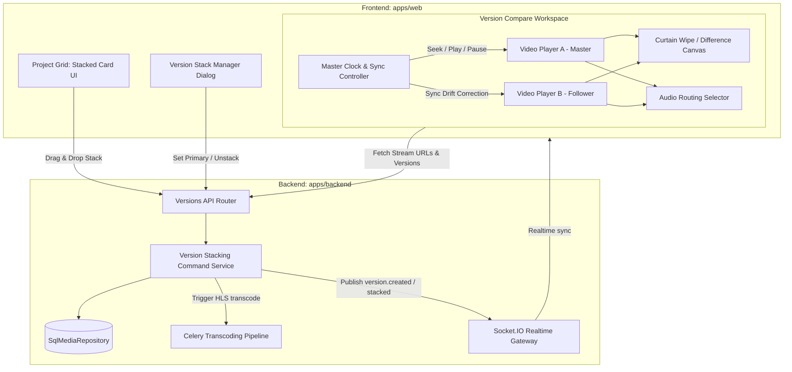

# Kế Hoạch Triển Khai Chi Tiết: Phase 8B — Video Version Stacking & Comparison

Tài liệu này quy định kiến trúc kỹ thuật, mô hình cơ sở dữ liệu, đặc tả API, luồng giao diện người dùng và kịch bản kiểm thử toàn diện cho **Phase 8B: Video Version Stacking & Side-by-Side Comparison** của nền tảng Feed.io.

---

## 🎯 Mục Tiêu Nghiệp Vụ của Phase 8B

1. **Version Stacking (Quản lý ngăn xếp phiên bản)**:
   - Cho phép tải bản dựng mới (v1, v2, v3, final) gắn trực tiếp vào một Video Asset hiện có.
   - Hỗ trợ gộp (stack) các video riêng lẻ thành một version stack qua thao tác Drag & Drop hoặc Context Menu.
   - Quản lý version stack: đặt nhãn phiên bản (*Rough Cut*, *Color Graded*, *Director's Cut*), chọn phiên bản hiển thị chính (*Primary Version*), tách (*unstack*) phiên bản thành asset độc lập, hoặc xóa phiên bản cụ thể.
2. **Trải nghiệm Danh sách Media linh hoạt**:
   - Ở Project Grid/Kanban, mặc định toàn bộ các version của một video được thu gọn thành một thẻ đại diện duy nhất với hiệu ứng thị giác xếp chồng (stacked card effect) và huy hiệu phiên bản (ví dụ: `V3`), tránh tràn ngập màn hình.
   - Bổ sung nút toggle trên thanh công cụ: **"Gom nhóm phiên bản (Group Stacks)"** (bật mặc định) vs **"Hiển thị tất cả file đơn lẻ"** (Show All).
3. **Synchronized Dual Playback Engine (Động cơ phát đồng bộ)**:
   - Điều khiển song song 2 luồng video HLS/HTML5 bằng một Master Timecode Clock duy nhất.
   - Hỗ trợ Play/Pause, Scrubber đồng bộ, Frame Step (Phím mũi tên, J-K-L) đạt độ chính xác từng khung hình (frame-accurate).
   - Hỗ trợ tinh chỉnh độ lệch khung hình (*Frame Offset Alignment*) nếu hai bản dựng lệch timecode bắt đầu.
4. **3 Chế Độ So Sánh Trực Quan (Comparison Modes)**:
   - **Side-by-Side (50/50)**: Hai khung hình đặt cạnh nhau, chia đôi màn hình.
   - **Split-Screen Wipe Slider**: Khung hình đơn với thanh trượt rèm dọc (curtain wipe) kéo rê qua lại để soi từng pixel giữa bản cũ và bản mới.
   - **Difference / Onion Skin Overlay**: Chế độ pha trộn lớp (CSS difference blend mode) làm nổi bật tức thì mọi thay đổi về kỹ xảo, màu sắc và đồ họa.
5. **Audio Routing & Quản lý Nhận xét Độc lập**:
   - Cho phép chuyển đổi nhanh nguồn âm thanh: Nghe Bản A, Bản B, hoặc Tắt tiếng (Mute).
   - Nhận xét (Comments) và quyết định duyệt (Review Decisions) được lưu giữ độc lập theo từng phiên bản (`media_id`), phản ánh đúng thực tế của bản dựng đó mà không trộn lẫn hay tự động copy sang version mới.

---

## 🏛️ Kiến Trúc Hệ Thống Phase 8B



---

## 🗄️ Thiết Kế Cơ Sở Dữ Liệu & Schema Migration

### 1. Bổ sung trường cho bảng `media_assets`

Cơ sở dữ liệu đã có `version_group_id` (UUID) và `version_number` (int). Phase 8B bổ sung các trường và index:

```sql
-- Migration: 20260915_0017_enhance_media_versioning.py
ALTER TABLE media_assets
ADD COLUMN version_label VARCHAR(100) NULL,
ADD COLUMN is_primary_version BOOLEAN NOT NULL DEFAULT FALSE;

-- Index phục vụ tìm kiếm version nhanh và sắp xếp theo version number
CREATE INDEX ix_media_assets_version_group_number 
ON media_assets (version_group_id, version_number ASC)
WHERE deleted_at IS NULL;

-- Index phục vụ gom nhóm trong Project Grid (lấy primary version của từng group)
CREATE INDEX ix_media_assets_primary_version 
ON media_assets (organization_id, project_id, is_primary_version)
WHERE deleted_at IS NULL;
```

### 2. Quy tắc toàn vẹn dữ liệu (Business Rules):
- Khi một video đơn lẻ được tải lên lần đầu: `version_group_id = NULL`, `version_number = 1`, `is_primary_version = TRUE`.
- Khi tạo version mới (hoặc stack):
  - Tất cả các version cùng chung một `version_group_id`.
  - `version_number` tự động tăng dần (1, 2, 3...).
  - Chỉ có **duy nhất một version** mang cờ `is_primary_version = TRUE` trong cùng một `version_group_id` (thường là version mới nhất).
- Khi unstack một version: Video được tách nhận `version_group_id = NULL`, `version_number = 1`, `is_primary_version = TRUE`.

---

## 🔌 Thiết Kế Chi Tiết API Endpoints

Tất cả các endpoint đặt dưới prefix:  
`/api/v1/organizations/{organization_id}/projects/{project_id}/media`

| Method | Endpoint | Quyền hạn | Mô tả |
| :--- | :--- | :--- | :--- |
| `POST` | `/{media_id}/versions/presign-upload` | Owner, Admin, Editor | Tạo upload session cho version mới của media này |
| `POST` | `/{media_id}/versions/complete` | Owner, Admin, Editor | Hoàn tất upload version, tăng `version_number`, gán `version_group_id` |
| `POST` | `/stack` | Owner, Admin, Editor | Gộp 2 asset riêng biệt vào 1 version stack (`parent_id` + `child_id`) |
| `POST` | `/{media_id}/unstack` | Owner, Admin, Editor | Tách một version ra khỏi stack thành asset độc lập |
| `POST` | `/{media_id}/set-primary` | Owner, Admin, Editor | Đặt version này làm phiên bản hiển thị mặc định của stack |
| `PATCH`| `/{media_id}/version-label` | Owner, Admin, Editor | Đổi nhãn phiên bản (ví dụ: "Color Graded Final Cut") |
| `GET`  | `/{media_id}/versions` | Tất cả thành viên | Lấy danh sách đầy đủ tất cả các phiên bản trong stack (đã có) |
| `GET`  | `/` (cập nhật query) | Tất cả thành viên | Hỗ trợ tham số `group_versions: bool = true` để chỉ trả về primary version |

### Request & Response Schemas:

```python
class CreateVersionUploadRequest(BaseModel):
    filename: str = Field(min_length=1, max_length=255)
    file_size_bytes: int = Field(ge=1)
    mime_type: str = Field(min_length=3, max_length=100)
    version_label: str | None = Field(default=None, max_length=100)
    duration_seconds: float | None = None
    width: int | None = None
    height: int | None = None
    has_thumbnail: bool = False

class StackMediaRequest(BaseModel):
    target_media_id: UUID = Field(description="Media gốc giữ vai trò v1 hoặc stack hiện tại")
    source_media_id: UUID = Field(description="Media được kéo vào để trở thành version mới")

class UpdateVersionLabelRequest(BaseModel):
    version_label: str = Field(min_length=1, max_length=100)

class VersionSummaryResponse(BaseModel):
    id: UUID
    version_number: int
    version_label: str | None
    title: str
    status: str
    review_status: str
    is_primary: bool
    created_at: datetime
```

---

## 🎨 Thiết Kế Giao Diện Frontend (`apps/web`)

### 1. Trải Nghiệm Version Stack tại Project Grid (`media_card.tsx`)
- **Hiệu ứng Thẻ Xếp Chồng (Stacked Card Visual)**:
  - Khi một asset có `version_count > 1`, hiển thị viền bóng phía sau (layered card effect) tạo cảm giác có nhiều lớp video.
  - Huy hiệu góc trái: Hiển thị badge nổi bật: `V3 (3 versions)`.
- **Drag & Drop Stacking (Luôn hiển thị Modal xác nhận)**:
  - Người dùng có thể kéo một thẻ video và thả đè lên một thẻ video khác.
  - Luôn bật Modal xác nhận trước khi thực hiện: Hiển thị thumbnail hai bản (Bản gốc và Bản sắp gộp), cho phép xem trước số phiên bản mới (`V2`, `V3`...) và nhập tùy chọn nhãn phiên bản (*Version Label*). Thao tác chỉ thực hiện khi người dùng bấm *"Xác nhận gộp phiên bản"*, ngăn chặn hoàn toàn việc thả nhầm.
- **Toggle Chế độ Xem tại Toolbar**:
  - Nút chuyển đổi: **"Gom nhóm phiên bản (Group Stacks)"** (bật mặc định) và **"Hiển thị tất cả file đơn lẻ (Show All)"**.
- **Menu Quản lý Phiên bản (Version Stack Management Modal)**:
  - Xem danh sách thumbnail, ngày tải lên, người tải, và trạng thái review từng version.
  - 1-Click *"Set as Primary"*.
  - 1-Click *"Unstack"* để tách version thành file riêng nếu gộp nhầm.
  - Nút *"Upload New Version"* mở thẳng dropzone.

### 2. Giao Diện So Sánh Phiên Bản (`VersionCompareWorkspace`)
Tích hợp tại trang Review Workspace thông qua nút toggle: **[ Single View | Compare Versions ]** hoặc phím tắt `C`.

```text
+-----------------------------------------------------------------------------------+
| < Quay lại Project   [V3: Final Color Grade v] vs [V2: Rough Cut v]   [Sync: 0.00s]|
+-----------------------------------------+-----------------------------------------+
|                                         |                                         |
|             VERSION A (V3)              |             VERSION B (V2)              |
|        [Approved] 00:01:24:12           |      [Needs Changes] 00:01:24:12        |
|                                         |                                         |
+-----------------------------------------+-----------------------------------------+
| Mode: (•) Side-by-Side  ( ) Wipe Slider  ( ) Difference    Audio: (•) A  ( ) B     |
| [Play/Pause] [|< Frame] [Frame >|]  ====[o]========================= 00:01:24:12  |
| Timeline Markers: • A-Comment (00:01:10)   • B-Comment (00:01:24)                |
+-----------------------------------------------------------------------------------+
```

#### Các Chế Độ Hiển Thị:
1. **Side-by-Side (50/50)**:
   - Hai video player đặt cạnh nhau, tự động co giãn theo tỷ lệ khung hình chuẩn 16:9 / 9:16.
   - Header từng bên hiển thị số phiên bản, nhãn, và trạng thái duyệt (`Approved` / `Needs Changes`).
2. **Split-Screen Wipe Slider (Thanh trượt rèm)**:
   - Hai video được xếp chồng tuyệt đối (`position: absolute`) trong cùng một container.
   - Video B nằm lớp dưới; Video A nằm lớp trên với thuộc tính `clip-path: polygon(0 0, {wipePos}% 0, {wipePos}% 100%, 0 100%)`.
   - Một thanh trượt dọc (Divider Bar) cho phép người dùng kéo chuột hoặc phím mũi tên từ 0% đến 100% để soi trực quan pixel thay đổi.
3. **Difference Overlay Mode**:
   - Áp dụng lớp phủ CSS `mix-blend-mode: difference;` hoặc canvas shader.
   - Các điểm giống nhau 100% sẽ hiển thị màu đen tuyền; các chi tiết thay đổi (chỉnh màu, thêm vật thể, xóa logo) sẽ sáng lên rực rỡ.

#### Động cơ Đồng bộ hóa (Master Clock Sync):
- Sử dụng hook React `useSynchronizedPlayback`:
  - Chọn Video A làm **Master Clock**.
  - Sự kiện `onTimeUpdate` từ Video A liên tục đồng bộ `currentTime` sang Video B.
  - Nếu độ lệch $|time_A - time_B| > 0.04s$ (vượt quá 1 frame ở 24fps), tự động bù trôi (*drift correction*) bằng cách seek Video B.
  - Hỗ trợ `frame_offset`: Cho phép người dùng chỉnh lệch $\pm N$ frames nếu bản dựng mới bị dời đầu video.

---

## 📁 Cấu Trúc File & Module Cần Triển Khai

### Backend (`apps/backend`):
```text
src/feedio/modules/media/
├── domain/
│   ├── entities.py                       # [MODIFY] Thêm version_label, is_primary_version vào MediaAsset
│   └── errors.py                         # [MODIFY] Thêm VersionStackNotFoundError, InvalidVersionOperationError
├── infrastructure/
│   ├── models.py                         # [MODIFY] Thêm columns & indices vào MediaAssetTable
│   └── repository.py                     # [MODIFY] Thêm stack_media, unstack_media, set_primary_version, list_primary_media
├── application/
│   ├── commands/
│   │   ├── stack_media.py                # [NEW] Use case gộp 2 media vào stack
│   │   ├── unstack_media.py              # [NEW] Use case tách version ra khỏi stack
│   │   ├── set_primary_version.py        # [NEW] Use case chọn version đại diện
│   │   └── update_version_label.py       # [NEW] Use case cập nhật nhãn version
│   └── queries/
│       └── get_version_stack.py          # [NEW] Use case lấy toàn bộ metadata stack
└── presentation/
    ├── schemas.py                        # [MODIFY] Thêm schemas cho stacking, unstacking, label
    └── versions_router.py                # [MODIFY] Mở rộng endpoints quản lý versions & stack
```

### Frontend (`apps/web`):
```text
src/modules/
├── media/
│   ├── components/
│   │   ├── media_card.tsx                # [MODIFY] Thêm Stacked Card visual, Drag & Drop target
│   │   ├── version_stack_dialog.tsx      # [NEW] Modal quản lý danh sách version (Reorder, unstack, label)
│   │   └── upload_version_dialog.tsx     # [NEW] Modal tải lên version mới trực tiếp
│   └── hooks/
│       └── use_version_stack.ts          # [NEW] React Query hooks cho stack, unstack, set-primary
└── review/
    └── components/
        └── compare/
            ├── version_compare_workspace.tsx # [NEW] Workspace so sánh 2 phiên bản
            ├── synchronized_dual_player.tsx  # [NEW] Dual player với master clock controller
            ├── wipe_slider_view.tsx          # [NEW] Chế độ xem rèm kéo split-screen
            ├── difference_overlay_view.tsx   # [NEW] Chế độ xem difference blend mode
            └── compare_control_bar.tsx       # [NEW] Thanh điều khiển so sánh (Mode, Offset, Audio)
```

---

## 📅 Các Bước Triển Khai Tuần Tự (Step-by-Step Roadmap)

1. **Bước 1: Database Migration & Repository Update**
   - Viết migration `20260915_0017_enhance_media_versioning.py`.
   - Cập nhật `MediaAssetTable` và `MediaAsset` entity.
   - Viết các phương thức repository: `stack_media()`, `unstack_media()`, `set_primary_version()`, cập nhật `list_by_project()`.
2. **Bước 2: Backend Use Cases & API Endpoints**
   - Hoàn thiện các lệnh use cases: `StackMedia`, `UnstackMedia`, `SetPrimaryVersion`, `UpdateVersionLabel`.
   - Bổ sung endpoints vào `versions_router.py`.
   - Phát sự kiện realtime `media.version_created`, `media.stacked`, `media.unstacked` qua Valkey/Socket.IO.
3. **Bước 3: Frontend Version Stacking UI (Project Grid)**
   - Cập nhật `media_card.tsx` với stacked card visual và version badge.
   - Thêm Drag & Drop stacking giữa các cards.
   - Xây dựng modal `version_stack_dialog.tsx` và `upload_version_dialog.tsx`.
4. **Bước 4: Frontend Dual Synchronized Playback Engine**
   - Xây dựng hook `useSynchronizedPlayback` quản lý master clock, frame-accurate play/pause, seek, frame-step, và offset.
   - Tạo component `synchronized_dual_player.tsx` với khả năng điều khiển 2 video elements độc lập.
5. **Bước 5: 3 Chế Độ So Sánh Trực Quan**
   - Triển khai chế độ **Side-by-Side**.
   - Triển khai chế độ **Split-Screen Wipe Slider** với thanh trượt tương tác mượt mà.
   - Triển khai chế độ **Difference Overlay View**.
   - Tích hợp Audio Routing Selector (Nghe Audio A / Audio B).
6. **Bước 6: Testing & End-to-End Verification**
   - Viết unit tests cho use cases Backend (`pytest`).
   - Viết contract tests cho versions API (`TestClient`).
   - Viết component tests cho Dual Player và Wipe Slider (`vitest`).
   - Kiểm tra E2E: Tải v1 ➔ Tải v2 ➔ Kéo thả stack ➔ Mở Compare Mode ➔ Kéo wipe slider ➔ Chuyển đổi audio ➔ Verify đồng bộ timecode.
