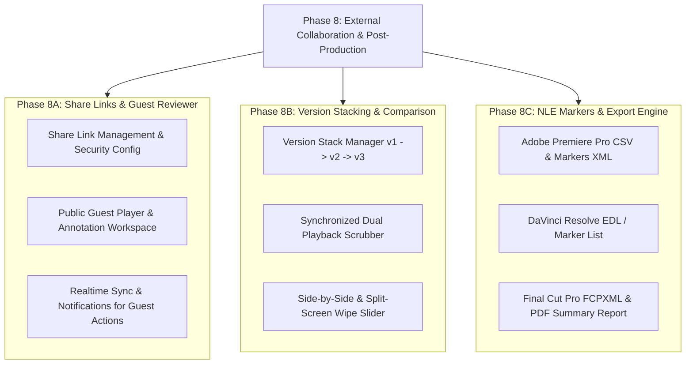

# Kế Hoạch Triển Khai Chi Tiết: Phase 8 — External Collaboration & Advanced Post-Production Tools

Tài liệu này quy định chi tiết kiến trúc, cơ sở dữ liệu, API endpoints, luồng giao diện (UI/UX) và kịch bản kiểm thử cho **Phase 8** của nền tảng Feed.io.

---

## 🗺️ Cấu trúc tổng thể Phase 8



---

## 🚀 Phase 8A: Public Share Links & Guest Review Mode

### 1. Mục tiêu nghiệp vụ
Cho phép nhóm sản xuất video chia sẻ liên kết bảo mật ra bên ngoài (cho khách hàng, đạo diễn, agency) mà người nhận **không cần đăng ký tài khoản**. Khách mời có thể xem video HLS chất lượng cao, vẽ annotation, viết nhận xét và duyệt trạng thái video.

### 2. Thiết kế Cơ sở Dữ liệu & Schema (PostgreSQL)

Bảng `share_links`:
```sql
CREATE TABLE share_links (
    id UUID PRIMARY KEY DEFAULT gen_random_uuid(),
    organization_id UUID NOT NULL REFERENCES organizations(id) ON DELETE CASCADE,
    project_id UUID NOT NULL REFERENCES projects(id) ON DELETE CASCADE,
    media_id UUID REFERENCES media_assets(id) ON DELETE CASCADE,
    folder_id UUID REFERENCES project_folders(id) ON DELETE CASCADE,
    created_by_user_id UUID NOT NULL REFERENCES users(id) ON DELETE CASCADE,
    token_hash VARCHAR(64) NOT NULL UNIQUE,
    passphrase_hash VARCHAR(255) NULL,
    allow_comments BOOLEAN NOT NULL DEFAULT TRUE,
    allow_approval BOOLEAN NOT NULL DEFAULT TRUE,
    allow_download BOOLEAN NOT NULL DEFAULT FALSE,
    expires_at TIMESTAMPTZ NULL,
    access_count INTEGER NOT NULL DEFAULT 0,
    is_revoked BOOLEAN NOT NULL DEFAULT FALSE,
    created_at TIMESTAMPTZ NOT NULL DEFAULT NOW(),
    updated_at TIMESTAMPTZ NOT NULL DEFAULT NOW(),
    CONSTRAINT chk_target_asset CHECK (
        (media_id IS NOT NULL AND folder_id IS NULL) OR
        (media_id IS NULL AND folder_id IS NOT NULL)
    )
);

CREATE INDEX ix_share_links_token_hash ON share_links (token_hash);
CREATE INDEX ix_share_links_media_id ON share_links (media_id);
CREATE INDEX ix_share_links_project_id ON share_links (project_id);
```

### 3. Thiết kế Backend API

#### 3.1. Phân hệ Quản lý Share Link (Internal API - Xác thực Cookie/JWT)
- `POST /api/v1/organizations/{org_id}/projects/{project_id}/media/{media_id}/share-links`:
  - **Body**: `{ passphrase?: string, expires_at?: string, allow_comments: bool, allow_approval: bool, allow_download: bool }`
  - **Response**: Trả về `share_url` chứa `raw_token` (chỉ hiển thị 1 lần duy nhất khi tạo).
- `GET /api/v1/organizations/{org_id}/projects/{project_id}/media/{media_id}/share-links`:
  - Liệt kê các link đã tạo, số lượt truy cập (`access_count`), trạng thái active/revoked/expired.
- `DELETE /api/v1/organizations/{org_id}/projects/{project_id}/share-links/{share_link_id}`:
  - Thu hồi (Revoke) link ngay lập tức.

#### 3.2. Phân hệ Khách ngoài (Public Guest API - Không yêu cầu đăng nhập)
- `GET /api/v1/public/shares/{token}`:
  - Kiểm tra tính hợp lệ của token, hạn sử dụng, và kiểm tra link có yêu cầu mật khẩu (`has_passphrase: bool`) hay không.
  - Nếu link không có mật khẩu: Trả về metadata của video (Title, Duration, FPS, Resolution, Permissions).
- `POST /api/v1/public/shares/{token}/verify`:
  - **Body**: `{ passphrase: "..." }`
  - **Response**: Trả về `guest_session_token` (JWT mã hóa ngắn hạn) để tiếp tục thao tác.
- `GET /api/v1/public/shares/{token}/stream`:
  - Presigned HLS Playback URL cho khách ngoài.
- `GET /api/v1/public/shares/{token}/comments`:
  - Lấy danh sách comment & annotation của video.
- `POST /api/v1/public/shares/{token}/comments`:
  - **Body**: `{ guest_name: string, guest_email?: string, content: string, timestamp_seconds: float, annotation_data?: json }`
  - Tự động phát sự kiện `comment.created` qua WebSocket tới Media Review Room nội bộ.
  - Gửi in-app notification `COMMENT_REPLY` hoặc `MENTION` tới chủ sở hữu media.
- `POST /api/v1/public/shares/{token}/decisions`:
  - **Body**: `{ guest_name: string, status: "approved" | "needs_changes", notes?: string }`
  - Cập nhật review status, phát `decision.updated` qua WebSocket và gửi in-app notification `REVIEW_DECISION` cho creator.
- `GET /api/v1/public/shares/{token}/download`:
  - Presigned download URL file gốc (nếu `allow_download = true`).

### 4. Thiết kế Giao diện Frontend (UI/UX)
- **Modal Tạo Share Link trong Review Workspace**:
  - Tùy chọn đặt mật khẩu, hạn dùng (1 ngày, 7 ngày, 30 ngày, vĩnh viễn).
  - Tùy chọn quyền: Cho phép nhận xét, Cho phép duyệt, Cho phép tải về.
  - 1-Click Copy Link.
- **Trang Public Guest Reviewer (`/share/[token]`)**:
  - Giao diện standalone tối giản, sang trọng, mang phong cách rạp chiếu phim (Cinematic Player).
  - Form nhập Guest Name khi lần đầu comment/approve (lưu vào localStorage/session).
  - Đầy đủ bộ công cụ: Video scrubber, Audio waveform, Phím tắt Space/J-K-L, Canvas Annotation (Pen, Box, Arrow), Threaded Comment List.

---

## 🎞️ Phase 8B: Video Version Stacking & Side-by-Side Comparison

### 1. Mục tiêu nghiệp vụ
Cho phép team hậu kỳ tải lên các bản dựng mới (v1, v2, v3, final) vào cùng một Video Asset và so sánh trực tiếp sự khác biệt giữa 2 phiên bản bất kỳ trên cùng màn hình.

### 2. Kiến trúc & Logic Kỹ thuật
- **Version Stack Linking**:
  - Mỗi media asset có `version_group_id` (UUID) và `version_number` (int: 1, 2, 3...).
  - API upload version mới: `POST /api/v1/.../media/{media_id}/versions/upload`.
  - API đặt active version: `POST /api/v1/.../media/{media_id}/versions/{version_id}/set-active`.
- **Synchronized Playback Engine**:
  - 2 thẻ `<video>` HTML5 chạy song song được điều khiển bởi 1 Playback Controller duy nhất (master timecode clock).
  - Tự động bù trừ chênh lệch FPS / duration giữa 2 video.
- **3 Chế độ So sánh (Comparison Modes)**:
  1. **Side-by-Side**: 2 màn hình đặt cạnh nhau (50% - 50%).
  2. **Split-Screen Wipe Slider**: 1 khung hình duy nhất có thanh trượt dọc kéo qua lại để soi từng pixel giữa bản cũ và bản mới.
  3. **Overlay Difference**: Chế độ blend mode để làm nổi bật các frame có hiệu ứng kỹ xảo / màu sắc thay đổi.
- **Audio Routing Selector**: Chọn nghe âm thanh của Bản A, Bản B, hoặc Mix cả hai.

---

## 📥 Phase 8C: NLE Markers & Export Engine

### 1. Mục tiêu nghiệp vụ
Tiết kiệm hàng giờ nhập liệu thủ công cho Editor/Colorist bằng cách xuất toàn bộ comments, timestamp và visual annotations từ Feed.io trực tiếp vào timeline của các phần mềm dựng phim chuyên nghiệp.

### 2. Định dạng hỗ trợ & Cấu trúc file

#### 2.1. Adobe Premiere Pro (`CSV` & `Markers XML`)
- Cấu trúc file CSV theo chuẩn Marker Import của Adobe Premiere:
  ```csv
  Marker Name,Description,In,Out,Duration,Marker Type
  "Comment by John","Needs color grading fix at this spot",00:01:24:12,00:01:24:12,00:00:00:01,Comment
  "Approved by Director","Approved version",00:02:10:00,00:02:10:00,00:00:00:01,Comment
  ```

#### 2.2. DaVinci Resolve (`EDL` - Edit Decision List)
- Cấu trúc EDL chuẩn CMX3600 kèm Maker Notes:
  ```text
  TITLE: Feed.io Review Export
  FCM: NON-DROP FRAME

  001  AX       V     C        00:01:24:12 00:01:24:13 00:01:24:12 00:01:24:13
  * FROM CLIP NAME: master_v2.mp4
  * LOC: 00:01:24:12 Cyan Needs color grading fix at this spot | John Doe
  ```

#### 2.3. Final Cut Pro (`FCPXML`)
- Cấu trúc XML chuẩn FCPX 1.10 chứa các `<marker>` tag gắn theo frame rate timeline.

#### 2.4. PDF Review Summary Report
- Xuất file PDF tóm tắt bao gồm:
  - Header: Tên dự án, tên video, ngày duyệt, tổng số comment, review status hiện tại.
  - Body: Bảng danh sách các nhận xét kèm ảnh chụp màn hình (Snapshot có chứa nét vẽ annotation) tại đúng timecode đó.

---

## 📅 Lộ trình thực thi (Implementation Phases)

| Giai đoạn | Nội dung công việc | Output cụ thể |
| :--- | :--- | :--- |
| **8A.1** | Database Migration & Backend Share Link Services | Migration `share_links`, CRUD Share Links API |
| **8A.2** | Public Guest API & Token Security | Public endpoints cho Stream, Comments, Decisions |
| **8A.3** | Frontend Guest Review Page (`/share/[token]`) | Giao diện Reviewer cho khách ngoài |
| **8B.1** | Version Stacking API & Upload New Version | Upload v2/v3 và quản lý Version Switcher |
| **8B.2** | Frontend Synchronized Dual Player & Wipe Slider | Chế độ so sánh Side-by-Side & Split Screen |
| **8C.1** | NLE Export Formats Generator (CSV, EDL, FCPXML) | API tải file Marker cho Premiere/DaVinci/FCP |
| **8C.2** | PDF Summary Exporter & Annotation Snapshots | Xuất báo cáo PDF kèm ảnh chụp canvas |

---

## 🧪 Kịch bản kiểm thử & Tiêu chuẩn chất lượng (Quality Gate)

1. **Unit & Integration Tests**:
   - Backend: Viết test cho Share Link CRUD, token hashing, expiration check, passphrase verify, public comment/decision submission.
   - Frontend: Viết unit test cho Share Dialog, Public Player, Version Comparison Scrubber, NLE Export modal.
2. **Security & Access Control**:
   - Không thể truy cập link đã bị revoke hoặc quá hạn (404/410).
   - Rate limiting trên endpoint xác thực passphrase để chống brute-force.
   - Presigned URL cho Guest có thời hạn ngắn (1-2 giờ).
3. **Hiệu năng & Tương thích**:
   - Split-screen player duy trì 60 FPS khi scrub timeline cả 2 video cùng lúc.
   - File marker xuất ra import trực tiếp thành công vào Adobe Premiere Pro và DaVinci Resolve.
