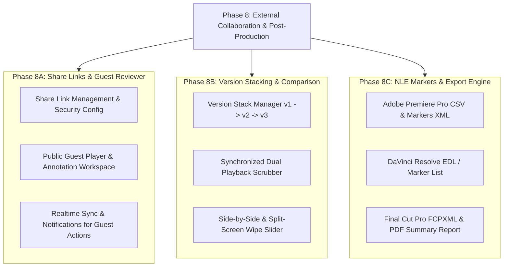

# Detailed Implementation Plan: Phase 8 — External Collaboration & Advanced Post-Production Tools

This document specifies the architecture, database schema, API endpoints, UI/UX interaction flows, and verification criteria for **Phase 8** of the Feed.io platform.

---

## 🗺️ Phase 8 Architecture Overview



---

## 🚀 Phase 8A: Public Share Links & Guest Review Mode

### 1. Business Objectives
Enable production teams to share password-protected external review links with clients, directors, and agencies **without requiring them to create an account**. Guest reviewers can stream adaptive HLS video, draw vector annotations, submit timecoded comments, and make approval decisions.

### 2. Database Schema (PostgreSQL)

Table `share_links`:
```sql
CREATE TABLE share_links (
    id UUID PRIMARY KEY DEFAULT gen_random_uuid(),
    organization_id UUID NOT NULL REFERENCES organizations(id) ON DELETE CASCADE,
    project_id UUID NOT NULL REFERENCES projects(id) ON DELETE CASCADE,
    media_id UUID REFERENCES media_assets(id) ON DELETE CASCADE,
    folder_id UUID REFERENCES project_folders(id) ON DELETE CASCADE,
    created_by_user_id UUID NOT NULL REFERENCES users(id) ON DELETE CASCADE,
    token_hash VARCHAR(64) NOT NULL UNIQUE,
    passphrase_hash VARCHAR(255) NULL,
    allow_comments BOOLEAN NOT NULL DEFAULT TRUE,
    allow_approval BOOLEAN NOT NULL DEFAULT TRUE,
    allow_download BOOLEAN NOT NULL DEFAULT FALSE,
    expires_at TIMESTAMPTZ NULL,
    access_count INTEGER NOT NULL DEFAULT 0,
    is_revoked BOOLEAN NOT NULL DEFAULT FALSE,
    created_at TIMESTAMPTZ NOT NULL DEFAULT NOW(),
    updated_at TIMESTAMPTZ NOT NULL DEFAULT NOW(),
    CONSTRAINT chk_target_asset CHECK (
        (media_id IS NOT NULL AND folder_id IS NULL) OR
        (media_id IS NULL AND folder_id IS NOT NULL)
    )
);

CREATE INDEX ix_share_links_token_hash ON share_links (token_hash);
CREATE INDEX ix_share_links_media_id ON share_links (media_id);
CREATE INDEX ix_share_links_project_id ON share_links (project_id);
```

### 3. Backend API Specification

#### 3.1. Share Link Management (Internal API - Cookie/JWT Authenticated)
- `POST /api/v1/organizations/{org_id}/projects/{project_id}/media/{media_id}/share-links`:
  - **Body**: `{ passphrase?: string, expires_at?: string, allow_comments: bool, allow_approval: bool, allow_download: bool }`
  - **Response**: Returns `share_url` embedding `raw_token` (revealed only once upon creation).
- `GET /api/v1/organizations/{org_id}/projects/{project_id}/media/{media_id}/share-links`:
  - Lists active and historical links, access counters (`access_count`), and expiration status.
- `DELETE /api/v1/organizations/{org_id}/projects/{project_id}/share-links/{share_link_id}`:
  - Immediately revokes share link access.

#### 3.2. Public Guest Review (Public API - Unauthenticated)
- `GET /api/v1/public/shares/{token}`:
  - Validates token, verifies expiration, and checks if password verification is required (`has_passphrase: bool`).
  - Unprotected link: Returns media metadata (Title, Duration, FPS, Resolution, Permissions).
- `POST /api/v1/public/shares/{token}/verify`:
  - **Body**: `{ passphrase: "..." }`
  - **Response**: Returns short-lived `guest_session_token`.
- `GET /api/v1/public/shares/{token}/stream`:
  - Returns presigned streaming playback URLs for guest playback.
- `GET /api/v1/public/shares/{token}/comments`:
  - Fetches review comments and vector annotations.
- `POST /api/v1/public/shares/{token}/comments`:
  - **Body**: `{ guest_name: string, guest_email?: string, content: string, timestamp_seconds: float, annotation_data?: json }`
  - Emits `comment.created` via WebSocket to internal media review room.
  - Sends in-app notifications (`COMMENT_REPLY` / `MENTION`) to asset owners.
- `POST /api/v1/public/shares/{token}/decisions`:
  - **Body**: `{ guest_name: string, status: "approved" | "needs_changes", notes?: string }`
  - Updates review decision status, broadcasts `decision.updated` via WebSocket, and emits in-app notification.
- `GET /api/v1/public/shares/{token}/download`:
  - Presigned download URL for original media (if `allow_download = true`).

### 4. Frontend UI/UX Design
- **Share Modal in Review Workspace**:
  - Optional passphrase, expiration selector (1 day, 7 days, 30 days, unlimited).
  - Permission toggles: Allow comments, Allow approval decisions, Allow downloads.
  - 1-Click Copy Link with feedback state.
- **Public Guest Reviewer Portal (`/share/[token]`)**:
  - Clean, cinema-inspired standalone layout.
  - Onboarding prompt for Guest Name on first comment or decision (persisted in session).
  - Full player toolset: Video scrubber, Audio waveform, Space/J-K-L keyboard shortcuts, Canvas annotations (Pen, Box, Arrow), Threaded comments.

---

## 🎞️ Phase 8B: Video Version Stacking & Side-by-Side Comparison

### 1. Business Objectives
Allow post-production teams to stack new iterations (v1, v2, v3, final) under a unified asset container and directly compare differences between any two versions in real time.

### 2. Architecture & Technical Logic
- **Version Stack Linking**:
  - Assets track `version_group_id` (UUID) and `version_number` (int: 1, 2, 3...).
  - Upload version: `POST /api/v1/.../media/{media_id}/versions/upload`.
  - Set active version: `POST /api/v1/.../media/{media_id}/versions/{version_id}/set-active`.
- **Synchronized Playback Engine**:
  - Dual HTML5 `<video>` elements managed by a single master timecode clock.
  - Automatic drift compensation across differing framerates and durations.
- **3 Visual Comparison Modes**:
  1. **Side-by-Side**: Dual viewports positioned side-by-side (50% / 50%).
  2. **Split-Screen Wipe Slider**: Single viewport with draggable vertical slider revealing pixel differences.
  3. **Overlay Difference**: Blend mode comparison highlighting altered VFX or color grading passes.
- **Audio Routing**: Toggle audio output between Version A, Version B, or blended mix.

---

## 📥 Phase 8C: NLE Markers & Export Engine

### 1. Business Objectives
Save editors and colorists hours of manual data entry by exporting all comments, timestamps, and annotations directly into professional video editing timelines.

### 2. Supported Formats & File Structures

#### 2.1. Adobe Premiere Pro (`CSV` & `Markers XML`)
- Premiere-compliant CSV Marker file structure:
  ```csv
  Marker Name,Description,In,Out,Duration,Marker Type
  "Comment by John","Needs color grading fix at this spot",00:01:24:12,00:01:24:12,00:00:00:01,Comment
  "Approved by Director","Approved version",00:02:10:00,00:02:10:00,00:00:00:01,Comment
  ```

#### 2.2. DaVinci Resolve (`EDL` - Edit Decision List)
- CMX3600 standard EDL with Marker notes:
  ```text
  TITLE: Feed.io Review Export
  FCM: NON-DROP FRAME

  001  AX       V     C        00:01:24:12 00:01:24:13 00:01:24:12 00:01:24:13
  * FROM CLIP NAME: master_v2.mp4
  * LOC: 00:01:24:12 Cyan Needs color grading fix at this spot | John Doe
  ```

#### 2.3. Final Cut Pro (`FCPXML`)
- FCPX 1.10 XML schema with timecode-synchronized `<marker>` elements.

#### 2.4. PDF Review Summary Report
- Comprehensive review document export:
  - Header: Project title, asset name, review date, comment count, decision status.
  - Body: Chronological table of feedback accompanied by frame snapshots including vector annotations.

---

## 📅 Implementation Roadmap

| Sub-Phase | Scope of Work | Deliverables |
| :--- | :--- | :--- |
| **8A.1** | Database Migration & Backend Share Link Services | `share_links` migration, CRUD Share Links API |
| **8A.2** | Public Guest API & Token Security | Public endpoints for Stream, Comments, and Decisions |
| **8A.3** | Frontend Guest Review Page (`/share/[token]`) | External guest reviewer interface |
| **8B.1** | Version Stacking API & Upload New Version | Version stacking commands and Version Switcher |
| **8B.2** | Frontend Synchronized Dual Player & Wipe Slider | Side-by-Side and Wipe Slider comparison workspaces |
| **8C.1** | NLE Export Formats Generator (CSV, EDL, FCPXML) | Marker export endpoints for Premiere, DaVinci, and FCP |
| **8C.2** | PDF Summary Exporter & Annotation Snapshots | PDF summary generation with canvas capture |

---

## 🧪 Verification & Quality Gate

1. **Unit & Integration Tests**:
   - Backend: Share Link CRUD, token hashing, expiration verification, passphrase validation, guest comment/decision workflows.
   - Frontend: Share modal, public player, version comparison scrubber, NLE export modal.
2. **Security & Access Control**:
   - Revoked or expired links return 404/410.
   - Rate limiting on passphrase verification prevents brute-force attempts.
   - Short-lived presigned URLs for guest streaming sessions (1-2 hours).
3. **Performance & Compatibility**:
   - Dual-playback maintains smooth 60 FPS while scrubbing both timelines simultaneously.
   - Exported marker files import cleanly into Adobe Premiere Pro and DaVinci Resolve timelines.
