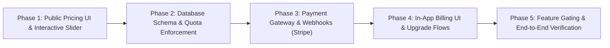
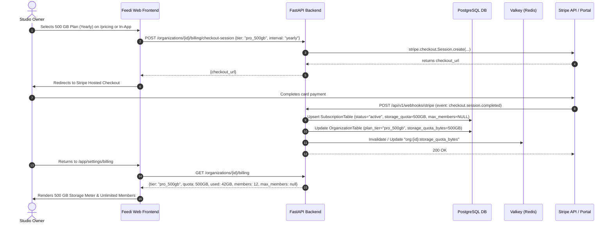

# Feedi — Pricing & Subscription Architecture Plan

This document defines the architectural design, business model rules, database schemas, enforcement mechanisms, payment gateway integration, and a **5-Phase Delivery Roadmap** for the **Feedi Pricing & Subscription Engine**.

> [!IMPORTANT]
> **Core Benchmark & Guiding Principle:** [FreeFrame Pricing](https://freeframe.io/pricing)  
> **"No per-seat pricing. Ever."**  
> Unlike traditional video review tools (such as Frame.io) that charge $15–$25 per head per month—penalizing studios whenever they invite clients, directors, colorists, or freelancers—**Feedi charges exclusively for storage capacity**. Every paid tier includes **unlimited members and reviewers**. A 10-person team pays $5/month, and so does a 50-person team.

---

## 🗺️ 5-Phase Delivery Roadmap



| Phase | Core Objective | Primary Deliverables |
|---|---|---|
| **Phase 1** | Public Pricing UI & Interactive Slider | Interactive Storage Slider (100GB - 1TB), Monthly/Yearly toggle (-17%), standalone `/pricing` page, feature matrix, and FAQ |
| **Phase 2** | Database Schema & Dynamic Quota Enforcement | `subscriptions` table, `organizations` quota fields, dynamic `StorageQuotaService`, and 5-member limit check in `InviteMember` |
| **Phase 3** | Payment Gateway & Webhook Infrastructure | Stripe Checkout Sessions, Customer Billing Portal, Webhook Handlers (`checkout.session.completed`, `customer.subscription.updated`), and Mock Provider for offline dev |
| **Phase 4** | In-App Organization Billing & Upgrade Flows | `/app/settings/billing` page, visual Storage Meter (`X GB / Y GB used`), member limit paywall modal, and 80%/95% quota warning alerts |
| **Phase 5** | Pro Feature Gating & Comprehensive Verification | NLE Marker Export gating (FCPXML/EDL/CSV), Version Comparison gating, unit & integration test suites, and build validation |

---

## 1. Plan Structure & Pricing Matrix

### 1.1. Plan Tiers Comparison

| Feature / Tier | Free Plan ($0) | Hosted / Pro (100 GB) | Hosted / Pro (500 GB) | Hosted / Pro (1 TB) | Enterprise (> 1 TB) |
| :--- | :--- | :--- | :--- | :--- | :--- |
| **Monthly Billing** | **$0** / forever | **$5** / month | **$15** / month | **$27** / month | Custom Quote |
| **Annual Billing (-17%)** | $0 | **$50** / year (~$4.15/mo) | **$150** / year (~$12.50/mo) | **$270** / year (~$22.50/mo) | Custom Contract |
| **Storage Quota** | **5 GB** | **100 GB** | **500 GB** | **1 TB** | 5 TB+ Custom S3 |
| **Team Members** | **Capped at 5 members** | **Unlimited** | **Unlimited** | **Unlimited** | Unlimited |
| **Active Projects** | Unlimited | Unlimited | Unlimited | Unlimited | Unlimited |
| **Frame-Accurate Video/Audio Review** | Full capability | Full capability | Full capability | Full capability | Full capability |
| **Timestamped Comments & Canvas Drawings** | Full capability | Full capability | Full capability | Full capability | Full capability |
| **Password-Protected Share Links** | Supported | Supported | Supported | Supported | Supported |
| **Version Stacking & Approvals** | Basic (2 versions) | Full version history | Full version history | Full version history | Full version history |
| **NLE Comment Export (Premiere, FCPX, Resolve)** | ❌ No | **✅ Full Export** | **✅ Full Export** | **✅ Full Export** | **✅ Full Export** |
| **Side-by-Side Version Compare** | ❌ Basic preview | **✅ Full Split/Diff** | **✅ Full Split/Diff** | **✅ Full Split/Diff** | **✅ Full Split/Diff** |
| **Custom Project Statuses** | Standard statuses | **✅ Customizable** | **✅ Customizable** | **✅ Customizable** | **✅ Customizable** |
| **Studio Branding & Custom Social Previews** | Feedi default | **✅ Custom Brand** | **✅ Custom Brand** | **✅ Custom Brand** | Dedicated Subdomain / Domain |
| **Storage Infrastructure** | Shared S3 Storage | High-Speed Accelerated S3 | High-Speed Accelerated S3 | High-Speed Accelerated S3 | Dedicated S3 Bucket / On-Prem |

---

## 2. End-to-End System Architecture



---

## 3. Database Schema & Data Models

### 3.1. `SubscriptionTable` (`apps/backend/src/feedio/modules/billing/infrastructure/models.py`)

```python
from datetime import datetime
from uuid import UUID, uuid4
from sqlmodel import Column, DateTime, Field, Index, SQLModel, String
from feedio.shared.infrastructure.persistence import utc_now


class SubscriptionTable(SQLModel, table=True):
    __tablename__ = "subscriptions"
    __table_args__ = (
        Index("uq_subscriptions_org_id", "organization_id", unique=True),
        Index("ix_subscriptions_provider_sub_id", "provider_subscription_id"),
        Index("ix_subscriptions_customer_id", "provider_customer_id"),
    )

    id: UUID = Field(default_factory=uuid4, primary_key=True)
    organization_id: UUID = Field(
        foreign_key="organizations.id",
        nullable=False,
        ondelete="CASCADE",
    )
    provider: str = Field(default="stripe", sa_column=Column(String(32), nullable=False))
    provider_customer_id: str | None = Field(default=None, sa_column=Column(String(255), nullable=True))
    provider_subscription_id: str | None = Field(default=None, sa_column=Column(String(255), nullable=True))

    plan_tier: str = Field(default="free", sa_column=Column(String(32), nullable=False))
    # plan_tier values: 'free', 'pro_100gb', 'pro_500gb', 'pro_1tb', 'enterprise'

    billing_interval: str = Field(default="monthly", sa_column=Column(String(16), nullable=False))
    # billing_interval values: 'monthly', 'yearly'

    storage_quota_bytes: int = Field(default=5 * 1024 * 1024 * 1024)  # 5 GB default for Free
    max_members: int | None = Field(default=5)  # 5 for Free, NULL for unlimited

    status: str = Field(default="active", sa_column=Column(String(32), nullable=False))
    # status values: 'active', 'past_due', 'canceled', 'trialing', 'incomplete'

    current_period_start: datetime | None = Field(
        default=None,
        sa_column=Column(DateTime(timezone=True), nullable=True),
    )
    current_period_end: datetime | None = Field(
        default=None,
        sa_column=Column(DateTime(timezone=True), nullable=True),
    )
    cancel_at_period_end: bool = Field(default=False)

    created_at: datetime = Field(
        default_factory=utc_now,
        sa_column=Column(DateTime(timezone=True), nullable=False),
    )
    updated_at: datetime = Field(
        default_factory=utc_now,
        sa_column=Column(DateTime(timezone=True), nullable=False),
    )
```

### 3.2. `OrganizationTable` Column Additions (`apps/backend`)

To ensure ultra-low latency on media upload pre-signed URL requests, `organizations` denormalizes two columns so `StorageQuotaService` and `InviteMember` avoid unnecessary table joins:
1. `plan_tier: str = Field(default="free", sa_column=Column(String(32), nullable=False, server_default="free"))`
2. `storage_quota_bytes: int = Field(default=5 * 1024 * 1024 * 1024, sa_column=Column(BigInteger, nullable=False, server_default="5368709120"))`

---

## 4. Phase-by-Phase Technical Specifications

---

### Phase 1: Public Pricing UI & Interactive Slider

#### Objectives:
Deliver a customer-facing pricing experience benchmarked against FreeFrame on the public landing page and a dedicated standalone `/pricing` route.

#### Key Deliverables:
1. **Interactive Slider Component in `landing_pricing_section.tsx`:**
   - Replace the legacy per-seat pricing card with the 2-column layout:
     - **Card 1: Free Tier ($0):**
       - 5 GB storage · Up to 5 members · No credit card required.
       - Core review, timecode comments, drawings, share links with passphrase.
     - **Card 2: Hosted / Pro Tier (Primary Hero Card):**
       - Interactive range slider with 3 discrete positions:
         - **100 GB** $\rightarrow$ **$5 / mo** (or $50 / yr)
         - **500 GB** $\rightarrow$ **$15 / mo** (or $150 / yr)
         - **1 TB** $\rightarrow$ **$27 / mo** (or $270 / yr)
       - Dynamic price, storage badge, and dynamic CTA button (`Get 100 GB`, `Get 500 GB`, `Get 1 TB`).
       - Prominent highlight banner: **"Unlimited members: reviewers and clients never cost a seat"**.
       - Feature list: NLE comment export, version compare, custom project statuses, social preview branding.
   - **Billing Period Switcher (Toggle Pill):**
     - `Monthly` vs `Yearly (Save 17%)`.
     - Automatically recalculates prices on the fly.
   - **Footer Sublines:**
     - *"Need more than 1 TB? Talk to us."*
     - *"Free workspaces are capped at five members. Every paid plan has unlimited members: reviewers, clients and freelancers never count against a seat."*

2. **Dedicated Standalone Page: `apps/web/src/app/pricing/page.tsx`:**
   - Full-width feature comparison matrix comparing Free vs 100 GB vs 500 GB vs 1 TB vs Enterprise.
   - Interactive Storage Estimator (input number of videos/week and average cut duration to calculate recommended GB tier).
   - Comprehensive FAQ section (dealing with overages, storage calculation, cancelation, guest reviewers, and enterprise options).
   - Structured JSON-LD schema (`SoftwareApplication` / `Offer`) for search engine optimization.

3. **Global Navigation & Footer Links:**
   - Add "Pricing" link in [`landing_nav.tsx`](file:///Users/nguyenkimquockhanh/Desktop/feed.io/apps/web/src/modules/landing/components/landing_nav.tsx) and [`landing_footer.tsx`](file:///Users/nguyenkimquockhanh/Desktop/feed.io/apps/web/src/modules/landing/components/landing_footer.tsx).

---

### Phase 2: Database Schema & Dynamic Quota Enforcement

#### Objectives:
Enforce the storage and member rules dynamically in the backend based on the active organization plan.

#### Key Deliverables:
1. **Alembic Migration:**
   - Create migration: `add_subscriptions_and_org_quota_fields.py`.
   - Creates `subscriptions` table.
   - Adds `plan_tier` and `storage_quota_bytes` to `organizations`.
   - Backfills existing organizations with `plan_tier="free"` and `storage_quota_bytes=5368709120` (5 GB).

2. **Dynamic `StorageQuotaService` Refactoring:**
   - File: [`apps/backend/src/feedio/modules/media/infrastructure/quota_service.py`](file:///Users/nguyenkimquockhanh/Desktop/feed.io/apps/backend/src/feedio/modules/media/infrastructure/quota_service.py)
   - Replace the static `50 GB` default with dynamic lookup:
     ```python
     async def get_organization_quota(self, organization_id: UUID) -> int:
         client = await self._get_client()
         key = f"org:{organization_id}:quota_bytes"
         if client:
             cached = await client.get(key)
             if cached is not None:
                 return int(cached)
         
         org = await self._repository.get_organization_record(organization_id)
         quota = org.storage_quota_bytes if org else 5 * 1024 * 1024 * 1024
         if client:
             await client.set(key, str(quota), ex=3600)  # 1 hour TTL
         return quota
     ```
   - In `check_upload_allowed()`:
     - Compare `current_usage + file_size_bytes > org_quota`.
     - Raise `StorageQuotaExceededError` with accurate plan details and upgrade guidance when exceeded.

3. **5-Member Limit Check in `InviteMember`:**
   - File: [`apps/backend/src/feedio/modules/organizations/application/invite_member.py`](file:///Users/nguyenkimquockhanh/Desktop/feed.io/apps/backend/src/feedio/modules/organizations/application/invite_member.py)
   - When inviting a user:
     - Check `organization.plan_tier`.
     - If `plan_tier == "free"`: count active members + pending invitations.
     - If count $\ge 5$: raise `FreeTierMemberLimitExceededError`:
       > *"Free workspaces are capped at 5 members. Upgrade to any paid plan ($5/mo) for unlimited team members and reviewers."*

4. **Unit & Domain Tests:**
   - Tests asserting quota blocks at 5 GB for free organizations.
   - Tests asserting quota blocks at 100 GB for Pro-100GB organizations.
   - Tests asserting member invitation is rejected when free organization reaches 5 members.
   - Tests asserting member invitation succeeds beyond 5 members on Pro organizations.

---

### Phase 3: Payment Gateway & Webhook Infrastructure

#### Objectives:
Integrate Stripe (or configurable payment adapter) for automated checkout, self-service customer portal, and idempotent webhook synchronization.

#### Key Deliverables:
1. **Gateway Abstraction Port (`PaymentGatewayPort`):**
   ```python
   class PaymentGatewayPort(Protocol):
       async def create_checkout_session(
           self,
           *,
           organization_id: UUID,
           customer_email: str,
           tier: str,
           interval: str,
           success_url: str,
           cancel_url: str,
       ) -> str: ...

       async def create_customer_portal_session(
           self,
           *,
           customer_id: str,
           return_url: str,
       ) -> str: ...
   ```

2. **Stripe Implementation & Mock Adapter:**
   - `StripePaymentAdapter`: Connects to Stripe API using `STRIPE_SECRET_KEY` and price IDs configured in `.env`.
   - `MockPaymentAdapter`: Runs in local development or test environments without requiring real Stripe credentials; automatically simulates successful checkouts.

3. **Webhook Controller (`POST /api/v1/webhooks/stripe`):**
   - Validates webhook signature (`stripe-signature`) against `STRIPE_WEBHOOK_SECRET`.
   - Handled Stripe Events:
     - `checkout.session.completed`: Extracts `organization_id`, `tier`, sets up `SubscriptionTable`, updates `OrganizationTable.storage_quota_bytes`.
     - `customer.subscription.updated`: Handles plan tier changes (upgrade/downgrade), renewal date updates, or payment status changes (`active`, `past_due`).
     - `customer.subscription.deleted`: Reverts organization to `free` tier (5 GB, 5 members limit), sets status to `canceled`.
     - `invoice.payment_failed`: Marks subscription as `past_due` and triggers notification email to organization owner.

4. **API Endpoints (`/organizations/{id}/billing`):**
   - `GET /organizations/{id}/billing`: Returns current plan, storage usage, storage quota, active member count, max members, billing interval, and renewal date.
   - `POST /organizations/{id}/billing/checkout`: Initiates checkout session URL.
   - `POST /organizations/{id}/billing/portal`: Generates Stripe Customer Portal link for managing cards and downloading receipts.

---

### Phase 4: In-App Billing UI & Upgrade Flows

#### Objectives:
Provide studio owners with self-serve billing controls, usage dashboards, and frictionless upgrade prompts.

#### Key Deliverables:
1. **Organization Billing Screen (`apps/web/src/app/(app)/app/settings/billing/page.tsx`):**
   - **Current Plan Overview Card:**
     - Current tier badge (`Free` / `Hosted Pro 100 GB` / `Hosted Pro 500 GB` / `Hosted Pro 1 TB`).
     - Next renewal date and amount.
     - Action buttons: *"Change Storage Tier"* (opens modal) and *"Manage Billing & Receipts"* (redirects to Stripe Portal).
   - **Storage Meter Widget:**
     - Visual brutalist progress bar showing `Used GB / Total GB` and percentage.
     - Color indicator: Lime (`<80%`), Amber (`80%–95%`), Crimson Red (`>95%`).
   - **Team Capacity Widget:**
     - Displays: `X / 5 Members` (Free tier) with upgrade prompt, OR `X Active Members · Unlimited Included` (Pro tier).

2. **Tier Change & Upgrade Modal:**
   - Embeds the interactive slider (100 GB / 500 GB / 1 TB) directly inside the app.
   - Seamlessly upgrades or downgrades storage tier via Stripe Checkout or prorated subscription update.

3. **Soft-Limit Banners & Hard Paywall Modals:**
   - **Storage Warning Banner:** Displays at the top of media views when an organization reaches 85% and 95% storage capacity.
   - **Member Paywall Modal:** Displays when an owner attempts to invite a 6th member to a Free organization:
     > *"You've reached the 5-member limit for free workspaces. Upgrade to Hosted Pro (from $5/mo) to invite unlimited team members, clients, and freelancers."*

---

### Phase 5: Pro Feature Gating & Comprehensive Verification

#### Objectives:
Gate premium features behind active Pro subscriptions and verify the entire system end-to-end.

#### Key Deliverables:
1. **NLE Comment Marker Export Gating:**
   - Backend endpoint: `POST /projects/{id}/export-nle` (DaVinci Resolve / Premiere / Final Cut Pro).
   - Enforce permission: verify `context.organization.plan_tier != "free"`.
   - Frontend: Display a `PRO` pill on the NLE Export button in the player/sidebar; clicking on it in Free tier opens the Upgrade Modal.

2. **Side-by-Side Version Compare Gating:**
   - Allow single version playback on Free.
   - Full side-by-side or split overlay comparison unlocks on any paid storage tier.

3. **Automated Testing Suite:**
   - **Backend Unit & Integration Tests:**
     - `test_storage_quota_service.py`: Verify quota checks at 5GB, 100GB, 500GB, 1TB.
     - `test_invite_member_limits.py`: Verify 5-member ceiling on Free, and unlimited invitations on Pro.
     - `test_stripe_webhook_lifecycle.py`: Simulate Stripe events and assert database state updates.
   - **Frontend Vitest & Playwright Tests:**
     - Test slider interaction and dynamic price recalculation on monthly/yearly toggle.
     - Test Billing Settings page rendering and storage bar calculation.
     - Test Paywall Modal triggering on member limit.
   - **Full Verification:**
     - Run `uv run pytest tests/unit`.
     - Run `pnpm --filter web test`.
     - Run `pnpm --filter web typecheck`.
     - Run `pnpm --filter web build`.

---

## 5. Risk & Edge Case Management

| Risk / Edge Case | Scenario | Mitigation Strategy |
|---|---|---|
| **Downgrade with Storage Overhang** | Organization on 500 GB plan has 320 GB stored, but owner downgrades to 100 GB plan. | **Soft Grace Period:** Assets are NOT deleted. Uploads are strictly blocked (`403 StorageQuotaExceeded`) until the owner deletes excess cuts or upgrades back to 500 GB. |
| **Concurrent Upload Quota Race** | Multiple editors upload 10 GB files simultaneously when only 5 GB quota remains. | Use atomic Redis increment (`INCRBY`) on pre-signed upload initiation or reserve storage slots to prevent quota overrun. |
| **Payment Delinquency / Past Due** | Card renewal fails at the end of the billing cycle. | Stripe webhook marks status as `past_due`. Grace period of 7 days before feature suspension; automated email reminders sent to owner. |
| **Invite Pending Count Abuse** | Free team owner sends 20 invitations before any are accepted. | `InviteMember` counts both `active` members AND `pending` invitations against the 5-member limit. |
| **Webhook Replay / Idempotency** | Stripe re-sends webhook events multiple times. | Store processed `event.id` in Redis/DB with 48h TTL; immediately return `200 OK` for duplicate events. |
