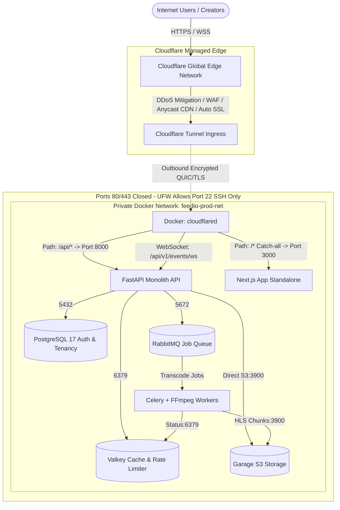

# Feed.io Production Deployment Guide

This guide provides technical specifications, operational procedures, security hardening, and disaster recovery plans for deploying **Feed.io** to a production environment (Bare-metal servers or Cloud VPS providers such as Hetzner, AWS EC2, DigitalOcean, OVH) using **Cloudflare Tunnel Ingress (Zero Open Inbound Ports)** and **Optimized Production Builds**.

---

## 1. System & Hardware Requirements

- **Operating System:** Ubuntu 24.04 LTS (or Debian 12 Bookworm).
- **CPU:** Minimum 4 vCPU (8 vCPU recommended for concurrent FFmpeg HLS transcoding).
- **RAM:** Minimum 8 GB RAM (16 GB recommended for PostgreSQL, Valkey, RabbitMQ, and FFmpeg workers).
- **Storage:**
  - OS & Database drive: 100 GB+ NVMe SSD.
  - Garage S3 Media drive: 200 GB - 1 TB+ NVMe/SATA SSD (or scalable block storage).
- **Network:** Stable outbound internet connectivity; authoritative domain DNS managed on Cloudflare.

---

## 2. Cloudflare Tunnel Network Architecture (Zero Public Inbound Ports)



> [!IMPORTANT]
> **Key Security & Architectural Advantages:**
> 1. **Zero Public Inbound Web Ports:** The server does not expose ports 80 or 443. The host firewall (UFW) only permits SSH port `22/tcp` (or zero open ports when managing SSH via Cloudflare Access).
> 2. **Direct Ingress (No Nginx Required):** `cloudflared` proxies traffic directly into the internal Docker network (`feedio-prod-net`) to `web:3000` and `api:8000`, reducing memory footprint and removing proxy maintenance overhead.
> 3. **Managed Edge TLS & DDoS Protection:** Cloudflare Edge terminates SSL/TLS (TLS 1.3, HTTP/3 QUIC) automatically—no local `certbot` or certificate renewal cron jobs required.
> 4. **Client IP Preservation:** Cloudflare automatically passes the visitor's real IP via the `CF-Connecting-IP` header directly into FastAPI and Next.js, allowing the internal Valkey rate limiter and audit logger to function accurately.

---

## 3. Cloudflare Zero Trust Tunnel Setup

1. Navigate to the [Cloudflare Zero Trust Dashboard](https://one.dash.cloudflare.com/) $\rightarrow$ **Networks** $\rightarrow$ **Tunnels** $\rightarrow$ click **Create a tunnel**.
2. Select **Cloudflared** as the connector type and name your tunnel (e.g., `feedio-prod-tunnel`).
3. Under environment setup, select **Docker** and copy the **Tunnel Token** (the string following the `--token` flag).
4. Under the **Public Hostname** tab, configure two Ingress Rules:
   - **Rule 1 (Backend API & WebSockets):**
     - Subdomain / Domain: `feedio.yourcompany.com`
     - Path: `api/*`
     - Service Type: `HTTP` | URL: `api:8000`
     - *Additional settings*: Enable **HTTP2**, enable **WebSocket**.
   - **Rule 2 (Frontend Web Catch-all):**
     - Subdomain / Domain: `feedio.yourcompany.com`
     - Path: leave empty (serves all remaining application traffic)
     - Service Type: `HTTP` | URL: `web:3000`
     - *Additional settings*: Enable **HTTP2**.

---

## 4. Environment Setup & Secret Generation (`scripts/ensure-prod-env.sh`)

On the target server, run the automated setup script to validate or generate the `.env.production` configuration:

```bash
chmod +x scripts/ensure-prod-env.sh
./scripts/ensure-prod-env.sh
```

This script generates high-entropy 256-bit cryptographic secrets (`openssl rand -hex 32`) and enforces `chmod 600 .env.production`. Next, edit `.env.production` with your domain and Cloudflare Tunnel token:

```ini
# Token retrieved from Cloudflare Zero Trust Dashboard
CLOUDFLARE_TUNNEL_TOKEN=eyJhIjoiYTM1...your_token_here...

# Domain & URL Configuration
FEEDIO_DOMAIN=feedio.yourcompany.com
FEEDIO_WEB_BASE_URL=https://feedio.yourcompany.com
FEEDIO_CORS_ORIGINS=["https://feedio.yourcompany.com"]

# Security & Session TTL
FEEDIO_AUTH_COOKIE_SECURE=true
FEEDIO_AUTH_ACCESS_TTL_SECONDS=300
FEEDIO_AUTH_REFRESH_TTL_SECONDS=2592000

# Production SMTP Email (Activation, password reset notifications)
FEEDIO_SMTP_HOST=smtp.postmarkapp.com
FEEDIO_SMTP_PORT=587
FEEDIO_SMTP_START_TLS=true
FEEDIO_SMTP_USER=your_smtp_user
FEEDIO_SMTP_PASS=your_smtp_password
FEEDIO_SMTP_SENDER=Feed.io <notifications@yourcompany.com>
```

---

## 5. Step-by-Step Deployment Procedure

### Step 1: Configure UFW Firewall (Block All Web Inbound Ports)
```bash
sudo apt update && sudo apt upgrade -y
sudo apt install -y curl git ufw jq openssl ca-certificates

# Allow SSH only; all web ingress is outbound through Cloudflare Tunnel
sudo ufw default deny incoming
sudo ufw default allow outgoing
sudo ufw allow 22/tcp
sudo ufw enable
sudo ufw status verbose
```

### Step 2: Install Docker & Docker Compose v2
```bash
curl -fsSL https://get.docker.com -o get-docker.sh
sudo sh get-docker.sh
sudo usermod -aG docker $USER
newgrp docker
docker compose version
```

### Step 3: Clone Repository & Prepare Persistent Data Directories
```bash
git clone https://github.com/khanhnkq/feed.io.git /opt/feedio
cd /opt/feedio

sudo mkdir -p /var/lib/feedio/{postgres,valkey,rabbitmq,garage_meta,garage_data,backups}
sudo chown -R 1001:1001 /var/lib/feedio
sudo chmod 700 /var/lib/feedio/backups
```

### Step 4: Build Optimized Production Images (Always use BUILD mode)
```bash
# Builds immutable, multi-stage production images (Next.js Standalone + FastAPI no-reload)
docker compose -f infra/compose/compose.prod.yaml --env-file .env.production build
```

### Step 5: Execute Database Schema Migrations
```bash
docker compose -f infra/compose/compose.prod.yaml --env-file .env.production run --rm migrate
```

### Step 6: Start the Production Stack
```bash
docker compose -f infra/compose/compose.prod.yaml --env-file .env.production up -d
```

### Step 7: Bootstrap Initial Super Admin Account
```bash
docker compose -f infra/compose/compose.prod.yaml --env-file .env.production exec api \
  python -m feedio.entrypoints.cli create-admin --email "admin@yourcompany.com" --name "Lead Administrator"
```
Log in at `https://feedio.yourcompany.com/login` and access the management console at `/app/admin`.

---

## 6. Zero-Downtime Rolling Update Workflow

To deploy code updates from the `main` branch:

```bash
# 1. Pull latest git commits
git pull origin main

# 2. Build updated production images
docker compose -f infra/compose/compose.prod.yaml --env-file .env.production build

# 3. Apply database migrations before rolling out new application code
docker compose -f infra/compose/compose.prod.yaml --env-file .env.production run --rm migrate

# 4. Gracefully restart services in topological dependency order
docker compose -f infra/compose/compose.prod.yaml --env-file .env.production up -d --no-deps worker
docker compose -f infra/compose/compose.prod.yaml --env-file .env.production up -d --no-deps api
docker compose -f infra/compose/compose.prod.yaml --env-file .env.production up -d --no-deps web

# 5. Verify system health
curl -f https://feedio.yourcompany.com/api/v1/health/ready
```

---

## 7. Backup & Disaster Recovery Procedures

### 1. Automated Daily PostgreSQL Backups
Use [scripts/backup-db.sh](file:///Users/nguyenkimquockhanh/Desktop/feed.io/scripts/backup-db.sh) to generate compressed binary dumps (`pg_dump -Fc`) with 30-day retention:

```bash
# Configure cron job to run at 02:00 AM daily
sudo crontab -e
# Append the following schedule:
0 2 * * * /opt/feedio/scripts/backup-db.sh >> /var/log/feedio-backup.log 2>&1
```

### 2. Disaster Recovery Drill
To restore the PostgreSQL database from a backup dump:

```bash
# 1. Stop write-heavy application containers
docker compose -f infra/compose/compose.prod.yaml stop api worker web

# 2. Execute restore script
./scripts/restore-db.sh /var/lib/feedio/backups/feedio_postgres_latest.dump

# 3. Resume application containers
docker compose -f infra/compose/compose.prod.yaml up -d
```
