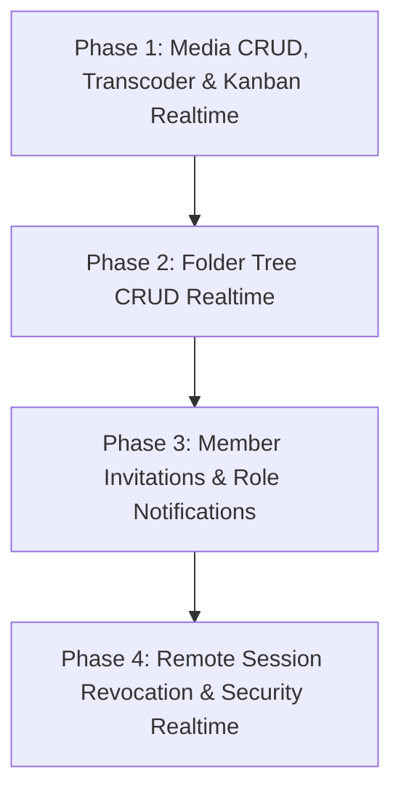

# Kế hoạch Triển khai Toàn diện Realtime & Thông báo (Feed.io)

Tài liệu này quy định chi tiết lộ trình 4 giai đoạn (4 Phases) để nâng cấp toàn diện hệ thống **Realtime Collaboration (WebSocket/Valkey)** và **Hệ thống Thông báo (In-App Notifications)** trên toàn bộ các phân hệ API của Feed.io.

---

## 🗺️ Lộ trình tổng quan các Phase

---

## 🚀 Phase 1: Realtime Media CRUD, Transcoding Worker & Kanban Board (✅ Đã hoàn thành)

### 1. Mục tiêu
- Khi bất kỳ thành viên nào upload media, cập nhật thông tin, di chuyển, xóa media hoặc thay đổi trạng thái phê duyệt (Approve/Changes Requested), toàn bộ người dùng đang mở **Project Dashboard**, **Media Grid / Table** và **Kanban Board** sẽ thấy dữ liệu nhảy tức thì mà không cần F5.
- Khi Celery Worker xử lý FFmpeg (HLS, thumbnail, waveform, filmstrip) hoàn tất hoặc gặp lỗi, badge trạng thái tự chuyển từ `Processing` sang `Ready`/`Failed`, kèm theo thông báo in-app cho người tải lên.

### 2. Chi tiết kỹ thuật Backend (`apps/backend`)
- **Inject `RealtimeEventPublisher`** vào:
  - `media_router.py`: `update_media`, `move_media`, `delete_media`.
  - `multipart_router.py`: `complete_multipart`, `abort_multipart`.
  - `versions_router.py`: `complete_version_upload`.
  - `worker.py` (Celery Transcoder Worker): khi chuyển trạng thái sang `ready` hoặc `failed`.
  - `decisions_router.py`: bắn thêm event vào room `project:{project_id}` bên cạnh `media:{media_id}`.
- **Danh sách Event phát vào room `project:{project_id}`**:
  - `media.created`: `{ media: MediaResponse, project_id, folder_id }`
  - `media.updated`: `{ media_id, title, project_id }`
  - `media.moved`: `{ media_id, source_folder_id, target_folder_id, project_id }`
  - `media.deleted`: `{ media_id, project_id }`
  - `media.transcoded`: `{ media_id, status: "ready", stream_url, thumbnail_url, project_id }`
  - `media.transcode_failed`: `{ media_id, status: "failed", error_message, project_id }`
  - `decision.updated`: `{ media_id, review_status, project_id }`
- **Hệ thống Thông báo (In-App)**:
  - Thêm `NotificationType.MEDIA_READY`: Gửi cho người upload khi video transcode xong.
  - Thêm `NotificationType.MEDIA_FAILED`: Gửi cho người upload khi transcode lỗi.

### 3. Chi tiết kỹ thuật Frontend (`apps/web`)
- **Tạo Hook `useRealtimeProject({ projectId, enabled })`**:
  - Kết nối WebSocket `/api/v1/events/ws?room=project:{projectId}`
  - Tự động lắng nghe các event `media.*` và `decision.updated`.
  - Tự động invalidate các React Query keys:
    - `useListMedia` (`["media", organizationId, projectId]`)
    - `useGetMedia` (`["media", organizationId, projectId, mediaId]`)
    - `useGetProject` (`["projects", organizationId, projectId]`)
- **Tích hợp vào các màn hình**:
  - `apps/web/src/app/(app)/app/organizations/[slug]/projects/[projectId]/page.tsx`
  - `apps/web/src/app/(app)/app/organizations/[slug]/projects/[projectId]/kanban/page.tsx`
  - Hiển thị Toast tinh tế: *"Video [Tên] đã xử lý xong và sẵn sàng review!"*

---

## 📂 Phase 2: Realtime Folder CRUD & Cây Thư Mục Dự Án (✅ Đã hoàn thành)

### 1. Mục tiêu
- Đồng bộ hóa cấu trúc cây thư mục (Folder Tree) theo thời gian thực khi có người tạo mới, đổi tên, di chuyển hoặc xóa thư mục con.

### 2. Chi tiết kỹ thuật Backend (`apps/backend`)
- **Inject `RealtimeEventPublisher`** vào `folders_router.py` trong module `projects`.
- **Danh sách Event phát vào room `project:{project_id}`**:
  - `folder.created`: `{ folder: FolderResponse, project_id }`
  - `folder.updated`: `{ folder_id, name, project_id }`
  - `folder.moved`: `{ folder_id, target_parent_id, project_id }`
  - `folder.deleted`: `{ folder_id, project_id }`

### 3. Chi tiết kỹ thuật Frontend (`apps/web`)
- Cập nhật hook `useRealtimeProject` để lắng nghe `folder.*`.
- Invalidate query key `useListFolders` (`["folders", organizationId, projectId]`).

---

## 👥 Phase 3: Realtime & Notifications cho Quản Lý Thành Viên (✅ Đã hoàn thành)

### 1. Mục tiêu
- Khi người dùng được thêm vào dự án, mời vào tổ chức hoặc thay đổi vai trò (Role), họ nhận được thông báo in-app ngay lập tức trên thanh chuông thông báo ([`NotificationBell`](file:///Users/nguyenkimquockhanh/Desktop/feed.io/apps/web/src/modules/notifications/components/notification_bell.tsx)).

### 2. Chi tiết kỹ thuật Backend (`apps/backend`)
- **Các loại thông báo bổ sung**:
  - `NotificationType.PROJECT_ACCESS_GRANTED`: *"Bạn vừa được thêm vào dự án [Tên dự án]"*.
  - `NotificationType.ORGANIZATION_INVITED`: *"Bạn có lời mời tham gia tổ chức [Tên Org]"* (hiển thị kèm nút chấp nhận nhanh).
  - `NotificationType.ROLE_UPDATED`: *"Vai trò của bạn trong tổ chức [Tên Org] đã được thay đổi thành [Admin/Member]"*.
- **Realtime Events phát vào room `project:{project_id}` và `org:{org_id}`**:
  - `project.members_updated`: Cập nhật danh sách thành viên dự án.
  - `organization.members_updated`: Cập nhật danh sách thành viên tổ chức.

### 3. Chi tiết kỹ thuật Frontend (`apps/web`)
- Tự động làm mới danh sách thành viên trong các Dialog:
  - `ProjectMembersDialog`
  - `OrganizationMembersScreen`

---

## 🔒 Phase 4: Realtime Security & Remote Session Revocation (✅ Đã hoàn thành)

### 1. Mục tiêu
- Khi người dùng vào trang cài đặt bảo mật và ấn **Đăng xuất thiết bị khác** (`Revoke Session`), thiết bị bị thu hồi phiên sẽ ngay lập tức bị ngắt kết nối và chuyển hướng về màn hình đăng nhập (`/login`).

### 2. Chi tiết kỹ thuật Backend (`apps/backend`)
- Trong endpoint `DELETE /api/v1/auth/sessions/{session_id}`:
  - Phát event `session.revoked` vào room `user:{user_id}` với payload `{ session_id, user_id, reason: "remote_revocation" }`.

### 3. Chi tiết kỹ thuật Frontend (`apps/web`)
- Hook `useRealtimeUser` được mount trong `AuthGate` kết nối room `user:{user_id}` và lắng nghe `session.revoked`.
- Khi nhận `session.revoked`: Clear React Query cache và chuyển hướng người dùng về `/login?reason=session_revoked`.

---

## 📊 Ma trận kiểm thử & Tiêu chuẩn nghiệm thu (Acceptance Criteria)

| Phase | Kịch bản kiểm thử (Verification Scenario) | Kết quả mong đợi |
|---|---|---|
| **Phase 1** | Mở 2 tab trình duyệt: Tab A ở Kanban Board, Tab B thực hiện Upload media và chuyển cột duyệt | Tab A tự động xuất hiện media mới và card tự chuyển cột mà không cần F5 |
| **Phase 1** | Upload 1 file video lớn ở Tab A | Khi Celery render xong HLS, Tab B đổi từ badge "Processing" sang "Ready" và có thể click xem ngay |
| **Phase 2** | Tạo 1 folder mới ở Tab A | Tab B tự cập nhật cây folder và danh sách thư mục ngay lập tức |
| **Phase 3** | Admin mời User B vào Project ở Tab A | Chuông thông báo của User B ở Tab B rung lên, hiện badge đỏ +1 và click vào mở đúng dự án |
| **Phase 4** | User đăng xuất phiên Safari từ Chrome | Tab Safari ngay lập tức nhận lệnh ngắt kết nối và quay về trang Login |
