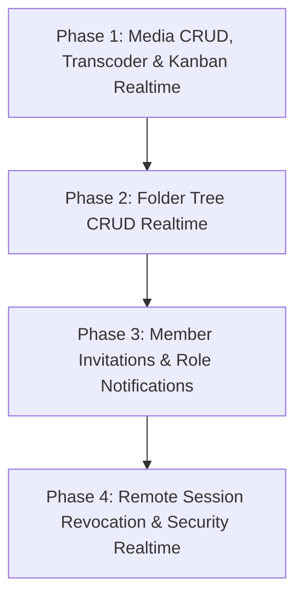

# Comprehensive Realtime & Notifications Plan (Feed.io)

This document specifies the four-phase implementation roadmap for upgrading the **Realtime Collaboration (WebSocket/Valkey)** and **In-App Notification Systems** across all Feed.io API modules.

---

## 🗺️ Phase Roadmap Overview

---

## 🚀 Phase 1: Realtime Media CRUD, Transcoding Worker & Kanban Board (✅ Completed)

### 1. Objectives
- When any team member uploads media, updates metadata, moves, deletes media, or updates review approval decisions (Approved / Changes Requested), all users on the **Project Dashboard**, **Media Grid / Table**, and **Kanban Board** receive immediate updates without refreshing.
- When the Celery Worker completes FFmpeg transcoding (HLS, thumbnail, waveform, filmstrip) or encounters an error, the status badge automatically updates from `Processing` to `Ready`/`Failed`, triggering an in-app notification for the uploader.

### 2. Backend Implementation (`apps/backend`)
- **Inject `RealtimeEventPublisher`** into:
  - `media_router.py`: `update_media`, `move_media`, `delete_media`.
  - `multipart_router.py`: `complete_multipart`, `abort_multipart`.
  - `versions_router.py`: `complete_version_upload`.
  - `worker.py` (Celery Transcoder Worker): state transitions to `ready` or `failed`.
  - `decisions_router.py`: emit events to room `project:{project_id}` alongside `media:{media_id}`.
- **Events Published to Room `project:{project_id}`**:
  - `media.created`: `{ media: MediaResponse, project_id, folder_id }`
  - `media.updated`: `{ media_id, title, project_id }`
  - `media.moved`: `{ media_id, source_folder_id, target_folder_id, project_id }`
  - `media.deleted`: `{ media_id, project_id }`
  - `media.transcoded`: `{ media_id, status: "ready", stream_url, thumbnail_url, project_id }`
  - `media.transcode_failed`: `{ media_id, status: "failed", error_message, project_id }`
  - `decision.updated`: `{ media_id, review_status, project_id }`
- **In-App Notification Additions**:
  - `NotificationType.MEDIA_READY`: Sent to uploader upon successful transcode completion.
  - `NotificationType.MEDIA_FAILED`: Sent to uploader if transcode fails.

### 3. Frontend Implementation (`apps/web`)
- **Hook `useRealtimeProject({ projectId, enabled })`**:
  - Subscribes to WebSocket `/api/v1/events/ws?room=project:{projectId}`.
  - Listens for `media.*` and `decision.updated` events.
  - Automatically invalidates TanStack Query keys:
    - `useListMedia` (`["media", organizationId, projectId]`)
    - `useGetMedia` (`["media", organizationId, projectId, mediaId]`)
    - `useGetProject` (`["projects", organizationId, projectId]`)
- **Screen Integration**:
  - `apps/web/src/app/(app)/app/organizations/[slug]/projects/[projectId]/page.tsx`
  - `apps/web/src/app/(app)/app/organizations/[slug]/projects/[projectId]/kanban/page.tsx`
  - Toast notification: *"Video [Title] transcoding complete and ready for review!"*

---

## 📂 Phase 2: Realtime Folder CRUD & Project Hierarchy (✅ Completed)

### 1. Objectives
- Synchronize project folder structures in real-time when users create, rename, relocate, or delete folders.

### 2. Backend Implementation (`apps/backend`)
- **Inject `RealtimeEventPublisher`** into `folders_router.py` in the `projects` module.
- **Events Published to Room `project:{project_id}`**:
  - `folder.created`: `{ folder: FolderResponse, project_id }`
  - `folder.updated`: `{ folder_id, name, project_id }`
  - `folder.moved`: `{ folder_id, target_parent_id, project_id }`
  - `folder.deleted`: `{ folder_id, project_id }`

### 3. Frontend Implementation (`apps/web`)
- Update `useRealtimeProject` to listen for `folder.*` events.
- Invalidate query key `useListFolders` (`["folders", organizationId, projectId]`).

---

## 👥 Phase 3: Realtime & Notifications for Member Management (✅ Completed)

### 1. Objectives
- When users are granted project access, invited to an organization, or have their role modified, they receive an immediate in-app notification on the notification bell ([`NotificationBell`](file:///Users/nguyenkimquockhanh/Desktop/feed.io/apps/web/src/modules/notifications/components/notification_bell.tsx)).

### 2. Backend Implementation (`apps/backend`)
- **Notification Types**:
  - `NotificationType.PROJECT_ACCESS_GRANTED`: *"You were granted access to project [Project Name]"*.
  - `NotificationType.ORGANIZATION_INVITED`: *"You received an invitation to join [Organization Name]"* (includes quick accept action).
  - `NotificationType.ROLE_UPDATED`: *"Your role in [Organization Name] was updated to [Admin/Member]"*.
- **Realtime Events Published to Rooms `project:{project_id}` and `org:{org_id}`**:
  - `project.members_updated`: Refreshes project member lists.
  - `organization.members_updated`: Refreshes organization member rosters.

### 3. Frontend Implementation (`apps/web`)
- Automatically refreshes member lists inside:
  - `ProjectMembersDialog`
  - `OrganizationMembersScreen`

---

## 🔒 Phase 4: Realtime Security & Remote Session Revocation (✅ Completed)

### 1. Objectives
- When a user navigates to security settings and triggers **Revoke Session** for another device, the targeted device is immediately disconnected and redirected to `/login`.

### 2. Backend Implementation (`apps/backend`)
- In endpoint `DELETE /api/v1/auth/sessions/{session_id}`:
  - Publish `session.revoked` to room `user:{user_id}` with payload `{ session_id, user_id, reason: "remote_revocation" }`.

### 3. Frontend Implementation (`apps/web`)
- `useRealtimeUser` hook mounted inside `AuthGate` subscribes to room `user:{user_id}` and listens for `session.revoked`.
- On receiving `session.revoked`: Clears query cache and redirects to `/login?reason=session_revoked`.

---

## 📊 Acceptance Criteria & Verification Scenarios

| Phase | Verification Scenario | Expected Outcome |
|---|---|---|
| **Phase 1** | Open 2 browser tabs: Tab A on Kanban Board, Tab B uploads media and drags card between columns | Tab A displays new media card and reflects column change immediately without page reload |
| **Phase 1** | Upload large video file in Tab A | When Celery completes transcoding, Tab B badge flips from "Processing" to "Ready" and becomes clickable |
| **Phase 2** | Create a new folder in Tab A | Tab B folder tree and list update immediately |
| **Phase 3** | Admin invites User B to Project in Tab A | User B's notification bell in Tab B updates with unread badge (+1) and links directly to project |
| **Phase 4** | User revokes Safari session from Chrome | Safari tab receives revocation event, clears session, and redirects to Login screen |
