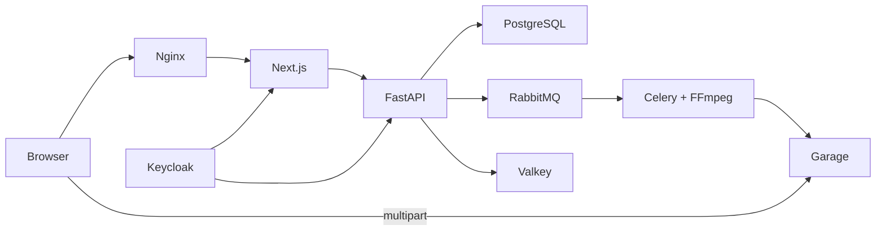

# System overview

## Dependency rules

- Domain code is framework-free.
- Application code orchestrates use cases through small ports.
- Infrastructure implements I/O ports.
- Presentation translates HTTP and WebSocket messages.
- Composition roots are the only place that binds concrete adapters.
- Frontend routes compose feature modules; React components never call Axios directly.
