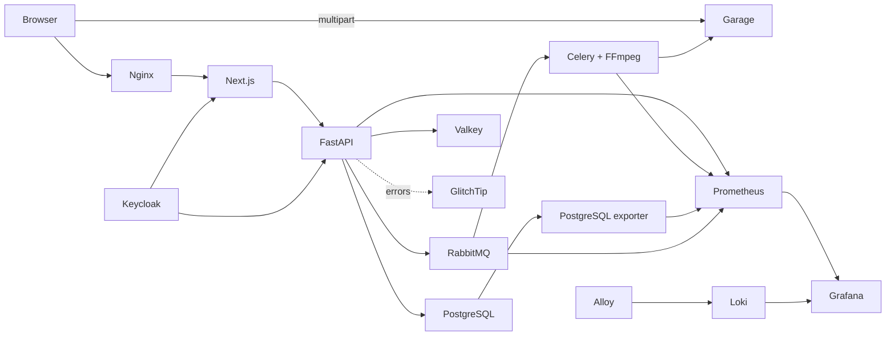

# System overview

The deployment unit is a modular monolith split into three processes: Next.js web, FastAPI API and a Python worker. PostgreSQL is authoritative. Valkey holds ephemeral cache/realtime state, RabbitMQ owns durable job delivery, and Garage owns media objects. All development dependencies are self-hosted through Docker Compose.

## Runtime health

- `/api/v1/health/live` verifies that the API process can serve requests.
- `/api/v1/health/ready` probes PostgreSQL, Valkey, RabbitMQ and Garage concurrently.
- The worker periodically performs the same probes and publishes `feedio_worker_ready`.
- Prometheus scrapes API, worker, PostgreSQL and RabbitMQ metrics.
- Alloy discovers Compose containers and forwards their logs to Loki.
- The provisioned Grafana dashboard combines service health, latency, dependency state and logs.

Operational details live in the [local stack runbook](../operations/local-stack.md).

## Dependency rules

- Domain code is framework-free.
- Application code orchestrates use cases through small ports.
- Infrastructure implements I/O ports.
- Presentation translates HTTP and WebSocket messages.
- Composition roots are the only place that binds concrete adapters.
- Frontend routes compose feature modules; React components never call Axios directly.
