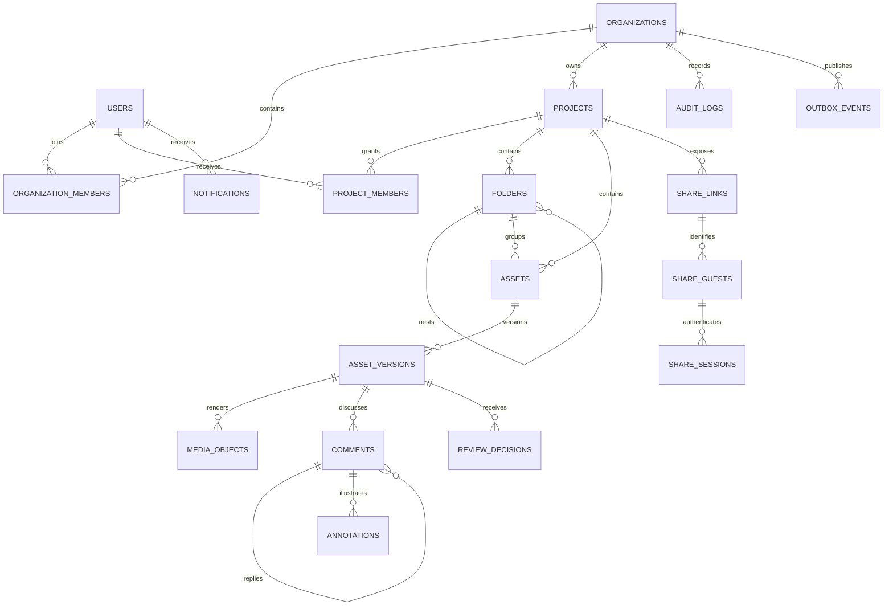

# Feed.io Database Design Plan

## Mục tiêu

Thiết kế PostgreSQL cho nền tảng review video self-hosted dành cho agency dưới 1.000 người dùng, nhưng giữ các nguyên tắc enterprise: cô lập tenant, lịch sử review bất biến, migration an toàn, truy vấn cursor, audit đầy đủ và ranh giới module rõ ràng.

## Quyết định đã chốt

- PostgreSQL là nguồn dữ liệu chuẩn; Garage chỉ lưu object media, Valkey chỉ giữ cache/session realtime, RabbitMQ chỉ chuyển job.
- Modular monolith dùng chung database và transaction; mỗi backend module sở hữu bảng của mình, không dùng schema PostgreSQL riêng cho từng module.
- Mọi dữ liệu nghiệp vụ thuộc tenant đều có `organization_id`, kể cả khi có thể suy ra qua bảng cha, để index và RLS rõ ràng.
- API luôn filter tenant ở repository và PostgreSQL Row-Level Security là lớp phòng thủ thứ hai.
- Member nội bộ ánh xạ từ Keycloak; khách ngoài dùng share guest/session, không bắt buộc tạo tài khoản.
- Resource chính soft-delete và nằm trong thùng rác 30 ngày; audit log và review decision là append-only.
- Dùng UUID v4 ở application để tương thích code hiện tại; không thêm dependency chỉ để dùng UUID v7 ở quy mô này.
- Dùng `TIMESTAMPTZ` UTC, `BIGINT` cho byte/timecode/duration và `VARCHAR + CHECK` cho trạng thái thay vì PostgreSQL native enum.
- JSONB chỉ dùng cho payload biến đổi nhưng có schema validation, ví dụ annotation geometry và event metadata; dữ liệu quan hệ vẫn chuẩn hóa.

## Sơ đồ quan hệ cốt lõi

## Bảng theo bounded module

### Identity và organizations

| Bảng | Cột/constraint quan trọng |
|---|---|
| `users` | `id`, `keycloak_subject UNIQUE`, `email CITEXT`, `display_name`, `avatar_url`, `status`, timestamps; không lưu password/token Keycloak |
| `organizations` | `id`, `name`, `slug`, `status`, `created_by_user_id`, timestamps, `deleted_at`; unique slug khi chưa xóa |
| `organization_members` | `organization_id`, `user_id`, `role`, `status`, `joined_at`; PK/unique `(organization_id, user_id)` |
| `organization_invitations` | organization, email, role, `token_hash UNIQUE`, inviter, expiry/accepted/revoked timestamps; không lưu token thô |

Role organization ban đầu: `owner`, `admin`, `member`. Mỗi organization phải luôn còn ít nhất một owner; chuyển/xóa owner chạy trong transaction có khóa membership liên quan.

### Projects và workspace

| Bảng | Cột/constraint quan trọng |
|---|---|
| `projects` | Bổ sung FK organization, `status`, `created_by_user_id`, `updated_at`, `deleted_at`, `lock_version`; giữ `name`, `description` hiện có |
| `project_members` | organization, project, user, `role`, inviter, timestamps; unique `(project_id, user_id)` và composite FK cùng tenant |
| `folders` | organization, project, `parent_id`, name, creator, timestamps, `deleted_at`; `parent_id != id` |

Role project: `manager`, `contributor`, `reviewer`, `viewer`. Quyền organization cao hơn có thể bao phủ project; không nhân bản permission thành nhiều boolean. Folder dùng adjacency list vì cây nhỏ; application kiểm tra cycle bằng recursive CTE trong cùng transaction.

### Media và processing

| Bảng | Cột/constraint quan trọng |
|---|---|
| `assets` | organization, project, folder nullable, title, type, creator, latest version number, timestamps, `deleted_at` |
| `asset_versions` | organization, asset, `version_number`, label, source filename, duration/width/height, processing/review status, creator, timestamps; unique `(asset_id, version_number)` |
| `media_objects` | organization, version, kind, bucket, object key, MIME, size, checksum, codec/metadata JSONB, created time; object key unique |
| `upload_sessions` | organization, project, asset nullable, Garage upload ID, idempotency key, expected size/checksum, status, expiry/completed timestamps |
| `upload_parts` | upload session, part number, ETag, size, checksum, completed time; unique `(upload_session_id, part_number)` |
| `processing_jobs` | organization, version, job type, status, attempt, idempotency key, error summary, started/finished timestamps |

Media object kinds ban đầu: `source`, `hls_manifest`, `hls_segment`, `proxy`, `thumbnail`, `filmstrip`, `waveform`. Database chỉ lưu metadata và object key; không lưu binary hoặc presigned URL.

### Review và collaboration

| Bảng | Cột/constraint quan trọng |
|---|---|
| `comments` | organization, version, parent nullable, author user XOR guest, body, timecode/range milliseconds, resolved_by/time, timestamps, `deleted_at`, `lock_version` |
| `annotations` | organization, comment, frame timecode, kind, normalized geometry JSONB, style JSONB, timestamps |
| `comment_mentions` | organization, comment, mentioned user; unique `(comment_id, mentioned_user_id)` |
| `review_decisions` | organization, version, reviewer user XOR guest, decision, note, created time; append-only |

Constraint bắt buộc:

- Chính xác một trong `author_user_id` và `author_guest_id` phải có giá trị.
- `timecode_start_ms >= 0`, `timecode_end_ms >= timecode_start_ms` và không vượt duration khi duration đã biết.
- Reply thuộc cùng asset version với comment cha.
- Annotation coordinates được chuẩn hóa `0..1`; Pydantic kiểm schema và DB CHECK kiểm các trường tối thiểu.
- Decision ban đầu: `approved`, `changes_requested`, `revoked`. Trạng thái hiệu lực là decision mới nhất của từng reviewer; không update lịch sử cũ.

### Sharing

| Bảng | Cột/constraint quan trọng |
|---|---|
| `share_links` | organization, project, version nullable, `token_hash UNIQUE`, password hash nullable, permission flags, expiry/revoked timestamps, creator |
| `share_guests` | organization, share link, normalized email nullable, display name, verified/last-seen timestamps |
| `share_sessions` | organization, share guest, `session_token_hash UNIQUE`, expiry/revoked timestamps, IP prefix/user-agent hash tùy chọn |

`project_id` luôn có giá trị; `asset_version_id` nullable quyết định link cấp project hay version. Token/password/session chỉ lưu hash bằng thuật toán phù hợp; token thô chỉ trả một lần. Public API resolve token qua một PostgreSQL `SECURITY DEFINER` function tối thiểu, sau đó đặt tenant context và quay lại query chịu RLS.

### Notifications, audit và reliable events

| Bảng | Cột/constraint quan trọng |
|---|---|
| `notifications` | organization, recipient user, event type, resource reference, payload JSONB giới hạn, created/read timestamps |
| `notification_deliveries` | notification, channel, status, attempt, provider message id, available/sent/failed timestamps |
| `audit_logs` | organization, actor user/guest/service, action, resource type/id, request id, IP, user agent, metadata JSONB, created time; append-only |
| `outbox_events` | organization, aggregate type/id, event type/version, payload JSONB, occurred/available/processed timestamps, attempts, last error |

Audit không dùng event sourcing. Trigger/privilege chặn `UPDATE` và `DELETE` với `audit_logs`; dữ liệu nhạy cảm, token, URL ký và comment body đầy đủ không được đưa vào metadata. Worker claim outbox bằng `FOR UPDATE SKIP LOCKED`.

## Quy ước khóa và cô lập tenant

- Bảng tenant-owned có `organization_id NOT NULL` và index dẫn đầu bằng organization cho query chính.
- Bảng cha khai báo `UNIQUE (organization_id, id)`; bảng con dùng composite FK `(organization_id, parent_id)` để DB chặn quan hệ chéo tenant.
- `ON DELETE RESTRICT` cho lịch sử/media/review; purge worker xóa theo thứ tự có kiểm soát. `CASCADE` chỉ dùng cho dữ liệu kỹ thuật không có giá trị độc lập như upload parts hoặc session đã hết hạn.
- API transaction chạy `SET LOCAL app.current_organization_id` và `app.current_user_id` sau khi xác thực membership.
- RLS policy chuẩn: `organization_id = current_setting('app.current_organization_id', true)::uuid`; thiếu context phải trả về zero rows hoặc lỗi, không mở toàn bộ dữ liệu.
- Dùng ba role: migration owner, API role không `BYPASSRLS`, worker role giới hạn. Worker xử lý cross-tenant chỉ đọc outbox/job bằng grant riêng rồi đặt tenant context trước khi thao tác resource.
- Test fixture luôn tạo ít nhất hai organization để phát hiện query thiếu scope.

## Index theo query thực tế

| Query | Index đề xuất |
|---|---|
| Organization membership | unique `(organization_id, user_id)` và `(user_id, status, organization_id)` |
| Project list | `(organization_id, created_at DESC, id DESC) WHERE deleted_at IS NULL` |
| Folder siblings | unique `(project_id, parent_id, lower(name)) NULLS NOT DISTINCT WHERE deleted_at IS NULL` |
| Asset list | `(organization_id, project_id, created_at DESC, id DESC) WHERE deleted_at IS NULL` |
| Versions | unique `(asset_id, version_number)`; `(organization_id, asset_id, created_at DESC)` |
| Media lookup | unique `(bucket, object_key)`; `(asset_version_id, kind)` |
| Active uploads | unique `(organization_id, idempotency_key)`; `(status, expires_at)` cho cleanup |
| Timeline comments | `(organization_id, asset_version_id, timecode_start_ms, id) WHERE deleted_at IS NULL` |
| Replies | `(parent_comment_id, created_at, id) WHERE deleted_at IS NULL` |
| Latest reviewer decision | `(asset_version_id, reviewer_user_id, created_at DESC, id DESC)` và index tương đương cho guest |
| Active share token | unique `token_hash`; `(organization_id, expires_at) WHERE revoked_at IS NULL` |
| Unread notifications | `(recipient_user_id, created_at DESC, id DESC) WHERE read_at IS NULL` |
| Audit history | `(organization_id, created_at DESC, id DESC)` và `(resource_type, resource_id, created_at DESC)` |
| Pending outbox | `(available_at, id) WHERE processed_at IS NULL` |

Không tạo GIN/trigram/full-text index trong migration đầu. Bổ sung chỉ sau khi có query cụ thể và `EXPLAIN (ANALYZE, BUFFERS)` chứng minh nhu cầu. Mọi foreign key phải có index phù hợp ở phía con.

## Soft delete, retention và purge

- Soft-delete: organizations, projects, folders, assets, comments và share links; query mặc định luôn có `deleted_at IS NULL`.
- Thùng rác mặc định 30 ngày, cấu hình theo organization về sau; restore phải khôi phục cả ancestor cần thiết.
- Share sessions hết hạn, upload session bỏ dở và notification delivery cũ được cleanup định kỳ.
- Purge job ghi audit trước khi xóa DB, sau đó enqueue xóa Garage object bằng outbox để retry an toàn.
- Audit/review decision giữ tối thiểu 12 tháng mặc định; thay đổi retention cần policy rõ ràng và không cascade ngoài ý muốn.
- Backup/restore phải coi PostgreSQL snapshot và Garage object manifest là một recovery set logic.

## Lộ trình migration từ schema hiện tại

- [x] **ADR và conventions:** ghi quyết định RLS, composite tenant FK, actor user/guest và retention; chốt naming/check constraints. → Verify: ADR được review, không có quyết định ngầm.
- [x] **`0002_identity_tenancy`:** bật `citext`, tạo users/organizations/members/invitations; tạo organization placeholder cho các `organization_id` đang có trong `projects`, rồi thêm FK. → Verify: migration chạy được khi DB rỗng và khi có project cũ.
- [ ] **`0003_project_workspace`:** expand `projects` bằng cột nullable, backfill, siết NOT NULL; thêm project members/folders và index cursor. → Verify: FK chéo tenant và folder self-parent bị từ chối.
- [ ] **`0004_media_pipeline`:** thêm assets, versions, media objects, uploads/parts và processing jobs. → Verify: concurrent version/upload idempotency không tạo bản ghi trùng.
- [ ] **`0005_review_collaboration`:** thêm comments, annotations, mentions và immutable decisions. → Verify: XOR actor, time range và cross-version reply constraints hoạt động.
- [ ] **`0006_sharing_notifications`:** thêm share guest/session, notifications/deliveries. → Verify: token chỉ lưu hash, expired/revoked session không resolve được.
- [ ] **`0007_audit_outbox`:** thêm audit/outbox, trigger append-only và claim index. → Verify: business write + outbox cùng commit; rollback không để event mồ côi.
- [ ] **`0008_rls_policies`:** tạo role/grant, session context helper, policies và public share resolver sau khi application đã hỗ trợ tenant context. → Verify: matrix API/worker/public và test chéo hai tenant đều qua.

Migration tuân theo expand → backfill → validate → contract. Index trên bảng đã lớn dùng `CREATE INDEX CONCURRENTLY` trong Alembic autocommit block. Không dùng migration để seed demo data. Production ưu tiên forward-fix; downgrade chỉ được tin cậy khi đã test trên backup copy.

## Tiêu chí hoàn tất thiết kế và triển khai

- Có ERD cuối, data dictionary và ADR cho tenancy/RLS trước khi viết toàn bộ models.
- Alembic `upgrade head` chạy trên DB mới và DB chứa dữ liệu từ migration `0001`.
- Upgrade → downgrade → upgrade được kiểm thử ở local/CI cho migration chưa production; migration destructive có restore test riêng.
- Schema contract test xác nhận PK/FK/unique/check/index/RLS policy bắt buộc.
- Integration test chứng minh user organization A không đọc/ghi resource organization B kể cả repository bị thiếu filter.
- Constraint/concurrency test bao phủ membership unique, version number, upload idempotency, actor XOR và outbox claim.
- Query list chính dùng keyset pagination và được kiểm `EXPLAIN`; không có sequential scan bất hợp lý trên fixture đủ lớn.
- Không có secret/token thô, binary media hoặc presigned URL được lưu trong PostgreSQL/log/audit.
- Mỗi model, repository, migration và test file không vượt quá 500 dòng; module chỉ truy cập bảng của module khác qua public application contract.

## Ngoài phạm vi vòng đầu

- Billing/subscription, custom workflow builder, legal hold và data residency nhiều vùng.
- Microservice database-per-service, event sourcing, CQRS read model và table partitioning.
- Search engine riêng hoặc vector search; PostgreSQL search chỉ bổ sung khi có use case được đo.
- Partition audit/outbox chỉ xem xét khi bảng vượt khoảng 10 triệu dòng hoặc maintenance/retention thực sự gây vấn đề.
