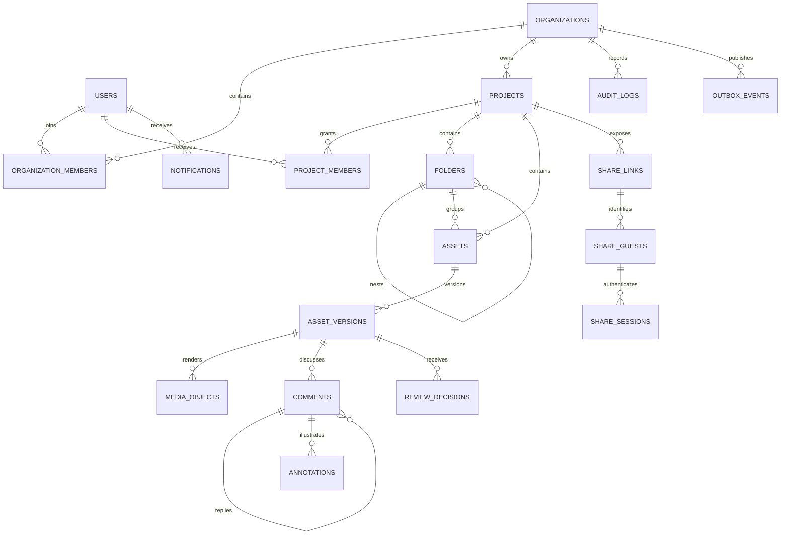

# Feed.io Database Design Plan

## Goals

Design an enterprise-grade PostgreSQL schema for a self-hosted video review platform supporting creative agencies. While tailored for workloads under 1,000 users, it adheres to rigorous enterprise standards: multi-tenant isolation, immutable review histories, safe forward-compatible migrations, keyset cursor pagination, comprehensive audit logging, and distinct bounded context boundaries.

## Core Architectural Decisions

- PostgreSQL is the authoritative single source of truth; Garage S3 stores media objects, Valkey handles ephemeral cache/real-time pub-sub, and RabbitMQ coordinates asynchronous queues.
- Monolithic schema sharing a single database and transaction space; each backend module strictly owns its tables without premature PostgreSQL schema fragmentation.
- All tenant-scoped business entities enforce an explicit `organization_id NOT NULL` column (even if inferable via parent relationships) for unambiguous indexing and Row-Level Security (RLS).
- Repositories enforce tenant filtering in code as the primary defense layer, with PostgreSQL RLS acting as defense-in-depth.
- Internal collaborators authenticate with verified email accounts; external clients access review sessions via signed guest links without mandatory account registration.
- Core business entities use soft deletion with a 30-day trash retention window; audit logs and review decisions are strictly append-only.
- Application generates UUIDv4 identifiers for maximum ecosystem compatibility.
- Standardizes on UTC `TIMESTAMPTZ`, `BIGINT` for bytes/timecodes/durations, and `VARCHAR + CHECK` constraints for statuses rather than native PostgreSQL enums.
- JSONB is reserved for variable-shape payloads validated by schemas (e.g., vector annotation geometries and event metadata); relational data remains normalized.

## Entity Relationship Overview

## Schema Definitions by Bounded Context

### Identity and Organizations

| Table | Key Columns / Constraints |
|---|---|
| `users` | `id`, `email CITEXT UNIQUE`, `password_hash`, `display_name`, `email_verified_at`, `status`, timestamps |
| `auth_sessions` | user, `refresh_token_hash UNIQUE`, device/IP, expiration/last-used/revoked timestamps; no raw tokens |
| `auth_action_tokens` | user, verification/reset purpose, `token_hash UNIQUE`, expiration/consumed timestamps; single-use |
| `organizations` | `id`, `name`, `slug`, `status`, `created_by_user_id`, timestamps, `deleted_at`; unique active slug |
| `organization_members` | `organization_id`, `user_id`, `role`, `status`, `joined_at`; composite PK `(organization_id, user_id)` |
| `organization_invitations` | organization, email, role, `token_hash UNIQUE`, inviter, timestamps; raw token never stored |

Initial organization roles: `owner`, `admin`, `member`. Every organization must retain at least one active owner.

### Projects and Workspace

| Table | Key Columns / Constraints |
|---|---|
| `projects` | Organization FK, `status`, `created_by_user_id`, `updated_at`, `deleted_at`, `lock_version`, `name`, `description` |
| `project_members` | organization, project, user, `role`, inviter, timestamps; unique `(project_id, user_id)` |
| `folders` | organization, project, `parent_id`, name, creator, timestamps, `deleted_at`; `parent_id != id` |

Project roles: `manager`, `contributor`, `reviewer`, `viewer`. Folders use adjacency lists; cycles are prevented via recursive CTE validation during creation and moving.

### Media and Processing

| Table | Key Columns / Constraints |
|---|---|
| `assets` | organization, project, optional folder, title, type, creator, latest version number, timestamps, `deleted_at` |
| `asset_versions` | organization, asset, `version_number`, label, filename, duration/dimensions, processing/review status; unique `(asset_id, version_number)` |
| `media_objects` | organization, version, kind, bucket, object key, MIME, size, checksum, JSONB metadata; unique object key |
| `upload_sessions` | organization, project, optional asset, Garage upload ID, idempotency key, expected size/checksum, status |
| `upload_parts` | upload session, part number, ETag, size, checksum, completion timestamp; unique `(upload_session_id, part_number)` |
| `processing_jobs` | organization, version, job type, status, attempt counter, idempotency key, error summary, timestamps |

Media object kinds: `source`, `hls_manifest`, `hls_segment`, `proxy`, `thumbnail`, `filmstrip`, `waveform`.

### Review and Collaboration

| Table | Key Columns / Constraints |
|---|---|
| `comments` | organization, version, optional parent, author user XOR guest, body, timecode/range ms, resolution status, `lock_version` |
| `annotations` | organization, comment, frame timecode, kind, normalized geometry JSONB, style JSONB, timestamps |
| `comment_mentions` | organization, comment, mentioned user; unique `(comment_id, mentioned_user_id)` |
| `review_decisions` | organization, version, reviewer user XOR guest, decision, note, created time; append-only |

Core constraints:
- Exactly one author field (`author_user_id` XOR `author_guest_id`) must be non-null.
- `timecode_start_ms >= 0`, `timecode_end_ms >= timecode_start_ms`.
- Thread replies must target the same asset version as their parent comment.
- Vector coordinates are normalized to `[0..1]` ranges.
- Initial decision states: `approved`, `changes_requested`, `revoked`.

### Sharing and Guest Access

| Table | Key Columns / Constraints |
|---|---|
| `share_links` | organization, project, optional version, `token_hash UNIQUE`, optional password hash, permissions, expiration |
| `share_guests` | organization, share link, optional normalized email, display name, verification timestamps |
| `share_sessions` | organization, share guest, `session_token_hash UNIQUE`, expiration/revocation timestamps |

Tokens and passwords store cryptographic hashes only; raw values are displayed once upon generation.

### Telemetry, Audit, and Reliable Events

| Table | Key Columns / Constraints |
|---|---|
| `notifications` | organization, recipient user, event type, resource reference, bounded payload JSONB, read timestamp |
| `notification_deliveries` | notification, channel, status, retry attempt, provider message ID, delivery timestamps |
| `audit_logs` | organization, actor user/guest/service, action, resource type/id, request ID, IP, user-agent, metadata JSONB; append-only |
| `outbox_events` | organization, aggregate type/id, event type/version, payload JSONB, availability/processing timestamps |

`UPDATE` and `DELETE` queries are prohibited on `audit_logs`. Background workers claim pending outbox jobs with `FOR UPDATE SKIP LOCKED`.

## Multi-Tenant Isolation Conventions

- Every tenant table enforces `organization_id NOT NULL`.
- Composite foreign keys `(organization_id, parent_id)` prevent cross-tenant record linking at the database engine level.
- `ON DELETE RESTRICT` is mandated for audit histories, assets, and reviews. `CASCADE` is strictly limited to disposable technical artifacts (e.g., upload parts).
- Every transaction sets session-level parameters: `SET LOCAL app.current_organization_id = ...` and `app.current_user_id = ...`.
- Automated test fixtures create at least two distinct organizations to detect un-scoped queries.

## Performance Indexing Strategy

| Access Pattern | Target Index |
|---|---|
| Organization membership | unique `(organization_id, user_id)` and `(user_id, status, organization_id)` |
| Project listing | `(organization_id, created_at DESC, id DESC) WHERE deleted_at IS NULL` |
| Folder siblings | unique `(project_id, parent_id, lower(name)) NULLS NOT DISTINCT WHERE deleted_at IS NULL` |
| Asset listing | `(organization_id, project_id, created_at DESC, id DESC) WHERE deleted_at IS NULL` |
| Version lookup | unique `(asset_id, version_number)`; `(organization_id, asset_id, created_at DESC)` |
| Media lookup | unique `(bucket, object_key)`; `(asset_version_id, kind)` |
| Active uploads | unique `(organization_id, idempotency_key)`; `(status, expires_at)` |
| Timeline comments | `(organization_id, asset_version_id, timecode_start_ms, id) WHERE deleted_at IS NULL` |
| Thread replies | `(parent_comment_id, created_at, id) WHERE deleted_at IS NULL` |
| Share token resolution | unique `token_hash`; `(organization_id, expires_at) WHERE revoked_at IS NULL` |
| Unread notifications | `(recipient_user_id, created_at DESC, id DESC) WHERE read_at IS NULL` |
| Audit trail query | `(organization_id, created_at DESC, id DESC)` and `(resource_type, resource_id, created_at DESC)` |
| Pending outbox polling | `(available_at, id) WHERE processed_at IS NULL` |

## Migration Conventions

Migrations follow the **Expand → Backfill → Validate → Contract** lifecycle. Large-table indexes utilize `CREATE INDEX CONCURRENTLY` in non-transactional blocks. Downgrade scripts are verified on staging copies before production rollouts.
