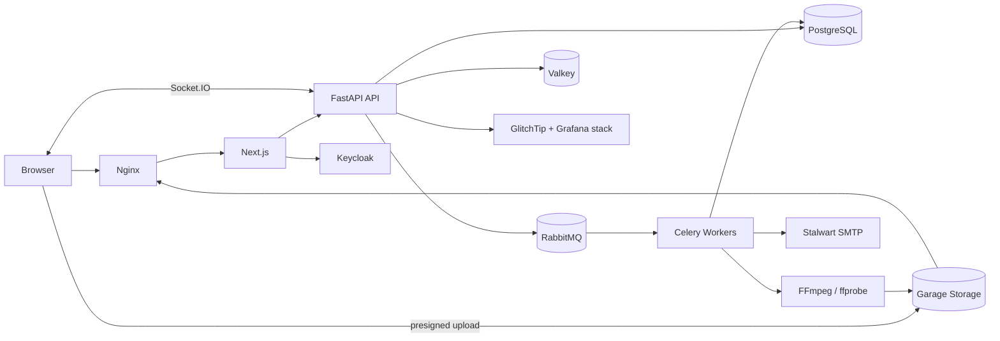

# Kế hoạch phát triển Feed.io

## Mục tiêu

Xây dựng nền tảng review video cộng tác cho agency: upload video, quản lý phiên bản, comment theo timestamp, annotation, phê duyệt, chia sẻ cho khách hàng và nhận thông báo. Mục tiêu tải ban đầu dưới 1.000 người dùng, nhưng kiến trúc đủ chuẩn để học và mở rộng mà không cần tách microservices sớm.

## Quyết định kiến trúc

- **Frontend:** Next.js App Router + TypeScript; Server Components cho màn hình dữ liệu, Client Components cho player và annotation.
- **Backend:** FastAPI theo modular monolith; SQLModel trên SQLAlchemy + Alembic + Pydantic.
- **Dữ liệu:** PostgreSQL là nguồn dữ liệu chuẩn; UUID, `TIMESTAMPTZ`, soft delete có chọn lọc.
- **Media:** upload trực tiếp bằng presigned multipart URL; Garage S3-compatible tự host + Nginx media cache.
- **Xử lý nền:** RabbitMQ + Celery; FFmpeg/ffprobe tạo HLS, thumbnail, filmstrip và metadata.
- **Realtime:** Socket.IO từ FastAPI; Valkey Pub/Sub đồng bộ comment/trạng thái giữa nhiều instance.
- **Auth:** Keycloak tự host quản lý identity/OIDC/MFA; quyền organization/project nằm trong Feed.io PostgreSQL.
- **Triển khai:** Docker Compose trên máy chủ tự quản; web, API, worker, scheduler và hạ tầng là các container độc lập.
- **Nguyên tắc:** bắt đầu bằng modular monolith, dùng outbox pattern cho event quan trọng; chỉ tách service khi có số liệu chứng minh cần thiết.



## Phạm vi MVP

**Có trong MVP**

- Organization, thành viên và vai trò `owner`, `admin`, `member`, `guest`.
- Project, folder, asset và nhiều version của một asset.
- Multipart upload, tiến độ upload, retry và hủy upload.
- Player HLS, thumbnail, filmstrip và thông tin kỹ thuật của video.
- Comment theo timestamp/range, reply, mention, resolve và annotation dạng vector JSON.
- Trạng thái `in_review`, `changes_requested`, `approved`; lịch sử quyết định.
- Share link có ngày hết hạn, mật khẩu tùy chọn và quyền comment/download.
- Notification trong ứng dụng và email; audit log cho hành động quan trọng.
- Tìm kiếm theo tên project/asset bằng PostgreSQL; cursor pagination.

**Để sau MVP**

- Desktop/mobile native app, live streaming, DRM/watermark forensic.
- Side-by-side comparison, AI transcription/search, plugin Adobe, public API và billing.
- SSO/SAML, SCIM, retention policy doanh nghiệp và microservices.

## Cấu trúc repository đề xuất

```text
feed.io/
├── apps/
│   ├── backend/             # Một Python package, entrypoint API/worker/scheduler
│   └── web/                 # Next.js App Router, feature modules
├── packages/
│   ├── api-client/          # Orval generated Axios client/hooks
│   ├── ui/                  # Design system dùng chung
│   ├── eslint-config/
│   └── typescript-config/
├── infra/                   # Compose, Nginx, Keycloak, Garage, monitoring, backup
├── scripts/                 # Boundary và 500-line checks
├── docs/                    # Architecture, ADR và runbook
└── Makefile
```

Backend chia module `identity`, `organizations`, `projects`, `media`, `reviews`, `sharing`, `notifications`, `audit`; mỗi module có `domain`, `application`, `infrastructure`, `presentation` và public API rõ ràng. Frontend chia feature module tương ứng; route chỉ composition. Dependency direction, naming và file limits tuân theo [Feed.io Engineering Standards](./feed-io-engineering-standards.md).

## Mô hình dữ liệu cốt lõi

| Bảng | Mục đích / quan hệ chính |
|---|---|
| `users` | Bản chiếu identity, `keycloak_subject` unique, email và trạng thái |
| `organizations` | Tenant gốc của agency, do Feed.io quản lý |
| `organization_members` | `organization_id + user_id` unique, role |
| `projects` | Thuộc organization; trạng thái và người tạo |
| `project_members` | Quyền project riêng, đặc biệt cho guest |
| `folders` | Cây thư mục bằng `parent_id`, không cho vòng lặp |
| `assets` | Logical media item thuộc project/folder |
| `asset_versions` | Version tăng tuần tự trên asset; processing status |
| `media_objects` | Source/rendition/thumbnail/filmstrip, object key, checksum, MIME, size |
| `upload_sessions` | Multipart upload ID, trạng thái, expiry, idempotency key |
| `comments` | Version, author, parent comment, timecode/range, body, resolved state |
| `annotations` | Comment 1–1/1–n; normalized coordinates + validated JSON payload |
| `review_decisions` | Version, reviewer, decision, note; lưu lịch sử bất biến |
| `share_links` | Token hash, scope, permission, password hash, expiry, revoked time |
| `notifications` | Recipient, event type, read time và payload giới hạn |
| `audit_logs` | Actor, action, resource, IP, user agent; append-only |
| `outbox_events` | Event được ghi cùng transaction rồi worker phát đi an toàn |

Index tối thiểu: mọi foreign key; unique membership; `(project_id, created_at, id)` cho asset; `(asset_version_id, timecode_ms, id)` cho comment; `(recipient_id, read_at, created_at)` cho notification; partial index cho bản ghi chưa xóa/chưa đọc. Tất cả truy vấn danh sách dùng keyset/cursor thay vì offset dài.

## API contract

- REST JSON dưới `/api/v1`, đặc tả OpenAPI là contract; Orval sinh TypeScript Axios client và React Query hooks tự động.
- Dữ liệu thành công trả resource trực tiếp; lỗi thống nhất: `code`, `message`, `details`, `request_id`.
- `Idempotency-Key` cho tạo upload/session và các lệnh dễ retry.
- Endpoint tiêu biểu:
  - `/users/me`, `/invitations`, `/invitations/{token}/accept` (login/refresh do Keycloak OIDC xử lý)
  - `/organizations`, `/organizations/{id}/members`
  - `/projects`, `/projects/{id}/folders`, `/projects/{id}/assets`
  - `/uploads`, `/uploads/{id}/parts`, `/uploads/{id}/complete`
  - `/assets/{id}/versions`, `/versions/{id}/renditions`
  - `/versions/{id}/comments`, `/comments/{id}/replies`, `/comments/{id}`
  - `/versions/{id}/review-decisions`, `/share-links`, `/public/reviews/{token}`
  - `/notifications`, `/events/ws`
- WebSocket chỉ phát event nhỏ như `comment.created`, `comment.updated`, `version.ready`; client luôn fetch lại resource chuẩn khi reconnect.

## Luồng media quan trọng

1. Client tạo upload session; API kiểm tra quota/quyền và trả presigned multipart URLs.
2. Browser upload thẳng object storage, sau đó gọi `complete` với danh sách parts.
3. API xác minh object/checksum, tạo `asset_version` ở trạng thái `queued` và ghi outbox event trong cùng transaction.
4. Worker lấy job, dùng ffprobe đọc metadata, FFmpeg tạo HLS adaptive renditions, thumbnail và filmstrip.
5. Worker cập nhật trạng thái `ready` hoặc `failed`; API phát WebSocket/notification.
6. Player đọc manifest qua Nginx media cache; file gốc chỉ được tải bằng URL ký có thời hạn và khi có quyền.

## Bảo mật và độ tin cậy

- Mọi query nghiệp vụ đều bị scope bởi `organization_id`; kiểm tra authorization trong service, không chỉ ở UI/router.
- Xác minh issuer/audience/signature/expiry của Keycloak JWT từ JWKS; hash invite/share token trong DB và hỗ trợ revoke.
- Presigned URL ngắn hạn, allow-list MIME/extension, giới hạn kích thước, checksum và quota.
- Rate limit share link và upload initiation bằng Valkey token bucket; login rate limit cấu hình ở Keycloak/Nginx.
- Secret mã hóa bằng SOPS + age và inject lúc deploy; TLS; log không chứa token, mật khẩu hoặc presigned URL.
- Retry task theo exponential backoff, task idempotent, dead-letter handling; không xóa source khi transcode lỗi.
- pgBackRest cung cấp PostgreSQL PITR; restic sao lưu config/volume và rclone sao chép media sang host khác; Garage production có ba node/zone.

## Kế hoạch thực hiện

- [ ] **1. Foundation:** tạo monorepo, Docker Compose cho PostgreSQL/RabbitMQ/Valkey/Garage/Keycloak/Mailpit, health checks và CI boundary/500-line gates. → **Verify:** một lệnh khởi động toàn stack; CI chặn file >500 dòng, cycle và dependency sai layer.
- [ ] **2. Identity & tenancy:** cấu hình Keycloak OIDC/MFA, migration user/organization/membership, invite flow, RBAC và agency demo. → **Verify:** test chéo tenant trả 403/404; revoke session có hiệu lực.
- [ ] **3. Project workspace:** CRUD project/folder/asset, membership và cursor pagination; dựng dashboard Next.js. → **Verify:** guest chỉ thấy project được mời; folder tree không tạo cycle.
- [ ] **4. Upload pipeline:** presigned multipart upload, retry/cancel, checksum, quota và idempotency. → **Verify:** upload file lớn trực tiếp không đi qua API; retry không tạo duplicate version.
- [ ] **5. Media processing:** Celery + FFmpeg/ffprobe, HLS/thumbnail/filmstrip, status/error UI. → **Verify:** source mẫu tạo rendition phát được; task chạy lại vẫn an toàn.
- [ ] **6. Review experience:** HLS player, timeline markers, comment/reply/resolve, annotation và version selector. → **Verify:** click comment seek đúng timestamp; annotation giữ đúng vị trí ở nhiều kích thước màn hình.
- [ ] **7. Collaboration:** Socket.IO + Valkey Pub/Sub, mention, in-app/email qua Stalwart và review decision. → **Verify:** hai browser thấy comment/status mới không reload; reconnect không mất dữ liệu.
- [ ] **8. Client sharing:** share link với scope, expiry, password, quyền comment/download và audit trail. → **Verify:** link hết hạn/revoked bị chặn; guest không truy cập resource ngoài scope.
- [ ] **9. Self-host platform:** Nginx, Stalwart, GlitchTip, Prometheus/Grafana/Loki/Alloy, Forgejo Runner/Registry và backup jobs. → **Verify:** dashboard/email/CI/registry chạy nội bộ; restore staging thành công.
- [ ] **10. Release:** staging bằng dữ liệu giả, load test, migration rehearsal, Garage node-failure drill và runbook. → **Verify:** rollback/restore thử thành công và không có lỗi severity cao.

## Chiến lược kiểm thử

- **Backend:** unit test service/policy; integration test với PostgreSQL/RabbitMQ/Valkey/Garage thật trong container; contract test OpenAPI.
- **Frontend:** component test player controls/forms; Playwright cho đăng nhập → upload → review → approve → share.
- **Worker:** golden media fixtures cho metadata/rendition; kiểm tra retry, timeout, corrupt file và idempotency.
- **Phi chức năng:** k6 cho API/WebSocket; test phân quyền chéo tenant; kiểm tra keyboard, focus và caption readiness.

## Roadmap tham khảo

Với 1 lập trình viên full-time: **12–14 tuần**; với nhóm 2–3 người: **8–10 tuần**. Self-host identity, mail, storage, observability, CI và backup cần thêm khoảng 2 tuần cùng runbook vận hành. Ưu tiên vertical slice “upload → transcode → comment → approve” trước, sau đó mới hoàn thiện hạ tầng production.

## Hoàn thành MVP khi

- Agency có thể mời member/guest và cô lập dữ liệu tuyệt đối giữa các organization.
- Video upload/resume được, chuyển thành HLS và phát ổn định qua Nginx/Garage tự host.
- Reviewer comment/annotation đúng timestamp, theo dõi version và approve/request changes.
- Share link có kiểm soát hoạt động; sự kiện cộng tác xuất hiện realtime và có audit log.
- E2E critical path, backup/restore host khác, observability và rollback deployment đều đã được xác minh mà không phụ thuộc SaaS.
