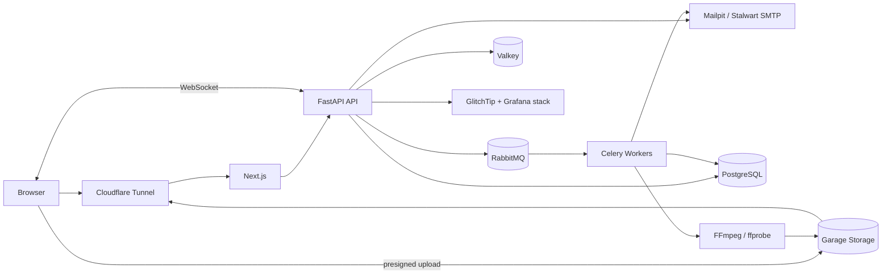

# Feed.io Development Plan

## Goals

Build a collaborative video review platform for creative agencies: video uploading, version management, timestamped comments, annotations, review approvals, client share links, and real-time notifications. Designed for initial workloads under 1,000 users while adhering to production-grade architectural boundaries without premature microservices.

## Architectural Decisions

- **Frontend:** Next.js App Router + TypeScript; Server Components for data views, Client Components for video playback and canvas annotation.
- **Backend:** FastAPI modular monolith; SQLModel on SQLAlchemy 2 + Alembic + Pydantic v2.
- **Data:** PostgreSQL as the single source of truth; UUID primary keys, `TIMESTAMPTZ`, selective soft deletes.
- **Media:** Direct upload via presigned multipart S3 URLs; self-hosted Garage S3 + Cloudflare Tunnel Ingress.
- **Background Jobs:** RabbitMQ + Celery; FFmpeg/ffprobe for HLS renditions, thumbnails, filmstrips, and audio waveforms.
- **Realtime:** Socket.IO / WebSockets from FastAPI; Valkey Pub/Sub for cross-instance state synchronization.
- **Auth:** First-party SaaS authentication (register/verify/login/recovery/session); identities and organization/project RBAC stored in PostgreSQL.
- **Deployment:** Docker Compose on self-hosted servers; standalone containers for web, API, worker, and data stores.
- **Principles:** Modular monolith first, transactional outbox pattern for critical events; service extraction only when supported by empirical telemetry.



## MVP Scope

**Included in MVP**
- Organization, members, and roles (`owner`, `admin`, `member`, `guest`).
- Projects, hierarchical folders, media assets, and iterative version stacks.
- Resilient multipart uploads with progress tracking, pause/resume, retry, and cancellation.
- Frame-accurate HLS player, thumbnails, filmstrips, and technical media metadata.
- Timecode/range comments, threaded replies, user mentions, resolution states, and vector annotations.
- Review decisions (`in_review`, `changes_requested`, `approved`) with immutable decision history.
- Share links with expiration dates, optional passphrases, and configurable comment/download permissions.
- In-app and email notifications; append-only security audit logs.
- Keyset cursor pagination and PostgreSQL search.

**Post-MVP Considerations**
- Desktop/mobile native apps, live streaming, forensic watermarking/DRM.
- AI transcription/search, Adobe Premiere/DaVinci plugins, public API, and automated billing.
- Enterprise SSO/SAML, SCIM provisioning, retention lifecycle policies, and microservice decomposition.

## Repository Structure

```text
feed.io/
├── apps/
│   ├── backend/             # Monolithic Python package (API, worker, CLI)
│   └── web/                 # Next.js App Router with modular features
├── packages/
│   ├── api-client/          # Orval-generated Axios client and React Query hooks
│   ├── eslint-config/
│   └── typescript-config/
├── infra/                   # Compose, Garage, monitoring, mail, backup
├── scripts/                 # Architectural boundary and 500-line limit checks
├── docs/                    # Architecture records, ADRs, and operational runbooks
└── Makefile
```

Backend is organized into distinct business modules (`identity`, `organizations`, `projects`, `media`, `reviews`, `sharing`, `notifications`, `audit`); each module encapsulates `domain`, `application`, `infrastructure`, `presentation` and a public API contract. Frontend feature modules mirror these boundaries. Dependency direction and file limits adhere to [Feed.io Engineering Standards](./feed-io-engineering-standards.md).

## Core Data Models

| Table | Purpose / Primary Relationships |
|---|---|
| `users` | First-party identity, unique email, password hash, verification status |
| `auth_sessions` | Refresh-token hash, device/IP, expiration, last-used, revoked state |
| `auth_action_tokens` | Single-use hashed tokens for verification/reset, expiration |
| `organizations` | Root agency tenant managed by Feed.io |
| `organization_members` | Unique `organization_id + user_id`, organization role |
| `projects` | Organization-scoped workspace with privacy settings |
| `project_members` | Project-specific membership overrides (especially for guests) |
| `folders` | Hierarchical folder tree via `parent_id` with cycle prevention |
| `assets` | Logical media item belonging to a project or folder |
| `asset_versions` | Monotonically incrementing versions per asset; processing status |
| `media_objects` | Source/renditions/thumbnails, object key, checksum, MIME, size |
| `upload_sessions` | Multipart upload ID, status, expiration, idempotency key |
| `comments` | Version, author, parent comment, timecode/range, body, resolution state |
| `annotations` | 1-to-1 or 1-to-many with comments; normalized coordinate vector payload |
| `review_decisions` | Version, reviewer, decision, note; immutable historical record |
| `share_links` | Token hash, scope, permissions, passphrase hash, expiration |
| `notifications` | Recipient, event type, read timestamp, scoped payload |
| `audit_logs` | Actor, action, resource, IP, user-agent; append-only |
| `outbox_events` | Transactional outbox events dispatched by workers |

Minimum indexes: all foreign keys; unique memberships; `(project_id, created_at, id)` for assets; `(asset_version_id, timecode_ms, id)` for comments; `(recipient_id, read_at, created_at)` for notifications; partial indexes for active records. Keyset/cursor pagination is used across all listings.

## API Contract

- REST JSON under `/api/v1` with OpenAPI specifications acting as the contract; Orval generates TypeScript clients and React Query hooks automatically.
- Success responses return resources directly; errors follow a consistent structure: `code`, `message`, `details`, `request_id`.
- `Idempotency-Key` headers for session/upload creation and retryable commands.
- WebSocket emits minimal events (`comment.created`, `version.ready`); clients refetch authoritative data upon reconnecting.

## Media Processing Lifecycle

1. Client initializes an upload session; API validates quota/permissions and issues presigned multipart URLs.
2. Browser uploads chunks directly to Garage S3, then calls `/complete` with part ETags.
3. API validates object integrity, creates `asset_version` in `queued` state, and writes an outbox event atomically.
4. Celery worker retrieves the job, reads metadata with ffprobe, and invokes FFmpeg to generate HLS renditions, thumbnails, and filmstrips.
5. Worker updates version state to `ready` or `failed`; API emits WebSocket events.
6. Player reads manifests via Cloudflare Tunnel; original files are accessible only via time-limited signed URLs.

## Implementation Roadmap

- [x] **1. Foundation:** Monorepo, Docker Compose, health checks, and CI 500-line gates.
- [x] **2. Identity & Tenancy:** Registration, verification, login, session rotation, and cross-tenant boundary tests.
- [x] **3. Project Workspace:** Project/folder CRUD, memberships, and Next.js workspace dashboard.
- [x] **4. Upload Pipeline:** Presigned multipart uploads, retry/cancel, and checksum validation.
- [x] **5. Media Processing:** Celery + FFmpeg/ffprobe, HLS renditions, and transcoding status updates.
- [x] **6. Review Experience & Versioning:** HLS player, timeline markers, timecode comments, vector annotations, version stacks, and dual-player comparison (Side-by-side, Wipe slider, Difference).
- [x] **7. Collaboration:** WebSocket presence, user mentions, in-app notifications, and review approvals.
- [x] **8. Client Sharing:** Share links with passphrase protection, expiration, and guest review portal.
- [x] **9. Self-Host Platform:** Cloudflare Tunnel Ingress (Zero Inbound Ports), Valkey rate limiter, and Platform Admin Panel.
- [x] **10. Release & DR:** Automated backup/recovery drills and production deployment guides.

> Real-time implementation tracking is documented in [docs/PROJECT_PROGRESS.md](./docs/PROJECT_PROGRESS.md).
